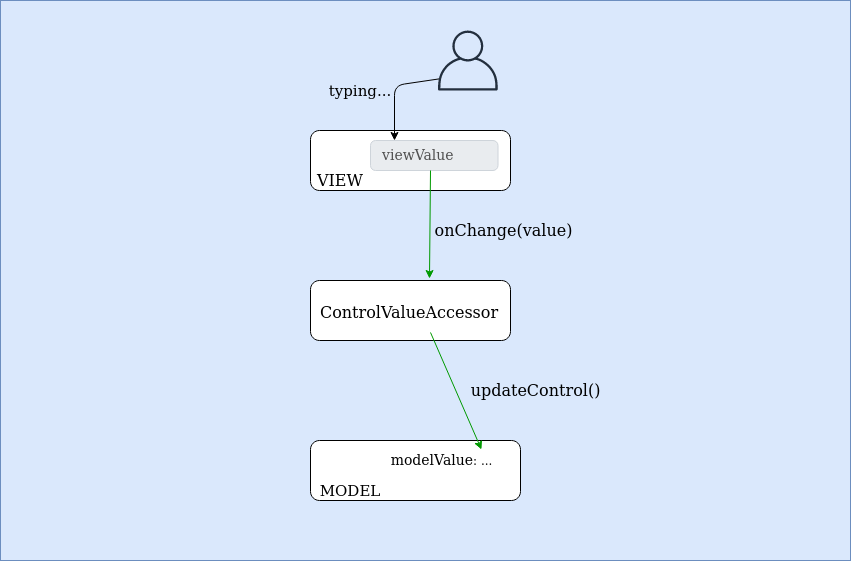
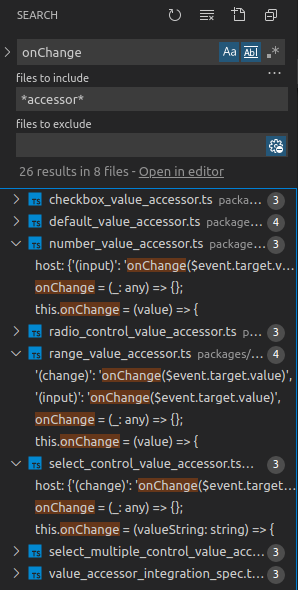

_This article has been published on [indepth.dev](https://indepth.dev/posts/1331/angular-forms-why-is-ngmodelchange-late-when-updating-ngmodel-value)._

## Introduction

The `@angular/forms` package is rich in functionalities and although is widely used, it still has some unsolved mysteries. The aim of this article is to clarify why the problem in question occurs and how it can be solved. This involves strong familiarity with Angular Forms, so it would be preferable to read [A thorough exploration of Angular Forms](https://indepth.dev/a-thorough-exploration-of-angular-forms/) first, but not mandatory, as I will cover the necessary concepts once again in the following sections.  
  
_This article has been inspired by this [Stack Overflow question](https://stackoverflow.com/q/63667435/9632621)._

## The problem

Let's say we want to create a directive which will perform some changes on what the user types into an input, so that the bound `FormControl` will have the altered value.

Our directive may look like this:

```ts
@Directive({
  selector: '[myDirective]'
})
export class Mydirective {
  constructor(private control: NgControl) { }
  
  processInput(value: any) {
    return value.toUpperCase();
  }

  @HostListener('ngModelChange', ['$event'])
  ngModelChange(value: any) {
    this.control.valueAccessor.writeValue(this.processInput(value));
  }
}
```

and could be used like this:

```ts
<hello name="{{ name }}"></hello>
<input class="form-control" id="label" [(ngModel)]='modelValue' required myDirective>

Model: {{ modelValue }}
```

In this snippet we're using the well known _banana in a box_ syntax, which is the same as: `[ngModel]='modelValue' (ngModelChange)='modelValue = $event'`.

[_Here's the corresponding StackBlitz_](https://stackblitz.com/edit/ngmodelchange-error?file=src%2Fapp%2Fapp.component.html).

As soon as we start typing into the input, the problem becomes evident.

# Understanding the problem

> `ControlValueAccessor` does not refer to a certain entity (such as an `interface`), but to the concept behind it.

Angular has _default value accessors_ for certain elements, such as for `input type='text'`, `input type='checkbox'` etc...

A `ControlValueAccessor` is the _middleman_ between the VIEW layer and the MODEL layer. When a user types into an input, the VIEW notifies the `ControlValueAccessor`, which has the job to inform the MODEL.



For instance, when the `input` event occurs, the `onChange` method of the `ControlValueAccessor` will be called. [Here's how](https://github.com/angular/angular/blob/master/packages/forms/src/directives/shared.ts#L93-L101) `onChange` looks like **for every** `ControlValueAccessor`:

```ts
function setUpViewChangePipeline(control: FormControl, dir: NgControl): void {
  dir.valueAccessor!.registerOnChange((newValue: any) => {
    control._pendingValue = newValue;
    control._pendingChange = true;
    control._pendingDirty = true;

    if (control.updateOn === 'change') updateControl(control, dir);
  });
}
```

The magic happens in [`updateControl`](https://github.com/angular/angular/blob/master/packages/forms/src/directives/shared.ts#L112-L117):

```ts
function updateControl(control: FormControl, dir: NgControl): void {
  if (control._pendingDirty) control.markAsDirty();
  control.setValue(control._pendingValue, {emitModelToViewChange: false});
 
  // !
  dir.viewToModelUpdate(control._pendingValue);
  control._pendingChange = false;
}
```

[`dir.viewToModelUpdate(control._pendingValue)`](https://github.com/angular/angular/blob/master/packages/forms/src/directives/ng_model.ts#L276-L279) is what invokes the `ngModelChange` event in the custom directive.

```ts
/* ... */

@Output('ngModelChange') update = new EventEmitter();

/* ... */

viewToModelUpdate(newValue: any): void {
  this.viewModel = newValue;
  this.update.emit(newValue);
}

/* ... */
```

What this means is that the **model value** is the value from the input (in lowercase). Because `ControlValueAccessor.writeValue` **only** writes the value to the VIEW, there will be a _delay_ between the VIEW's value and the MODEL's value. Here is how [`DefaultValueAccessor.writeValue()`](https://github.com/angular/angular/blob/master/packages/forms/src/directives/default_value_accessor.ts#L104-L107) is defined:

```ts
writeValue(value: any): void {
  const normalizedValue = value == null ? '' : value;
  this._renderer.setProperty(this._elementRef.nativeElement, 'value', normalizedValue);
}
```

It's worth mentioning that `FormControl.setValue(val)` will write `val` to **both** layers, VIEW and MODEL, but if we were to use this, there would be an **infinite loop**, since `setValue()` internally calls `viewToModelUpdate`(because the MODEL has to be updated, e.g the `modelValue` in `[(ngModel)]='modelValue'`), and `viewToModelUpdate` calls `setValue()`.


And [this](https://github.com/angular/angular/blob/master/packages/forms/src/directives/shared.ts#L119-L127) is the snippet depicted in the image above:

```ts
function setUpModelChangePipeline(control: FormControl, dir: NgControl): void {
  control.registerOnChange((newValue: any, emitModelEvent: boolean) => {
    // control -> view
    dir.valueAccessor!.writeValue(newValue);

    // control -> ngModel
    if (emitModelEvent) dir.viewToModelUpdate(newValue);
  });
}
```

## The solution

A way to solve the problem is to add this snippet to the directive:

```ts
ngOnInit () {
  const initialOnChange = (this.ngControl.valueAccessor as any).onChange;

  (this.ngControl.valueAccessor as any).onChange = (value) => initialOnChange(this.processInput(value));
}
```

With this approach, we're modifying the data at the VIEW layer, before it is sent to the `ControlValueAccessor`.

And we can be sure that `onChange` exists on every built-in `ControlValueAccessor`:



If you are going to create a custom one, just make sure it has an `onChange` property. TypeScript can help you with that.

[_StackBlitz_](https://stackblitz.com/edit/angular-ivy-kv3g3f?file=src%2Fapp%2Fapp.component.html).

## Conclusion

A `ControlValueAccessor` is responsible for keeping in sync the 2 main layers, VIEW and MODEL. By understanding some of the inner workings of Angular Forms, we were able to see why the problem occurred and how to solve it.  

Thanks for reading!