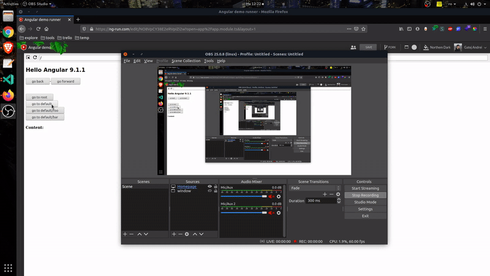
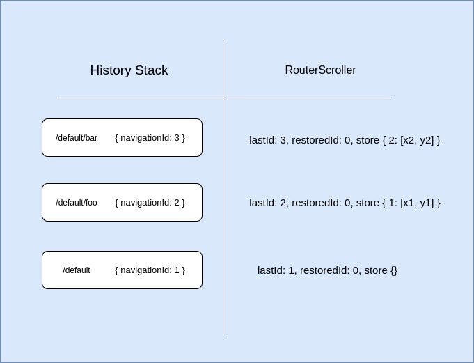

_This article has been published on [indepth.dev](https://indepth.dev/posts/1366/demystifying-angular-router-what-is-routerscroller-and-why-is-it-useful-2)._

## Introduction

The `RouterScroller` entity is a very interesting part of the Angular Router. In this post, we're going to have a look at how it works, what makes its features possible and how it can be configured, depending on the developer's needs.

It helps us achieve things like scrolling to a fragment, setting an offset for that fragment and, lastly, navigating back to where the browser left off as a result of a `popstate` event.

## How RouterScroller is set up

Files referenced in this section: [`router_module`](https://github.com/angular/angular/blob/master/packages/router/src/router_module.ts), [`router_scroller`](https://github.com/angular/angular/blob/master/packages/router/src/router_scroller.ts).

Since the `@angular/router` is a built-in package provided by Angular, is has to go through a process of initialization, in order to make sure everything is set up correctly. In this case, it happens inside a `APP_BOOTSTRAP_LISTENER`'s listener. If we peek at the source code, we can see that the first lines of the function's block are just [`this.injector.get` calls](https://github.com/angular/angular/blob/master/packages/router/src/router_module.ts#L549-L553):

```ts
const opts = this.injector.get(ROUTER_CONFIGURATION);
const preloader = this.injector.get(RouterPreloader);
const routerScroller = this.injector.get(RouterScroller);
const router = this.injector.get(Router);
const ref = this.injector.get<ApplicationRef>(ApplicationRef);

/* ... */
```

This might seem trivial at first sight, but some of the arguments provided to `this.injector.get` are in fact **factory tokens**, meaning that some piece of logic will run in order to retrieve what has been asked for.

For example, `RouterScroller`(the article's focal point) is defined as follows:

```ts
{
  provide: RouterScroller,
  useFactory: createRouterScroller,
  deps: [Router, ViewportScroller, ROUTER_CONFIGURATION]
},
```

`createRouterScroller` will simply create an instance of the `RouterScroller` class, based on the `ROUTER_CONFIGURATION` token. This can be seen in the class' constructor:

```ts
constructor(
    private router: Router,
    public readonly viewportScroller: ViewportScroller, private options: {
      scrollPositionRestoration?: 'disabled'|'enabled'|'top',
      anchorScrolling?: 'disabled'|'enabled'
    } = {}) {
  // Default both options to 'disabled'
  options.scrollPositionRestoration = options.scrollPositionRestoration || 'disabled';
  options.anchorScrolling = options.anchorScrolling || 'disabled';
}
```

Then, after the `Router` is initialized (`Router.initialNavigation`), the `RouterScroller` will be initialized as well, with `RouterScroller.init()`:

```ts
init(): void {
  // we want to disable the automatic scrolling because having two places
  // responsible for scrolling results race conditions, especially given
  // that browser don't implement this behavior consistently
  if (this.options.scrollPositionRestoration !== 'disabled') {
    this.viewportScroller.setHistoryScrollRestoration('manual');
  }

  this.routerEventsSubscription = this.createScrollEvents();
  this.scrollEventsSubscription = this.consumeScrollEvents();
}
```

The last two lines represent the gist of `RouterScroller`. We are going to explore them in the following section, along with some examples.

## How RouterScroller works

Router events(e.g `NavigationStart`, `NavigationEnd`) play an important role in achieving `RouterScroller`'s features. `Scroll` events are created based on specific Router events.

```ts
private lastId = 0;

/* ... */

private createScrollEvents() {
  return this.router.events.subscribe(e => {
    if (e instanceof NavigationStart) {
      // store the scroll position of the current stable navigations.
      this.store[this.lastId] = this.viewportScroller.getScrollPosition();
      this.lastSource = e.navigationTrigger;
      this.restoredId = e.restoredState ? e.restoredState.navigationId : 0;
    } else if (e instanceof NavigationEnd) {
      this.lastId = e.id;
      this.scheduleScrollEvent(e, this.router.parseUrl(e.urlAfterRedirects).fragment);
    }
  });
}
```

The `browser` implementation of `ViewportScroller.getScrollPosition()` returns `[this.window.scrollX, this.window.scrollY];`, a tuple that describes the amount of pixels the document is scrolled horizontally and vertically. The `e.navigationTrigger` defines what trigger this navigation, which might be on of the three:

*   `'imperative'` - _manually_ doing `router.navigate()` or `router.navigateByUrl()`
*   `'popstate'` - clicking the **forward** or the **back** button, or `history.back()`/`historyForward()`
*   `'hashchange'`\- when the `fragment` (the part prefixed with `#`) changes

`e.restoredState` is a very interesting part. Try to imagine the **history stack**. With every `history.pushState(stateObj, title, url)`, a **new item** is added to the browser's history stack. This is what essentially _concludes_ a router navigation. Angular identifies every navigation with a `navigationId`(as you can see, it's useful for `this.restoredId` as well). The `navigationId` is assigned to a new navigation this way:

```ts
const id = ++this.navigationId;

// `setTransition` will push the object through the `Router stream` - a series of operators that have to deal with
// determining the router configuration object, running the guards, setting the browser's URL etc...
this.setTransition({
  id,
  source,
  restoredState,
  currentUrlTree: this.currentUrlTree,
  currentRawUrl: this.rawUrlTree,
  rawUrl,
  extras,
  resolve,
  reject,
  promise,
  currentSnapshot: this.routerState.snapshot,
  currentRouterState: this.routerState
});
```

When a `popstate` event occurs, the browser will move to the **second uppermost** item from the stack, which, as mentioned earlier, has a `navigationId` property in its state. That `navigationId` will be the `this.restoredId` in our case. So, **two** important things happen when the `NavigationStart` event occurs:

*   we store the current position(`scrollX` and `scrollY`) of the document (with the help of `lastId`)
*   we determine(if it exists) the `restoredId`, which is the `navigationId` of the **previous navigation**; notice that it is done only when the `popstate` event takes place

Otherwise, if the `NavigationEnd` event occurs, only the current `navigationId` is stored: `this.lastId = e.id;` and a `Scroll` event is created:

```ts
private scheduleScrollEvent(routerEvent: NavigationEnd, anchor: string|null): void {
  // `router.triggerEvent` will push a new event(`routerEvent`) through the `router.events` stream
  this.router.triggerEvent(new Scroll(
      // so, only if the `popstate` event occurred, the stored position will considered
      // otherwise, the position will be `null`
      routerEvent, this.lastSource === 'popstate' ? this.store[this.restoredId] : null, anchor));
}
```

Let's now see how the `Scroll` events are handled:

```ts
// from `init()` method
this.scrollEventsSubscription = this.consumeScrollEvents();

/* ... */

private consumeScrollEvents() {
  return this.router.events.subscribe(e => {
    if (!(e instanceof Scroll)) return;
    
    // a popstate event. The pop state event will always ignore anchor scrolling.
    if (e.position) {
      if (this.options.scrollPositionRestoration === 'top') {
        this.viewportScroller.scrollToPosition([0, 0]);
      } else if (this.options.scrollPositionRestoration === 'enabled') {
        this.viewportScroller.scrollToPosition(e.position);
      }
      // imperative navigation "forward"
    } else {
      if (e.anchor && this.options.anchorScrolling === 'enabled') {
        this.viewportScroller.scrollToAnchor(e.anchor);
      } else if (this.options.scrollPositionRestoration !== 'disabled') {
        this.viewportScroller.scrollToPosition([0, 0]);
      }
    }
  });
}
```

The `viewportScroller.scrollToPosition`, in a browser environment, is simply just: `this.window.scrollTo(position[0] /* x */, position[1] /* y */);` The logic in this handler can be influenced by some configuration options provided when instantiating the `RouterModule`(with `RouterModule.forRoot(routes, { /* config */ })`). We'll discuss a couple of these options in the next section.

But before going further, let's get a better understanding of what's going on by examining a common user flow.

[ng-run demo.](https://ng-run.com/edit/NO8VpCY38E2eRVpIZi2w?open=app%2Fapp.module.ts)  
  
Assuming the user would follow these steps:

*   clicks on `go to default`
*   clicks on `go to default/foo`
*   scrolls until `Test from foo - bottom 20%` is visible, as well as `go to default/bar`
*   clicks on `go to default/bar`

Now, if you click on `go back` button, you should now see the `Test from foo - bottom 20%` text:



And here is how the flow could be visualized:



`x{n}, y{n}` are the `scrollX` and `scrollY` values at a certain time when a new navigation is started.

Now, after clicking on the `go back` button, the `RouterScroller`'s state becomes:

```ts
{
  restoredId: 2, // `navigationId`
  lastId: 2
  /* ... */
}
```

And by using `store[restoredId]` we get the coordinates for the previous `/default/foo` view.  
  
_Note: for this demo, the `scrollPositionRestoration` option has been used: `RouterModule.forRoot(routes, { scrollPositionRestoration: 'enabled' })`_

## Router options that concern RouterScroller

From the previous section we've seen what the `scrollPositionRestoration` option does.

Another 2 useful options are `anchorScrolling` and `scrollOffset`:

```ts
private consumeScrollEvents() {
  return this.router.events.subscribe(e => {
    if (!(e instanceof Scroll)) return;
    
    // a popstate event. The pop state event will always ignore anchor scrolling.
    if (e.position) {
      if (this.options.scrollPositionRestoration === 'top') {
        this.viewportScroller.scrollToPosition([0, 0]);
      } else if (this.options.scrollPositionRestoration === 'enabled') {
        this.viewportScroller.scrollToPosition(e.position);
      }
      // imperative navigation "forward"
    } else {
      if (e.anchor && this.options.anchorScrolling === 'enabled') {
        this.viewportScroller.scrollToAnchor(e.anchor);
      } else if (this.options.scrollPositionRestoration !== 'disabled') {
        this.viewportScroller.scrollToPosition([0, 0]);
      }
    }
  });
}
```

As you can notice from the above snippet, by setting the `anchorScrolling` option to `enabled`, we can navigate to a particular element that belongs to the new view. The element can be recognized by settings its `id` attribute:

```html
<h4 id="custom-fragment"><!-- ... --></h4>
```

and the navigation can be achieved with:

```html
<button routerLink="/default/foo" fragment="custom-fragment"><!-- ... --></button>
```

[ng-run demo.](https://ng-run.com/edit/M0hEF4qn04ENateiUGjC?open=app%2Fapp.component.html)

Furthermore, when having `anchorScrolling` enabled, the `scrollOffset` option might be useful as well. You can play around with it by using: `RouterModule.forRoot(routes, { scrollOffset: [xOffset, yOffset] })`. To describe it briefly, imagine a Cartesian system xOy, where a coordinate Y is the point where the browser would normally scroll to if there were no offset specified. In fact, the default offset is 0. So, the _formula_ would be: `finalOffsetY = Y + yOffset`. And the same goes for the `X` coordinate.

## Conclusion

The `RouterScroller` provides some essentials features of `angular/router`. We've examined how it is set up, the mechanisms that make everything possible and some of the ways it can be configured to suit certain needs.

**Thank you for reading!**
