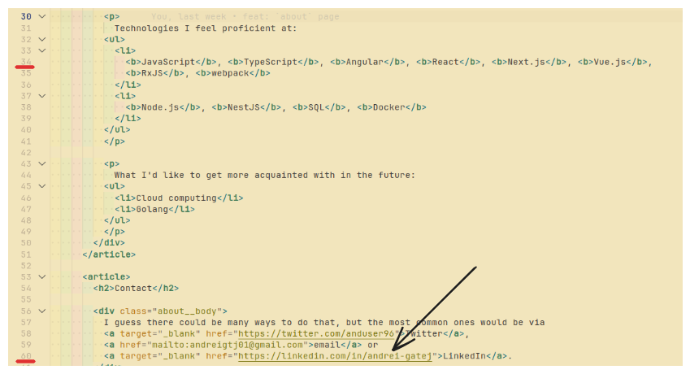
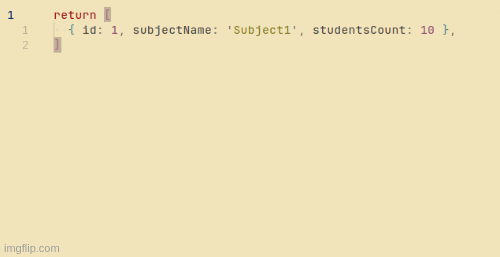
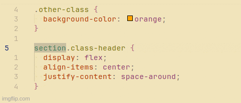
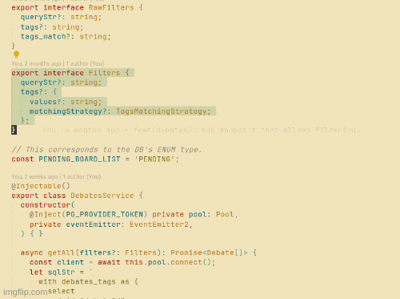

## Introduction

Sincerely speaking, the beginning of my Vim journey was tough and wearying. But, as with everything that (probably) is worth pursuing, a great deal of effort is required. Fortunately, Vim was definitely worth pursuing and that’s why, in this article, I’d like to share some *************tips & tricks************* that improved my productivity while coding.

## Setting up VS Code and Vim

I’ve been using VS Code since I started learning to code(around 2016), so it is expected that it was kind of hard for me to *completely* ditch VS Code. There were some commands/shortcuts I couldn’t really give up on and I was very glad to find out that VS Code and Vim really work smoothly together.

First, you should have the VS Code’s Vim extension installed.

These are my current VS Code settings that concern Vim:

```json
"vim.handleKeys": {
        "<C-j>": false,
        "<C-s>": false,
        "<C-z>": false,
        "<C-f>": false,
        "<C-w>": false,
        "<C-t>": false,
        "<M-S-h>": false,
        "<C-n>": false,
        "<C-S-4>": false,
        "<C-S-3>": false,
    },
    "editor.lineNumbers": "relative",
    "vim.vimrc.path": "~/.vimrc",
    "vim.vimrc.enable": true,
    "vim.normalModeKeyBindingsNonRecursive": [
        {
            "before": [
                "u"
            ],
            "after": [],
            "commands": [
                {
                    "command": "undo"
                }
            ]
        },
        {
            "before": [
                "<C-r>"
            ],
            "after": [],
            "commands": [
                {
                    "command": "redo"
                }
            ]
        }
    ],
```

And this is what the `.vimrc` file looks like:

```json
:set number
:set relativenumber
:set rnu

runtime macros/matchit.vim
filetype plugin on
```

## Improving my workflows

### Enabling relative line numbers

Arguably, this is among my favorites. 

To quickly demonstrate this feature’s usefulness, consider this scenario, where you are on line 34 and want to quickly get to line 60 and edit the `<a>`'s href:



There may be many ways to achieve this(e.g. doing the math, doing `26J` and then edit, going directly to line 60 and edit, using your mouse, etc.,), but, from my experience, the fastest way to do that is to enable relative line numbers(e.g. the `"editor.lineNumbers": "relative"` setting in VS Code)


and then perform:

- `26J` - notice you don’t need to do the math yourself!
- `f=;w` - move the cursor to the first character of the `href`'s value
- `ci"` - start editing

Relative numbers can provide huge speed improvements when it comes to navigating through a file, so it’s something I could hardly work without.

### Selecting paragraphs

The text objects that correspond to paragraphs are `{`(for moving backward) and `}`(for moving forward). There is also `p`, but it would be exemplified later in this article.

Selecting paragraphs becomes very helpful when writing SQL queries directly in VS Code, as I did for some of my projects.

Let’s say that we want to run this query(and we want to do that very quickly, of course):


Notice that the cursor is in the middle of the query. What we really want now is to be able to select the entire query and press a button to run it.

> Although the query seems to be already selected, there have been cases where directly trying to run it didn’t work. Regardless of that, I think this is a feature of Vim worth knowing.
> 

This is the fastest way I could select the entire query and run it:

- `{` - go backward one paragraph, e.g. on line 10 on the top
- `V` - select the entire line
- `}` go forward one paragraph, e.g. on line 10 in the bottom
- run the query

### Automatically increment numbers

This example might seem a bit contrived, but it’s definitely useful when creating placeholder or seeding data.

Let’s say that we want to create a placeholder array with *N* entities, starting from this:

```jsx
return [
  { id: 1, subjectName: 'Subject1', studentsCount: 10 },
]
```

Instead of copying the line, pasting it *N* times and then manually increment the values, I prefer following these steps:

- `Y` - copy the first placeholder entity
- `5p` - paste what’s been copied 5 times
- go to the `id` value of the second entity
- `CTRL+v` - enter the column-oriented visual mode
- `4j` - select until the last column
- `gCTRL+a` - automatically increment the selected numbers

Here’s a GIF that illustrates the above steps:



### Editing paragraphs that contain curly braces

Consider this CSS snippet:


Let’s suppose we’d like to completely override the `section.class-header` paragraph. One may be tempted to go to line 4 and press `ca}`, but that will only lead to this:


The reason is that `ca}` is translated to ***************change around `}` and its pair, which is `{`.* Luckily, there is another way to refer to paragraph text objects in Vim - via `p`.

So, in order to achieve that we initially wanted, we can:

- go to the line where the paragraph starts(i.e. the line with `section.class-header`)
- `cap` - change around paragraph

Here’s a GIF with the above steps:



### Toggle between the beginning and the end of a selection

A concrete situation would be this: we have already started selecting downwards, but we suddenly realize that we need to also select a piece of what’s above the line we initially started selecting from. In other words, we might need so select downwards, then upwards.

We can toggle between the beginning and the end of a selection by typing `O`.

Here’s an example of that: 



### Quickly deleting an unused import

We’re given this situation, where we want to delete `BadGatewayException`, because it’s not used at all in this file:


We are all familiar with how one could delete a word - `diw`. However, by doing that, we are left with a dangling comma:


Of course, that could easily be deleted by typing `xx`.

My preferred way to achieve the same result with a single combination of keystrokes is `daW` - ******************delete around word******************, and `W` has been used instead of `w` because `W` will not consider punctuation symbols(e.g. `,`, `;`, etc.) as separate words. To put it another way, `W` considers that words are only separated by spaces.

Here is what we end up with after putting the cursor on the thing we want to remove and pressing `daW`:


### Changing inside quotes regardless of where the cursor is on the line

Let’s say we want to quickly update the styles import:


One way to do that would be to, first of all, go to the line below(i.e. `j`), then `f'` to move the cursor to the first quote, then `w` to move inside the quotes and, finally, `ci'` to edit the value inside the quotes.

I was very happy to find out that the four steps described above and be narrowed down to only two:

- `j` - move to the line below
- `ci’` - edit the contents inside the single quotes

Note that ******************************************************it may not work as expected****************************************************** if there are multiple pairs of quotes on the same line.

## Why I think Vim is worth it

At the time of writing this article(June 2023), I could say that I’ve been on this ***********Vim journey*********** for almost 6 moths. 

One thing that I’ve noticed recently, which is also the reason as to why I’m writing this article, is that being ****in the flow**** is much more pleasant since I’m no longer ****wasting extra time**** on performing an action and I can move more rapidly to the next idea instead. What I’d define **********extra time********** like is moving to line X using `CTRL + arrows` or mouse, then use `CTRL + arrows` to move to the word I want modify, then go back,* etc. Such actions usually took place after I had made a decision on a given problem and, at a certain point, it became annoying to keep the same *******************solved problem******************* in my mind while performing the steps to actually get it to completion. What Vim really allowed me to do is to spend as least time as possible on performing such actions and to move onto the next problem that is to be solved much faster.

## Future plans

When it comes to Vim, there is still a lot of learn and, more importantly, to improve. Besides reading materials on Vim and trying things out myself, I plan to give Neovim a try.

## Aknowledgements

I would say that this journey wouldn’t have been possible if a good friend of mine, [Ovi Stoica](https://twitter.com/ovstoica), hadn’t recommended to try out Vim.  

Lastly, seeing how fast [ThePrimeagen](https://www.youtube.com/@ThePrimeagen/videos) codes, I felt greatly inspired. 

## Conclusion

I’m sure that there are many handy features that have yet to be discovered. I will update this article as I find new interesting stuff worth sharing.

If you plan to learn Vim, regardless of how frustrating it may seem in the beginning, it’s worth giving a try(or more tries, as I did myself). 

Thanks for reading!
