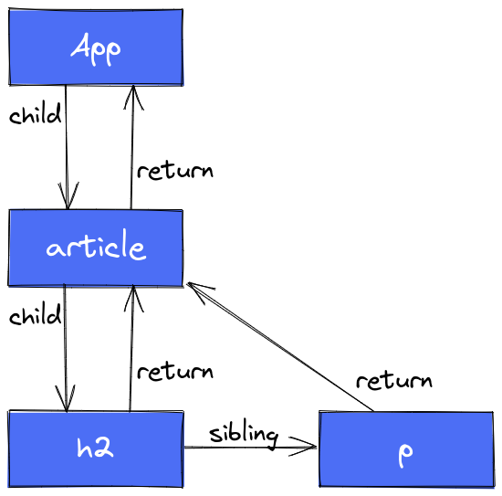
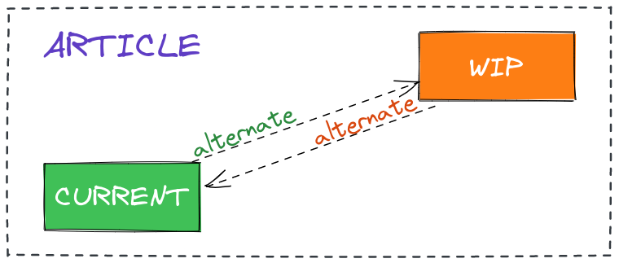
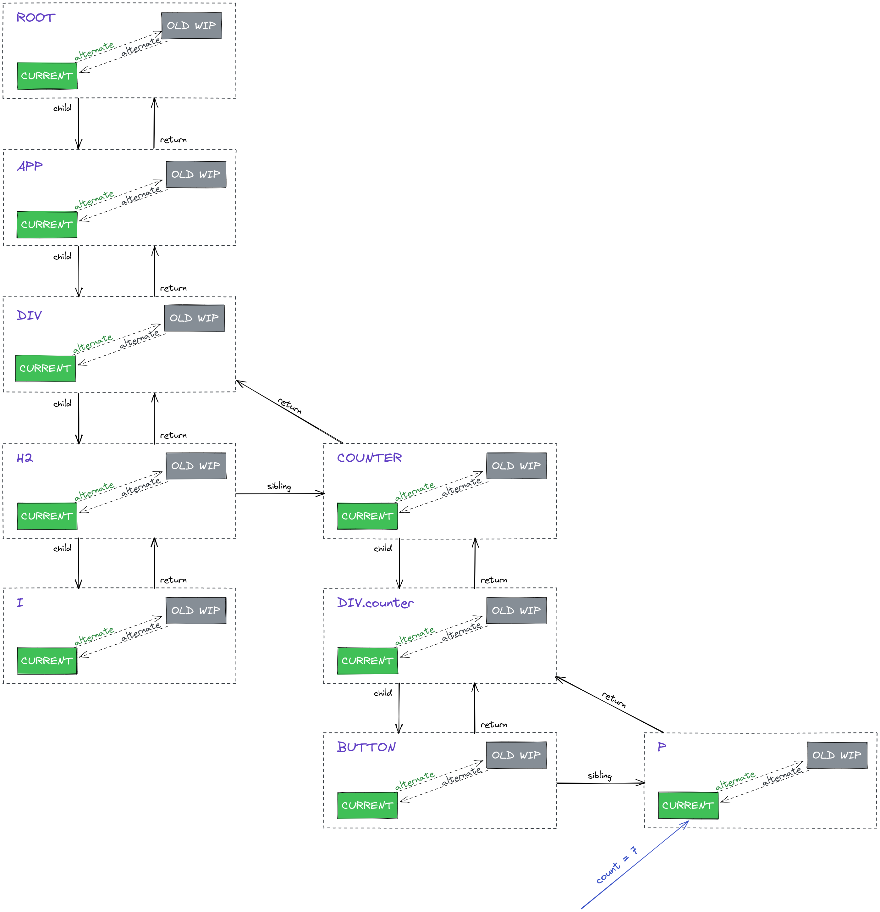
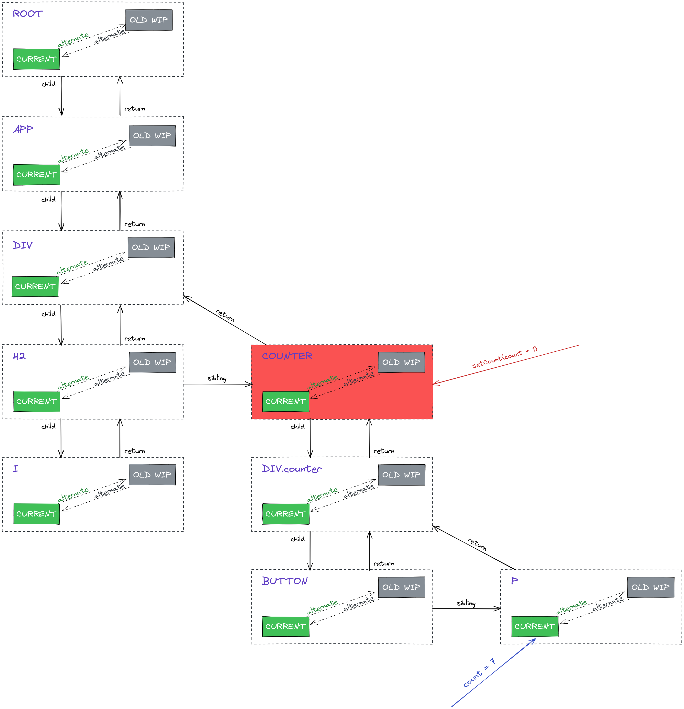
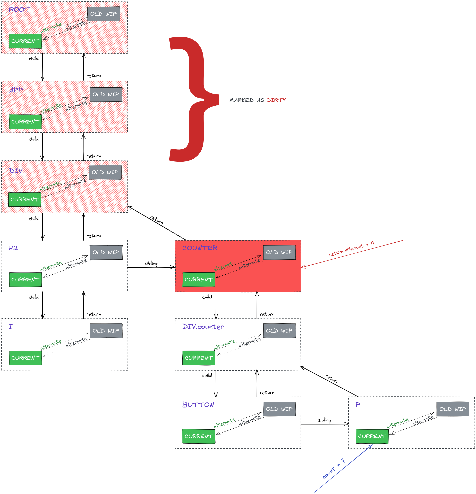
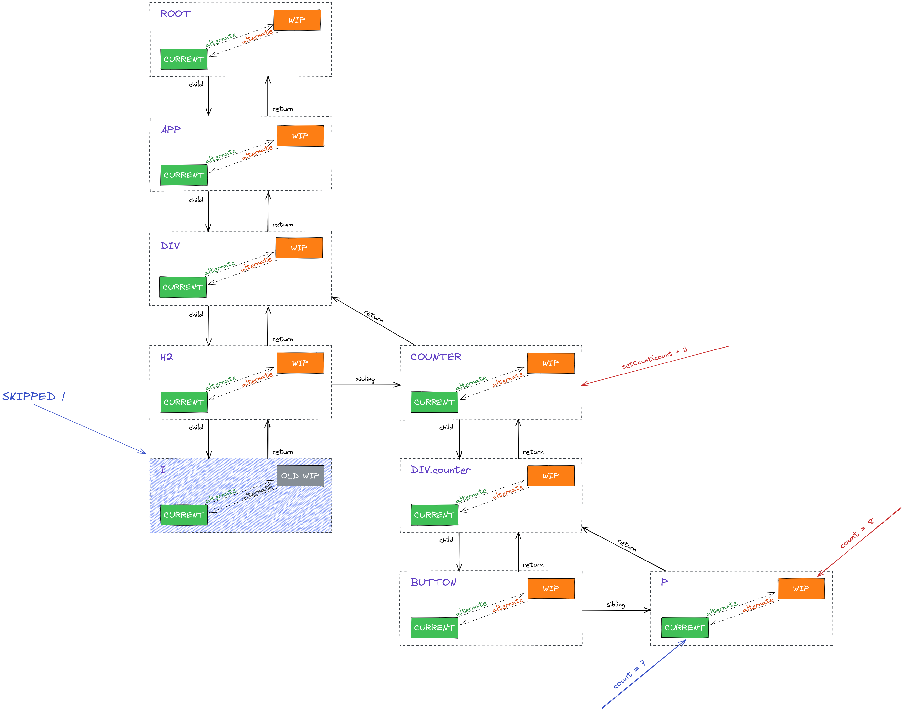
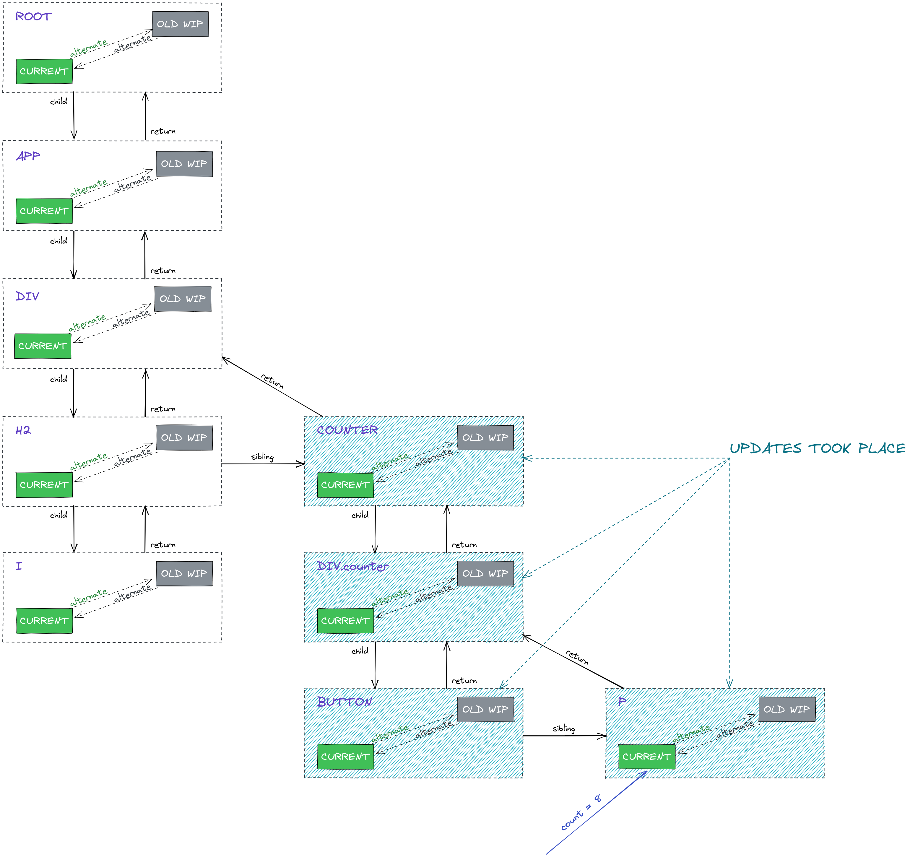
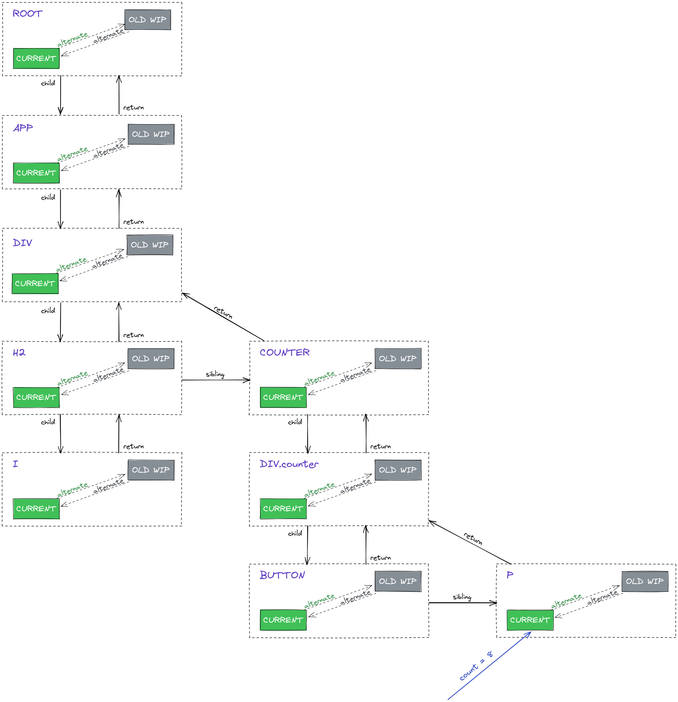

_This article has been published on [indepth.dev](https://indepth.dev/posts/1501/exploring-how-virtual-dom-is-implemented-in-react)._

## Introduction

It is almost inevitable to stumble across the term _virtual DOM_ in your React learning journey(which I doubt it will ever end). This article aims to clarify how the _virtual DOM_ is actually implemented in React and set the stage for future writings that will expand on different _virtual DOM_ features and behaviours, such as: deleting elements, updating state and props, working with lists and more.

Before we get the ball rolling, I’d kindly suggest to ponder this question a bit: _How do you think the virtual DOM is implemented in React?_ You might have already read a pile of materials that cover this topic, therefore thinking about the actual implementation based on the knowledge acquired so far might help you get the most out of this article.

Some prerequisites would be some familiarity with React and a decent understanding of JavaScript. Let’s get started!

## About the virtual DOM

As we know, the DOM is a tree-like structure that is used to represent a web page. It provides an interface through which developers can perform certain operations on that page, such as fetching information and altering the content/structure. However, operating **directly** on the DOM is something that shouldn’t be done more often than actually required because it is a **slow process**. Even [accessing some element’s properties](https://gist.github.com/paulirish/5d52fb081b3570c81e3a), such as `offsetHeight`, would result in a browser reflow, which is **can be computationally expensive**.

So, operations on the DOM should be done when needed and efficiently. **This is where the _virtual DOM_ comes into play.** The _virtual DOM_ is also tree-like structure, kept in memory, that stores the elements of a page, but it comes with the benefit that performing any work on is cheaper and faster, compared to its counterpart. It is the _virtual DOM_ that takes on the responsibility of determining what has changed in terms of content/structure and then all the modifications are committed on the **actual DOM** at once.

At its core, the _virtual DOM_ is just a **tree of so-called `FiberNode`s**(we will refer to it as `FiberTree`). As we will see, these nodes are just **JavaScript objects** with some properties that are very cleverly leveraged.

In the next section, as another small introductory step, we will see what a `FiberNode` is about.

## Becoming familiar with what a FiberNode is

Since the `FiberTree` is built from the compiled JSX, we could say that there is a `FiberNode` for each [React element](https://reactjs.org/blog/2015/12/18/react-components-elements-and-instances.html#elements-describe-the-tree). Although this is not always true(e.g. certain elements can lead to more `FiberNodes` being created), we will stick to this principle for now because it won’t impede our understanding process.

So, from the following JSX snippet:

```tsx
function App () {
  return (
    <article>
      <h2>Title</h2>

      <p>Some content</p>
    </article>
  )
}
```

we’d end up with 4 `FiberNode`s, one for each of the following: the `App` function component, the `<article>` tag, the `<h2>` tag and the `<p>` tag. There is also a **root** `FiberNode`, but it is not relevant now.

The relationships between the React elements persist when it comes to `FiberNode`s. For instance, we could intuitively say that the `App`'s `FiberNode` will be the parent of the `<article>`'s `FiberNode`. As far as the `<h2>` and `<p>` blog_tags are concerned, there is no parent-child relationship, but a **sibling relationship**.

In the above paragraph we’ve already listed some of the most important `FiberNode`'s properties:

*   `child`: `AppFiberNode.child === ArticleFiberNode`
*   `sibling`:  `H2FiberNode.sibling === PFiberNode`
*   `return`: arguably, this might be the least intuitive, but it can be thought of as the **parent** `FiberNode` - `H2FiberNode.return === ArticleFiberNode` and also `PFiberNode.return === ArticleFiberNode`(so, all the siblings have a reference to their parent `FiberNode`); an explanation as to why it is called `return` instead of `parent` can be found in [this document](https://github.com/acdlite/react-fiber-architecture#return) written by [Andrew Clark](https://github.com/acdlite); for the rest of the article, we will use `return` and `parent` interchangeably

This would be a plain visualization of the above `FiberTree`:



_The link for the above diagram can be found [here](https://excalidraw.com/#json=1FroN8EyyXg-r0g7OzdOO,gFKVP94j1Wvl4vtRhqkd4A)._

However, recall that the _virtual DOM_ is responsible for **determining what’s changed** and also for **collecting the changes** so that they can be **committed all at once** so that the browser can render the new content. For now, all we have is a way to organize the React elements based on the relationships between them. But we need more than that, we also need a way to tell whether changes(of any kind) have occurred or not within a `FiberNode`. Therefore, we will have to **introduce another powerful property** of the `FiberNode`, which is vital for the **[render phase](https://reactjs.org/blog/2018/09/10/introducing-the-react-profiler.html#browsing-commits)**: `alternate`.

Firstly, let’s state once again the problem that is to be solved: _how to determine the changes that have been made in a `FiberNode`?_ Suppose there is a React element that displays a counter’s value:

```tsx
<p>{counter}</p>
```

we need to find a way to not miss any updates on the `counter` value. Keep in mind that, in order to find any modifications, we will have to **traverse the `FiberTree`**. Imagine the `FiberNode` of the above element is now being visited, how would one be able to tell that something has changed?

We need **something to compare against** and this is where the `alternate` property plays an important role. In this case, where we want to discover any updates, `alternate` will refer to the previous state of a `FiberNode`. Yes, an `alternate` property of a `FiberNode` will also point to a `FiberNode`! It’s like having **2 copies** of the same `FiberNode`, one which stores the value that is, **at this moment**, **visible in the browser,** while the other stores the **new changes** that **have to be reflected in the browser**. So, we can determine whether there is something to commit later on if the _state_ of the **previous** `FiberNode` differs from the state of the **newly updated** `FiberNode`.

There is a _formal_ way to define the `alternate` property’s usefulness and we will do this in the next section, by going into detail about the two possible states of a `FiberNode`: `current`(the state that **is now reflected in the browser**) and `workInProgress`(the state that **is to be reflected in the browser**).

## The current and workInProgress states of a FiberNode

Let’s restate the **purpose** of these 2 _states_ of a single `FiberNode`: we need to **find and collect** all the **changes** that have occurred in the tree so that all the necessary updates will be incurred by the real DOM at once/in a single batch. The way to find a change in the `FiberTree` is by **comparing** what’s currently being shown on the screen(i.e. the `current` `FiberNode`) with what will be shown on the screen(i.e. the `workInProgress` `FiberNode`).

In the diagrams that will follow we will include both the `current` and the `workInProgress` `FiberNodes` for a single React element. For instance, this is how an `<article>` tag will be illustrated:



In the image above, there are 2 `FiberNode`s that correspond to an `article` element: `current` and `workInProgress`(abbreviated as _WIP_). One can access its counterpart via the `alternate` property:

```ts
// `workInProgress === current.alternate` // true
// `workInProgress.alternate === current` // true
current === current.alternate.alternate // true
```

Before moving on, let’s find a possible answer to another interesting question: _why is this property called `alternate`?_ My take on this is that these 2 `FiberNode`s, `current` and `workInProgress`, continuously _alternate_ across browser renderings. Suppose there is a `Counter` component rendered in the browser with the value `10`. If the `Increment` button is clicked, then the 2 `FiberNode`s associated with the `Counter` component will look like this:

*   `current` - has the value of `10`, because it is what’s currently being shown in the browser
*   `workInProgress` - has the value of `11`, because it contains the change that has to be performed

After **comparing** `current`'s state with `workInProgress`' state, a modification has been discovered(going from `10` to `11`) and it will eventually be **reflected in the browser**. **After this happens**, it is expected for the **barely resolved** `workInProgress` to **become** `current`. That’s because if the user clicks on the `Increment` button once again, then the same logic will be applied and `current` will have the value of `11`(the value of the **old** `workInProgress`), whereas the **new** value of `workInProgress` will be `12`. As you can probably anticipate, the alternation goes on and on: when some work has to be done on the `FiberTree`, `current` reflects the current state visible in the browser, then, after the changes have been applied to the DOM,  `workInProgress` becomes `current`.

The next section is meant to clarify these concepts even further with the help of some diagrams.

## A hands-on example to grasp the FiberTree

_All the diagrams used in this section can be found in this [Excalidraw workspace](https://excalidraw.com/#json=sVh5iAmG_QQrJGZI91STQ,MA7J2M1WJf-CTRenCvTINg)._

This section aims at illustrating how the _virtual DOM_(and thus the `FiberTree`) works, with the help of a simple application and some comprehensive diagrams.

[This the demo application](https://stackblitz.com/edit/react-ts-ye87vy?file=index.tsx) that we will follow:

```ts
// index.tsx
function App() {
  return (
    <div>
      <h2><i>Welcome world!</i></h2>
      
      <Counter />
    </div>
  );
}

// Counter.tsx
export default function Counter() {
  const [count, setCount] = useState(0);

  return (
    <div className="counter">
      <button onClick={() => setCount(count + 1)}>Increment</button>

      <p>The value is: {count}</p>
    </div>
  );
}
```

Assuming the `count`'s value is `7`, this is what the `FiberTree` would look like:



It is implied that the relationships indicated by the arrows(e.g. _child, parent, sibling_) apply on `FiberNode`s of the same type(i.e. a `current` `FiberNode` is a child of another `current` `FiberNode`, **not** `workInProgress`).

Notice the **old** `workInProgress` `FiberNode`s(highlighted in grey and abbreviated as _OLD WIP_) - what it is saying is that, prior to what’s currently being shown in the browser, the `count`’s value was `6` and the **new** `workInProgress` came with the value of `7`. Then, `workInProgress` became the current `current`. As a result, in the situation depicted by the above diagram, `current === OLD_WIP` is `true`. _OLD WIP_ doesn’t do anything per se, it’s just a placeholder for a potential `workInProgress` `FiberNode` that may come with a new value.

Now, let’s see what happens if the `Increment` button is clicked. Firstly, an event will be triggered as a result of pressing the button and then the `useState`'s _dispatcher_(i.e. the `setCount()` function) will be invoked. This event signals that _**some synchronization work**_ needs to be done on the `FiberTree`. It is called _synchronization_ because the `current` tree needs to take in the changes carried by the `workInProgress` tree, so that in the end the results are visible in the browser.



The `Counter` has been highlighted in red because it’s where the `useState` hook has been used. It’s also the topmost node that would be affected by a state change(since it holds the state), so any updates could affect only the state of its children elements(e.g. the `p` element which displays the `count`'s value). Put differently, by invoking `setCount()`, the `Counter` component becomes the cause of a re-render of the `FiberTree`.

What happens next is that the **branch**/**subtree** of nodes which starts from the root and includes the `Counter`'s `FiberNode`s is marked as _dirty_(marked with red hachures)_:_



Marking those ancestor nodes as _dirty_ indicates that **something has changed** somewhere down in the tree. This has further implications - by setting apart a subtree that contains modifications, we can **avoid** doing redundant work on branches that are not affected at all. For example, the `FiberNode`s associated with the `<i>` tag will not be influenced by the `Counter`'s state. Let’s see the next diagram, which underlines the presence of `workInProgress` nodes:



Notice how the `FiberNode` corresponding to the `<i>` tag is _skipped,_ because the changes that occurred have no effect on it. If such `FiberNode` had had any children, the entire subtree would’ve been skipped. As you can see, a `workInProgress` node has been set for **each node in the entire _modified_ subtree**(including `Counter`'s descendants - so modifications can be discovered). Although not every `workInProgress` node may bring new updates, it’s necessary to be able to identify the subtree which brought modifications. This comes handy especially during the **commit phase**, where all the changes will be applied to the real DOM.

Also, take note of the fact that the `p`'s `workInProgress` node contains the most recent value of the `counter`, which is `8`.

Now, you might be wondering why a `workInProgress` node has been set for `h2` as well(which clearly isn’t affected at all by the `Counter`'s state) - the reason is that its parent, the `div`'s `FiberNode`, is part of the subtree which contains a changes and, when this happens, a parent `FiberNode` will set `workInProgress` nodes for all its children. Concretely, the `div`'s `FiberNode` has created a `workInProgress` node for each of `h2` and `Counter`. Another way to think about this is because `div`'s `FiberNode` is marked as dirty, it means that, somewhere among its descendants, a modification has occurred. Since it can’t know beforehand where exactly it took place, all the `div'`s direct descendants will get a new `workInProgress` `FiberNode`. This doesn’t seem to provoke any issues, since the subtree which has `h2` as root will be skipped either way.

However, if a `workInProgress` node has been created, it doesn’t necessarily have to bring updates. It **may be just part of a branch**/**subtree** in which updates have been made. This can be observed in the following diagram:



> What is shown above is the moment after the changes have been committed to the real DOM.

Let’s now go step by step and understand why each of the nodes coloured in blue brought changes:

*   `p` - it displays the `count`'s value, so obviously its content has been changed
*   `button` - it has been used like this in our component: `<button onClick={() => setCount(count + 1)}>...</button>`. This means that a new function will be created each time the `Counter` component renders. And since a change in the state occurred, we know for sure the component re-rendered and therefore the `button` element has received a **new prop**
*   `div.counter` - its parent node(i.e. `Counter`) re-rendered and its children are different(i.e. its `p` child previously displayed `7` and now it displays `8`); [here](https://github.com/indepth-dev/community/discussions/264#discussioncomment-4089979) is a discussion that might clear up some possible confusions regarding this aspect
*   `Counter` - its state(from `useState`) changed

> As a side note, if there was a static element inside the `Counter` component, like `<h3>hello</h3>`, it would’ve been different across re-renders of `Counter`. That’s because React elements are essentially objects resulted from calling [`createElement()`](https://github.com/facebook/react/blob/v18.0.0/packages/react/src/ReactElement.js#L362). So, re-rendering `Counter` involves re-calling that `createElement` and hence a new object will be returned every time.

And now, since all the changes have been committed, the `FiberTree` is back to its _stable_ state:



> Notice how the `count`'s value is now `8`.

As a side note, another interesting facet of the `alternate` property is that is allows React to keep track of 2 separate trees simultaneously. You can distinguish the `current` tree by following the green rectangles and the `workInProgress` tree by following the orange ones. What’s also worth mentioning is that these aforementioned trees don’t have to be symmetrical - one can have more or less nodes compared to the other(e.g. when elements are added/removed). We will explore such cases in upcoming articles.

## Conclusion

It would be unfair to say this article was just the tip of the iceberg, because I believe we actually covered many fundamental aspects of the React’s _virtual DOM._ Of course, some details have been omitted for the sake of simplicity, but I hope the bits of knowledge acquired from this writing will make you more aware of what’s going on under the hood and, why not, give you enough confidence to start exploring the source code on your own.

**To do a quick recap**: the main unit of React’s _virtual DOM_ is the `FiberNode`. With the help of its `alternate` property, React can discover what changes have been made inside the application. It does that by **comparing** the **current state**(what’s visible at this moment in the browser - stored in the `current` tree) and the **newly updated state**(what’s to be shown in the browser - stored in the `workInProgress` tree). One `current` `FiberNode` can access its counterpart `workInProgress` `FiberNode`(and vice versa) via the `alternate` property. Once all changes have been discovered, they are all committed at once on the real DOM and, after that, the outcomes can be seen in the browser.

**Thanks for reading!**
