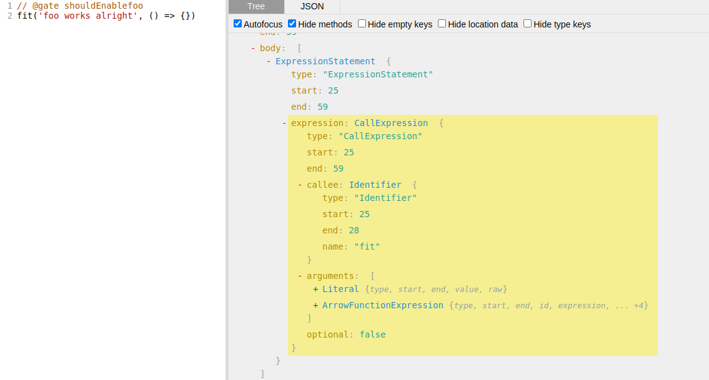

## Introduction

This article is part of my learning journey as I explore React’s source code. At some point, while reading some tests, I stumbled upon something like this:

```jsx
// @gate enableSuspenseList
it('warns if an unsupported revealOrder option is used', async () => {
  ....
 }); 
```

At first sight, it didn’t tell me much - just a comment and a test case. Then, I noticed this _gate comment_ appeared more and more frequently and then I started looking into it. In this article, I’d like to share my findings, which are pretty much about Babel, Jest and a Abstract Syntax Trees. 

By the end of this article, we should get some insights regarding:

- the way React sets up its testing environment in a flexible way
- how Jest is smartly used by React
- what *pragmas* are as a general concept and how they can be implemented with Babel

A few prerequisites for this article would be some familiarity with [Abstract Syntax Trees](https://en.wikipedia.org/wiki/Abstract_syntax_tree)(henceforth AST) and some basic knowledge of [Babel](https://babeljs.io/).

Let’s get the ball rolling!

## What are *pragmas* and why are they useful?

In simple terms, p*ragmas* can be thought of as additional instructions or hints given to the compiler. 

Babel is a JavaScript compiler and also provides an API whereby the developer can modify AST(i.e. Abstract Syntax Trees) nodes as they’re being visited. This way, by using its API and some clever(but intuitive) logic, we can bring the concept of ***pragmas*** to Babel.

When it comes to React, *******pragmas******* are used to run tests conditionally based on the environment. For example:

```jsx
// @gate enableSuspenseList
it('warns if an unsupported revealOrder option is used', async () => {
  ....
 }); 
```

*The link to the actual test case can be found [here](https://github.com/facebook/react/blob/v18.2.0/packages/react-reconciler/src/__tests__/ReactSuspenseList-test.js#L48).*

If the variable `enableSuspenseList`(we well see where it is defined and how exactly it is retrieved later in the article), then the test case below it will run.

We’ll see how this can be achieved in the following sections.

## An overview on React’s testing environment

React uses Jest for testing. Since the tests cases are written using the JSX syntax, React also uses Babel to transpile the JSX code into valid JavaScript code which can then be understood by Jest.

The way React achieves that is by using a custom Jest transformer that is to be applied for **all the files** in the code base. The Jest option that allows that is called [`transform`](https://jestjs.io/docs/configuration#transform-objectstring-pathtotransformer--pathtotransformer-object) and it can accept a function that decides how each file needed for the testing task should be processed. 

> More about code transformation in Jest can be found [here](https://jestjs.io/docs/code-transformation).
> 

Concretely, React specifies the custom transformer function this way:

```jsx
transform: {
    '.*': require.resolve('./preprocessor.js'),
  }, 
```

*The above snippet has been excerpted from [this configuration file](https://github.com/facebook/react/blob/v18.2.0/scripts/jest/config.base.js#L12-L14).*

The file `preprocessor.js` leads to a function that, as previously mentioned, is responsible for properly processing **every file**(denoted by the `'.*'` regex) encountered during the testing process. Let’s take a quick look at how it is defined:

```jsx
function(src, filePath) {
  if (filePath.match(/\.css$/)) {
		// ...
  }
  if (filePath.match(/\.coffee$/)) {
    // ... Compile CoffeeScript file ...
  }
  if (filePath.match(/\.ts$/) && !filePath.match(/\.d\.ts$/)) {
    // ... Compile TypeScript file ...
  }
  if (filePath.match(/\.json$/)) {
    // ...
  }
	
  // Transpiling the source code into valid JavaScript code.
	return babel.transform(
        src,
        otherBabelOptions
		)
}
```

*The link to the complete implementation can be found [here](https://github.com/facebook/react/blob/v18.2.0/scripts/jest/preprocessor.js#L56).*

After the file has been successfully processed, it can be then loaded and executed by Jest and, as a result, the tests will finally run.

The **main takeaway** to take from this section is that, before letting Jest do its magic, an additional preprocessing step is carried out by Babel. As we will see in the following section, during this processing step we will be able to implement a _pragma_ that will skip a test case based on some conditions.

## What does writing a custom pragma actually involve?

> As we will see, this section is heavily based on Abstract Syntax Trees(i.e AST) and their usage in Babel, so, for that, I would recommend reading a bit upon these topics from this [great resource](https://github.com/kentcdodds/babel-plugin-handbook#visitors).
> 

The short answer to the question in the title is to use a write a custom **Babel plugin** that will alter certain AST nodes such that, when Jest executes the resulted code, it will know it has to skip the test case in question.

Let’s take a simple example in order to get a better understanding of what we are trying to achieve:

```jsx
// @gate shouldEnableFoo
fit('foo works alright', () => {})
```

> There is no particular reason as to why `fit` has been used instead of `it`. *f* stands for *****focus.*****
> 

Let’s assume the variable `shouldEnableFoo` has been defined in a `.js` file and it has the value set to `true`. Thus, when running Jest, the test case should run.

This is what the AST of the above snippet looks like:



*The link to the above AST Explorer playground can be found [here](https://astexplorer.net/#/gist/1b109a974b9f61a5017d0efe1aa69155/500d00eb42e3429e766be9ad52f1cf147592d3f5).*

There a few things to be noticed:

- to AST node that encapsulates `fit(...)` is of type `ExpressionStatement`
- `ExpressionStatement` nodes can be narrowed down to even more explicit *expression nodes*; as can be seen in the image, `fit(...)` is a `CallExpression`(denoted by the `expression` property), which makes sense, because, in essence, a function is called
- another example of a more specific `ExpressionStatement` node is `BinaryExpression`:


Knowing the type of the AST node is central to properly creating a plugin that will allow us to implement *******pragmas******* with the help of Babel. Additional information on how to create custom Babel plugins can be found [in this resource](https://github.com/kentcdodds/babel-plugin-handbook#writing-your-first-babel-plugin), which has also been mentioned in the beginning of this section.

Let’s go a bit into detail on how this plugin will work:

- it will handle AST nodes whose type is `ExpressionStatement` and their `expression` property is of type `CallExpression` - the reason is that each test case is defined by calling a function, e.g. `fit('description', () => { ... })` or `it('description', () => { ... })`
    
    ```jsx
    return {
        name: 'test-gate-pragma',
        visitor: {
          ExpressionStatement(path) {
            const statement = path.node;
            const expression = statement.expression;
            if (expression.type === 'CallExpression') {
    					...
    			}
    		}
    	}
    }
    ```
    

- once such AST nodes are visited, the plugin will **get the comments** that are placed right above the line where the test case is defined - since we are dealing with AST nodes, they will also contain information such as their location(e.g. line number, column number); we also have access to all of the comments in the file(along with their location as well), so we can basically filter them out based on their line number and the line number of the `CallExpression` node
    
    ```jsx
    switch (callee.type) {
      case 'Identifier': {
        if (
          callee.name === 'test' ||
          callee.name === 'it' ||
          callee.name === 'fit'
        ) {
          const comments = statement.leadingComments;
    			...
    		}
    	}
    }
    ```
    
- if we are left with a comment that starts with `'@gate'`, then we can carry on and take the expression after the string
    
    ```jsx
    for (const line of comments) {
      const commentStr = line.value.trim();
      if (commentStr.startsWith('@gate ')) {
        const code = commentStr.slice(6);
        const condition = parse(code);
        ...
      }
    }
    ```
    
    > Some line of codes have been removed for the sake of simplicity.
    > 
    
    the `parse()` function will simply parse the expression, which means it will return the AST representation of that expression; this is necessary because, at this point, we are only working with ASTs
    
- if the expression after `'@gate'` is successfully parsed, then we know we have to **alter this `CallExpression` AST node** - the way we are going to do that is by:
    - **changing the function name** to a name of a **globally declared function** - doing `expression.callee.name = 'globally_declared_function'`
    - `'globally_declared_function'` will have access to an object that contains all the variables based on which tests are skipped or not and will also have access to all the initial arguments passed to `fit(...)`, which are the **description string** and the **function that contains the assertions**
        
        ```jsx
        callee.name =
          callee.name === 'fit' ? '_test_gate_focus' : '_test_gate';
        expression.arguments = [
          t.arrowFunctionExpression(
            [t.identifier('ctx')],
            condition
          ),
          ...expression.arguments,
        ];
        ```
        
        Here, `'globally_declared_function'` is either `_test_gate_focus`(when `fit()` has been used) or `_test_gate`(when `it()` has been used).
        `t.arrowFunctionExpression` will create an arrow function which implicitly returns `condition`.
        

*The actual plugin implementation can be found [here](https://github.com/facebook/react/blob/v18.2.0/scripts/babel/transform-test-gate-pragma.js#L266-L270).*

When Jest loads and executes the resulted code, it will call, in this example, `_test_gate_focus(gateFn, descriptionString, assertionsFunc)`, where `gateFn` is the ********************************************************************function that corresponds to the******************************************************************** `'@gate'` expression. This function will be used by `_test_gate_focus`, which **has access** to all the variables(which can also be thought of as flags) based on which tests will skipped or not.

Now, the cherry on the take, the implementation of `_test_gate_focus`:

```jsx
global._test_gate_focus = (gateFn, testName, callback) => {
    let shouldPass;
    try {
      const flags = getTestFlags();
      shouldPass = gateFn(flags);
    } catch (e) {
      test.only(testName, () => {
        throw e;
      });
      return;
    }
		if (shouldPass) {
      test.only(testName, callback);
    } else {
      test.only(`[GATED, SHOULD FAIL] ${testName}`, () =>
        expectTestToFail(callback, gatedErrorMessage));
    }
  }; 
```

*The link for the above snippet can be found [here](https://github.com/facebook/react/blob/v18.2.0/scripts/jest/setupTests.js#L288).*

- `getTestFlags()` will get all the flags, which can come from different configuration files
- the `gateFn()` is invoked in order to determine whether the test should be expected to pass or not
    
    > Until now, the notion of _a test being skipped_ has been used, but, in reality, if the _gate expression_ fails, the test case that corresponds to it is expected to fail as well. It is, indeed, a slight difference between a test _being skipped_ and _being expected to fail_ but, in my opinion, this difference is not really relevant in the context of this article.
    > 

To quickly recap what we have been talking about until now:

- React uses Jest for testing and Babel for transpiling the code from JSX to valid JavaScript code, that can then be understood by Jest
- we can implement _pragmas_ by **intervening** in the Babel’s traspiling process by creating a custom plugin
- the plugin’s logic will be invoked when the `ExpressionStatement` nodes are visited; the logic involves, first of all, determining whether the expression is preceded by a _pragma comment_ and then, if that’s the case, wrap the test case’s arguments in a globally declared function which has access to all the environment flags and which also is given a function that properly describes the _pragma expression_; the latter function will then be called with the environment flags
- Jest will stumble upon the globally declared function instead of the initial test case expression and that is enough to determine whether the test case should run or not

This entire process can be visualized with the help of this diagram:


*The link the to above Excalidraw diagram can be found [here](https://excalidraw.com/#json=rsX64bftFEMdh_ao0604S,djzqxSPTEcZwg__2cYb_Ng).*

## Conclusion

In this article we have gone through many concepts and, ironically, none of them directly concerned React. At least we have got a better understanding of not only how React sets up its testing environment, but also about how Babel can be used to achieve very useful features.

Thanks for reading!
