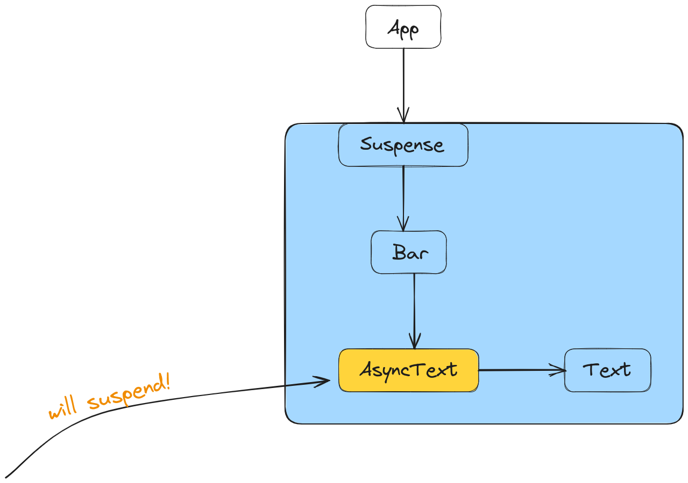

<!-- https://excalidraw.com/#json=Joq4cmAmyw2jqOhHT-Tkp,aOkzcD-Fbwmp2L0Cyi5UWA -->

## Introduction

I have to admit, the title sounds a bit ambiguous. But, the idea of this article came to mind after I have stumbled across a very interesting test case for the React’s `Suspense` component. I thought it was something definitely worth sharing.

*****Throttling***** can be taken into account when we consider **************nested************** `Suspense` components. What is actually meant by **********throttling********** is ********delaying******** showing the **fallback component** of a nested `Suspense` component **immediately after** its parent `Suspense` component has stopped suspending. This will make more sense by the end of this article.

We will first cover some basics of the `Suspense` component, then we will move to the interesting bits of this article.

> For the record, the test case this article is based on is called *[does not throttle fallback committing for too long](https://github.com/facebook/react/blob/main/packages/react-reconciler/src/__tests__/ReactSuspense-test.internal.js#L292C7-L292C57).*
> 

Let’s get started!

## Why do Suspended components throw errors?

There answer is that `Suspense` mimics the behavior of [error boundaries](https://react.dev/reference/react/Component#catching-rendering-errors-with-an-error-boundary).

In order to understand how the `Suspense` component works, we will essentially have to understand how error boundaries work. So, surprisingly, we will solve two problems at once, which doesn’t sound quite bad.

In the next section, we will quickly touch on the fundamentals of the `Suspense` component.

## A basic example of a Suspense component

This is the example we’re going to use throughout this section:

```jsx
function Bar(props) {
  return props.children;
}

function AsyncText({text}) {
    // `readText()` will trigger the `<Suspense />` component.
		readText(text);
		return text;
}

function Text({text}) {
    return text;
}

// ==================================

function App () {
	<Suspense fallback={<Text text="Loading..." />}>
		<Bar>
      <AsyncText text="A" />
      <Text text="B" />
    </Bar>
	</Suspense>
}
```

> The above example is heavily inspired by [React’s Suspense test suite](https://github.com/facebook/react/blob/v18.2.0/packages/react-reconciler/src/__tests__/ReactSuspense-test.internal.js).
> 

In the snippet above, `AsyncText` will be responsible for fetching data and, as a result, for making the `Suspense` component show the `fallback` component declared as a prop. For the purpose of simplicity, we are not going to focus on `<AsyncText />`'s `readText()` function - it suffices to know that the function will **throw** **a promise** the first time it is invoked and, while the data is fetched(i.e. during the ********pending******** state), the `Suspense`'s `fallback` component will be shown. When the data has arrived, React will know when to ****stop**** showing the `fallback` component and render the subtree whose root is the `<Bar />` component.

The component hierarchy can be visualized this way:



> The `AsyncText` and `Text` components are placed this way(on the same row and only one arrow connecting them) because this resembles the actual way React structures Virtual DOM nodes. In this case, they are **********sibling components**********. More about the React’s Virtual DOM implementation can be [found here](https://indepth.dev/posts/1501/exploring-how-virtual-dom-is-implemented-in-react).
> 

Notice how we have delimited the `Suspense`'s subtree in blue.

Now, on the first render, when the `AsyncText` component will be rendered, the `readText()` function will inevitably be invoked. When that happens, that function will ********************************throw a promise********************************. What happens next is that React ************************************************************will temporarily stop the rendering process************************************************************ because it has to **********************************find the closest********************************** `Suspense` component relative to the `AsyncText` component. In this case, it’s obvious which `Suspense` component will be chosen:


At this point, once the closest `Suspense` component has been found, that component must render the provided `fallback` component and basically ****************suspend**************** its content.

In the next section, we will see how React handles nested `Suspense` components.

## Nested Suspense components

Our example for this section looks like this:

```jsx
function AsyncText({text}) {
    // `readText()` will trigger the `<Suspense />` component.
		readText(text);
		return text;
}

function Text({text}) {
    return text;
}

// ================================

function App() {
	return (
	  <Suspense fallback={<Text text="Loading..." />}>
	    <AsyncText text="A" />
	    <Suspense fallback={<Text text="Loading more..." />}>
	      <AsyncText text="B" />
	    </Suspense>
	  </Suspense>
	);
}
```

And here is the corresponding diagram:


> The above example is heavily inspired by [React’s `<Suspense />` test suite](https://github.com/facebook/react/blob/v18.2.0/packages/react-reconciler/src/__tests__/ReactSuspense-test.internal.js).
> 

Notice how the two `Suspense` subtrees are colored in blue and green, respectively.

Before going any further, there is an interesting question I’d like you to ponder a bit: _which `Suspense` subtree will **suspend first**_? The blue one or the green one?*

Firstly, we can all agree that the ****App**** component will render first. Then, its single `Suspense` child will render. Then, since the the *AsyncText A component* will have to render first(because it’s the first child), its rendering will cause **********a promise to thrown**********(due to the `readText()` function) and, as a result, the *blue* `Suspense` will suspend first. The *****green***** one won’t even be reached because the fallback will be shown:


*What happens after `readText('A')` resolves?*

The answer is that the **rendering process will continue** from where it left off: the ****blue**** `Suspense` component. Now, when the *****AsyncText A***** component is rendered, its `renderText('A')` function ****************************************will no longer throw**************************************** - it will act normally. So, this means the rendering process can continue, the next rendered component being the *****green***** `Suspense`.

When the ************AsyncText B************ component is reached, its `readText('B')` will ******************************throw a promise****************************** and, then, it will be caught by its closest `Suspense` wrapper - in this case, the *****green***** one.

************Now, we have reached the interesting part - the throttling************.

*What will be throttled/delayed?*

Since a subtree(i.e. the *green* one) has been ******************suspended****************** as a result of **resuming** the rendering of the *****blue***** `Suspense`, React **********************will not commit the new changes to the DOM immediately**********************. By *new changes*, we mean showing the fallback component of the *****green***** `Suspense`. It’s true that React will actually ************render************ or, in other words, will determine what the new changes are, but, once again, it will not commit them to the DOM. This is how the ********not-committed-yet-to-the-DOM******** Virtual DOM looks like after the ******green****** `Suspense` has caught the promise thrown from the ******AsyncText B****** component:


While one would expect the web page to now show the content of ***********AsyncText A*********** **and** the content of ******green****** `Suspense`'s ******************fallback****************** component, ****************************************************this will not happen immediately.****************************************************

In fact, this is the what the browser shows:


So, it shows the content that was shown before the **AsyncText A**’s data has arrived.

*For how long?*

Definitely not for too much. The exact number depends on the timestamp of the moment a ********fallback******** has been shown, plus a constant number of milliseconds.

A pseudo-code of what React does would look like this:

```jsx
setTimeout(() => {
	commitRoot();
}, msUntilTimeout);
```

*But why does it do that?* From my understanding, it does that in order to not perform a redundant commit operation to the actual DOM in case the data arrives very quickly(let’s say, in less than 300ms).

At this point, the ****blue**** `Suspense` component’s ********fallback******** is shown and a commit operation to the real DOM has been scheduled at a later point in time. From here, two things can happen:

- the data in ***********AsyncText B*********** has not been fetched in less than `msUntilTimeout`; in this case, these changes will finally be committed to the DOM:
    
    
    
    So, the browser will show whatever the ****AsyncText A**** component renders and the content of the *****green***** `Suspense`'s *****fallback***** component.
    
- the data in ***********AsyncText B*********** arrives in time(before the timeout expires) and this is what the browser will show:
    
    
    

************************************Keep in mind that************************************, until either one of the above situations materialize, the browser will show the _blue_ `Suspense`'s fallback* component. This is what was meant by ***********throttling*********** - delay showing the *****green***** `Suspense`'s *fallback* too soon, because data might arrive very quickly and **committing its corresponding fallback** to the DOM becomes **redundant**, because React will have to commit to the DOM ********************once again******************** immediately after, after the data has arrived. 

## Conclusion

I hope this article was able to share some insights about how React’s `Suspense` work.

Lastly, if you’d like to start you own journey exploring React, I’d kindly suggest checking out [React: how to debug the source code](https://andreigatej.dev/blog/react-debugging-the-source-code/).

Thanks for reading!