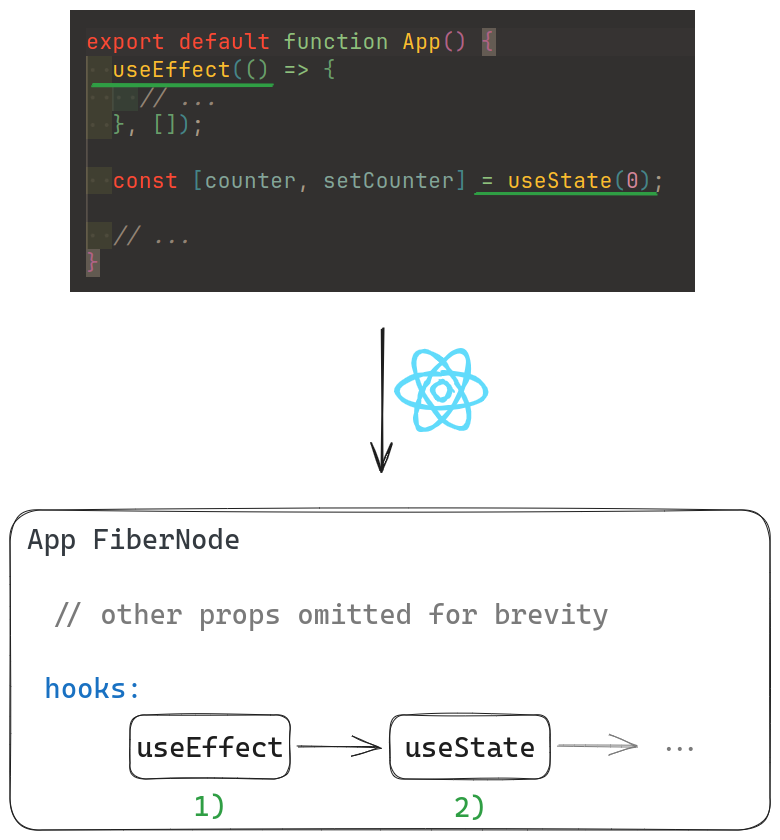

## Introduction

A while ago, I wrote an article about how [Virtual DOM is implemented in React](https://indepth.dev/posts/1501/exploring-how-virtual-dom-is-implemented-in-react). In this article, we are going to continue our journey onto *how React works under the hood*(sounds like a good name for a journey, right?) by exploring a special aspect of `useEffect()`, namely when effects are scheduled to be run.

Although the article linked previously is not necessary in order to get the most out of this article, it is worth checking it out - it will help you get a better overall understanding of React and will most likely ease the process of exploring it further. [Here](https://indepth.dev/posts/1501/exploring-how-virtual-dom-is-implemented-in-react) is once again the link to it.

Lastly, if you’d like to embark on this React journey, I have written an article that describes a way to explore React by debugging its tests - [React: how to debug the source code](https://andreigatej.dev/blog/react-debugging-the-source-code/)*.*

Let’s get started!

## A quick note on what hooks really are

Having in mind that Virtual DOM nodes(also known as `FiberNode`s in React’s implementation of VDOM) are, in essence, JavaScript objects with certain properties, hooks can also thought as being among these *******special******* properties.

It’s irrelevant to mention the exact properties - the gist is that React keeps track of hooks with the help of a **********************linked list**********************. This entails that hooks must be called in a ************************strict order************************ upon subsequent re-renders and this is also part of the reason(if not the entire reason itself) as to why one can’t call hooks conditionally.

Here’s a quick illustration that might help:



*[Link for the above diagram.](https://excalidraw.com/#json=b5v3CBUltfQCG3_KufXQ8,wPP7MQ-SG50RAMz6quBJZQ)*

> Note: `hooks` is **not** the actual property that is responsible for keeping track of hooks. It’s there just for simplicity’s sake.
> 

When it comes to the `useEffect` hook, it requires an additional property in order to be able to queue the *******effects******* need to be called at a certain point. Again, the actual name of the property is irrelevant, but it’s important to know that it exists. 

In the next section, we are going to reiterate some well-known aspects of `useEffect`, just to recap.

## What you might already know about `useEffect`

You might already have a basic idea of how `useEffect` works. If not, a quick Google search will reveal the gist of it: it allows you to run some logic **after the browser has (re-)rendered**. 

Usually, developers don’t need to know more than that in order to be productive. I myself didn’t worry too much about what’s going on under the hood in the beginning. However, there is a question that keep on *bothering* me for a while: ************************************************************************************************************************how does React know to schedule a task(i.e. a piece of code to be executed) after the browser finishes re-rendering?************************************************************************************************************************

Or, put differently, *how can one schedule a task to be run after a browser’s rendering tasks?*

> *Rendering tasks* are tasks like determining the coordinates of elements, painting pixels on the screen and properly positioning elements on the *Z* axis. A visualization of these tasks, which are part of the browser’s rendering pipeline, can be found [here](https://web.dev/rendering-performance/#the-pixel-pipeline).
> 

We are going to answer this question in the next section.

## What’s more to know about `useEffect`

Whenever a component uses `useEffect`, its corresponding `FiberNode` will be flagged accordingly. Such flags are set during the *******render******* phase and they are useful during the *******commit******* phase. The latter phase also represents the moment when React will ****************schedule**************** the action of running all the effects. 

The way React ensures that effects are run ****************************************after the browser finishes rendering**************************************** is by using the [MessageChannel API](https://developer.mozilla.org/en-US/docs/Web/API/MessageChannel). If the name of the API does not seem intuitive for the current situation is because it really isn’t. In fact, this API is most likely to be used as a means to communicate between browser threads. 

[This is how](https://github.com/facebook/react/blob/v18.2.0/packages/scheduler/src/forks/Scheduler.js#L569-L574) React makes use of the `MessageChannel` API to schedule tasks:

```jsx
const channel = new MessageChannel();
const port = channel.port2;
channel.port1.onmessage = performWorkUntilDeadline;
schedulePerformWorkUntilDeadline = () => {
  port.postMessage(null);
};
```

- `performWorkUntilDeadline()` is where scheduled tasks(among which can be the one responsible for running the registered effects) are being processed based on their priorities
- `schedulePerformWorkUntilDeadline()` is the function that, when invoked, ****************will schedule**************** `performWorkUntilDeadline()` to be executed **after the browser finishes rendering**

Now, another question arises - **what’s so special about the `MessageChannel` API?**

It’s a question I have very recently found an answer to, thanks to a very interesting [blog post](https://www.webperf.tips/tip/measuring-paint-time/#messagechannel) on [webperf.tips](http://webperf.tips) which says that:

> `MessageChannel` is being used here as a generic mechanism to *Post a Task to the Task Queue*.
> 
> 
> Furthermore, Tasks posted to the Task Queue via `MessageChannel` are prioritized above most other Tasks.
> 

Besides rendering tasks(e.g. ******layout******, ******paint, composite******), there are also tasks that have to be run as a result of user interaction(e.g. `keyup` event) or as a result of other factors(e.g. `setTimeout()`, parsing a file, etc.). So, we have just learned that tasks scheduled with the help of the `MessageChannel` API will have higher priority compared to other non-rendering tasks. Moreover, it’s important to reiterate that these **non-rendering tasks** will be **executed after** **rendering tasks**.

[This article](https://web.dev/optimize-long-tasks/#task-management-strategies) describes other ways to schedule tasks, such as ******************************************************yielding to the main thread******************************************************, using the `scheduler.postTask()`, `scheduler.yield()` and `requestIdleCallback()`, but some of these APIs are not fully supported among popular browsers or might not fulfill some requirements. It’s definitely worth checking [the article](https://web.dev/optimize-long-tasks/#task-management-strategies) out!

## Conclusion

Although this article was more about browser internals than React’s `useEffect` hook, I believe (and hope) it was helpful in the end. Personally, I’m very glad that I have got more acquainted with how browsers do their magic. 

Thanks for reading!

## References

While writing this article, I stumbled upon some very interesting resources related to how browsers work:

- [https://www.webperf.tips/tip/measuring-paint-time](https://www.webperf.tips/tip/measuring-paint-time/#messagechannel)
- [https://www.webperf.tips/tip/event-loop/](https://www.webperf.tips/tip/event-loop/)
- [https://www.webperf.tips/tip/long-tasks/](https://www.webperf.tips/tip/long-tasks/)
- [https://www.webperf.tips/tip/performance-timing-markers/](https://www.webperf.tips/tip/performance-timing-markers/)
- [https://web.dev/rendering-performance/](https://web.dev/rendering-performance/#the-pixel-pipeline)
- [https://web.dev/optimize-long-tasks/](https://web.dev/optimize-long-tasks/)
