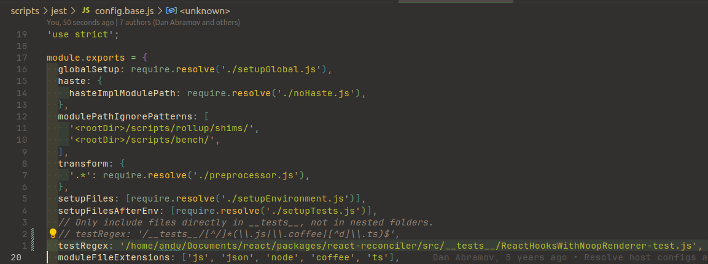
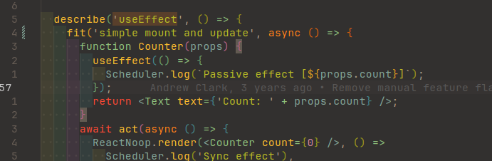
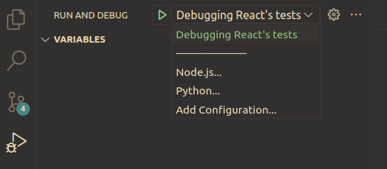
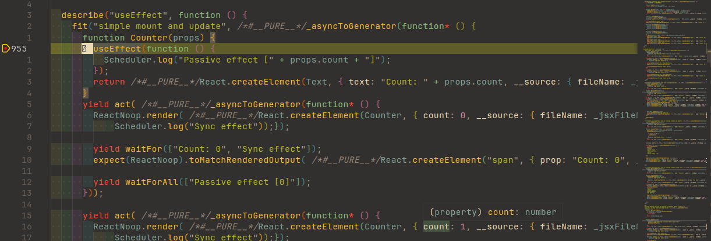
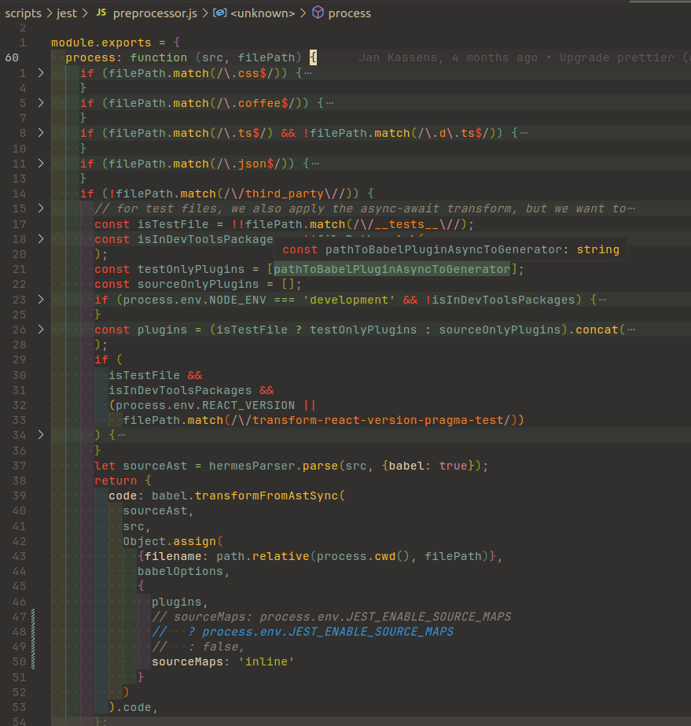
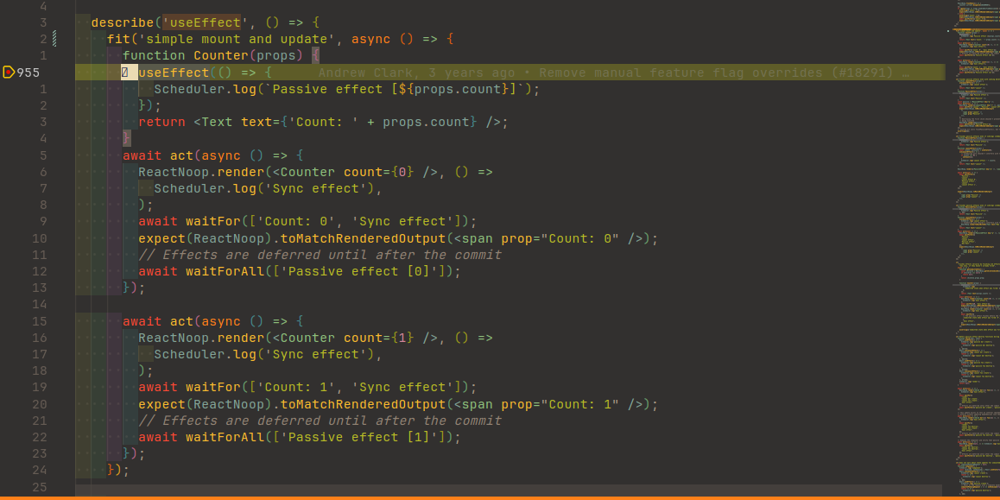
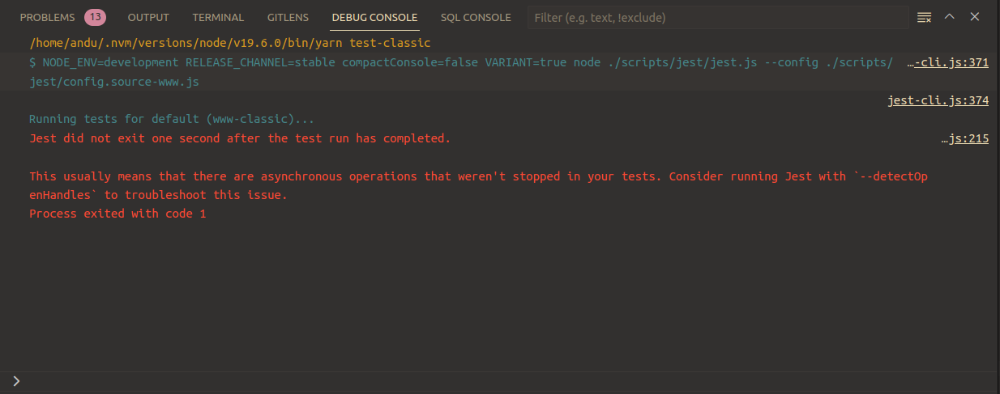
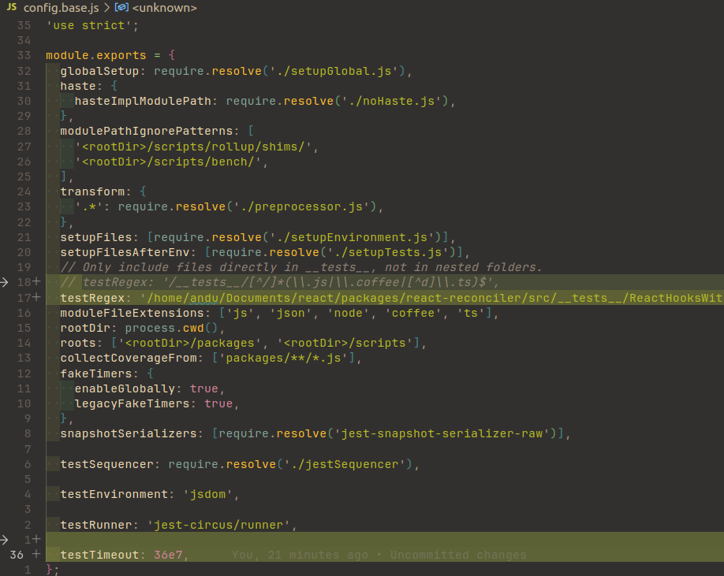

## Introduction

I genuinely think that exploring the source code of a tool is one of the best ways to become a better programmer.

From my experience, the more _magical_ a tool seems, the more interesting it will be to explore its source code. Hence, in this article we'll see how to explore React's source code by debugging its tests.

## Debugging React in VS Code

This section will provide the necessary steps required in order to have a decent Developer Experience(i.e. DX) while debugging React's tests.

### Cloning and setting up the repo

```bash
git clone git@github.com:facebook/react.git
```

Let's now install the required dependencies:

```bash
cd react
yarn
```

### Configure the `launch.json` file

This file is used to configure the debugger:

```json
{
  "version": "0.2.0",
  "configurations": [
    {
      "type": "node",
      "request": "launch",
      "name": "Debugging React's tests",
      "runtimeExecutable": "yarn",
      "runtimeArgs": [
        "test-classic"
      ],
      "sourceMaps": true,
    },
  ]
}
```

The `'test-classic'` script runs only some tests. Please refer to the `package.json` file to see what other types of tests can be run.

What we're achieving with the configuration above is to attach the debugger to the `yarn test-classic` command. 

### Select a test file that you'd like to explore

The tests are usually located in the `<package>/__tests__/*` directory, where `<package>` is the package that is to be explored. For example, we can pick `/react/packages/react-reconciler/src/__tests__/ReactHooksWithNoopRenderer-test.js`, which contains many test cases for hooks.

Once selected, please follow these steps:

1. get the absolute path of the file; in VS Code, this can be done by doing `CTRL + K P`
2. paste the absolute path as the value for the `testRegex` property from the `scripts/jest/config.base.js` file

    

### Extra tip for a better debugging experience

A test file might have a lot of test cases(denoted by the `it('...', () => {})` function). In order to focus on a certain test case so that Jest won't spend any additional time on others, you can simply change `it()` to `fit()`: 



### Debugging a test for the first time

At this step, we should have a decent set-up that should allow us to debug some tests.

Let's see this in action by:

1. adding some breakpoints to the test file
2. selecting the _Run and Debug_ tab
3. selecting the debug configuration we have set previously
4. start the debugging process either by pressing on the green button or by pressing _F5_

    

After short time(it usually takes longer than usual when run for the first time), we should see something like this:



Although it works, it doesn't look very nice. Indeed, it could've been worse - at least the code is not minified and/or obfuscated. We can do better. Let's see how in the next section.

### Improving the DX - enabling source maps

As we have seen, the code does not look exactly like the original source code. That's because the source maps have not been enable. 

> React uses Jest for testing and Babel to compile the JSX code that is to be used in tests.

We can enable the source maps this way:

1. go to the `scripts/jest/preprocessor.js` file
2. locate the `process` function
3. at the end of this function, there should be an object being returned and somewhere in there should be a property called `sourceMaps`
4. set the value of `sourceMaps` to `'inline`'`

    

Now, things look a bit nicer:



There is one more problem, though. If you don't finish debugging in less than 5 seconds, Jest will stop the process:



> Although it doesn't explicitly say 5 seconds, this is the [default value](https://jestjs.io/docs/configuration#testtimeout-number).

Let's see how to solve this problem in the next section.

### Improving the DX - extending the Jest timeout

The solution lies in a Jest configuration property, namely `testTimeout`:

1. go to the `scrips/jest/config.base.js` file
2. add the `testTimeout` property with a value long enough(e.g. 10 hours) so that the debugging session won't be interrupted when we expect the least

    

Now, we should be able to debug and explore React without any inconvenience.

## Why I think it's worth it

One of my favorite aspects about exploring a tool is that I will inevitably stumble upon interesting adjacent concepts. That usually means new questions, new curiosities, new tools to be explored.

When it comes to React(or any tool, really), I feel that knowing (mostly) what's going on under the hood makes me more confident in the code I write and allows me to properly investigate bugs when they appear. 

## Conclusion

In this article, we have seen how we can set up an environment to start exploring React.

I hope this will enrich your learning journey at least as much as it did for me.

Thanks for reading!
