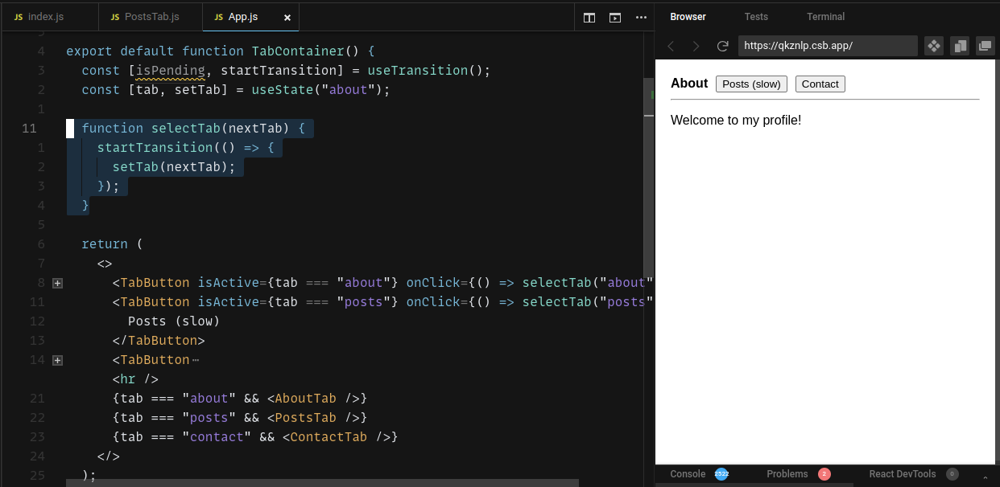

<!-- https://excalidraw.com/#json=CsOc3Doai8_kgfIjPiBeM,pnKdJiggoHyUc7jo3oYTHw -->

## Introduction

It’s not the first time React seemed like magic to me. But, this time, reading the *[Marking a state update as a non-blocking transition](https://react.dev/reference/react/useTransition#marking-a-state-update-as-a-non-blocking-transition)* section from the `useTransition` documentation really caught my attention. 

In this article, besides sharing how the concurrent mode works with the help of React’s transitions, I will also walk you through my reasoning process that I employ whenever I try to arrive from *having no idea how this works* to *****************I finally get it!*****************.

It’s worth mentioning that, this time, I took a ********roundabout approach******** to explaining a concept. We will heavily make use of the `startTransition` function from the `useTransition` hook to finally arrive to how ***************concurrent mode*************** works. First, we will introduce the problem, then we will test some assertions and, at the end, things should(and hopefully) make sense.

Let’s get started!

## Introducing the problem

[Here is the link](https://codesandbox.io/s/objective-ride-qkznlp?file=/App.js) to the CodeSandbox application that this article will be based on. As mentioned earlier, this example has been extracted from [this section](https://react.dev/reference/react/useTransition#marking-a-state-update-as-a-non-blocking-transition) of the React’s `useTransition` documentation:



The `PostTab` is slow in terms of rendering time:

```jsx
const PostsTab = memo(function PostsTab() {
  // Log once. The actual slowdown is inside SlowPost.
  console.log("[ARTIFICIALLY SLOW] Rendering 500 <SlowPost />");

  let items = [];
  for (let i = 0; i < 1000; i++) {
    items.push(<SlowPost key={i} index={i} />);
  }
  return <ul className="items">{items}</ul>;
});

function SlowPost({ index }) {
  console.log("rendering post " + index);
  let startTime = performance.now();
  while (performance.now() - startTime < 1) {
    // Do nothing for 1 ms per item to emulate extremely slow code
  }

  return <li className="item">Post #{index + 1}</li>;
}
```

The `PostsTab` component acts as a container for multiple `SlowPost` components, each of them requiring 1 millisecond to render. So, if there are 1000 posts to be rendered and each post corresponds to a `SlowPost` component, the total rendering time for the `PostsTab` component will be 1 second. One would expect that, during this period of **1 second**, the **browser would become unresponsive** to user interaction. However, this is **not going to happen** due to **setting the state** that would *********normally********* result in a noticeable freeze in a `startTransition` callback:

```jsx
function selectTab(nextTab) {
    startTransition(() => {
			setTab(nextTab);
    });
  }
```

In order to **see this in action**:

1. while being on the *****About***** page, select the *******Posts (slow)******* tab
2. immediately(i.e. while the *Posts* page isn’t shown in the page) click on the *******Contact******* page

If the *Posts* page seems to show too quickly, you can increase the number of posts from 1000(i.e. 1 second to render) to a larger amount.

As you can notice, there was no delay after quickly selecting the ********Contact******** page right after selecting the ******Posts****** page. Using `startTransition` is what makes this smooth user experience possible.

In order to **************feel the magic************** of `startTransition`, try commenting out the `startTransition` parts and follow the steps from above:

```jsx
function selectTab(nextTab) {
//    startTransition(() => {
			// If `nextTab === 'post'` -> noticeable browser freeze for the user!
      setTab(nextTab);
//    });
  }
```

Now, if, for example, 2000 posts must be rendered, you should notice a 2 second freeze period after clicking on the ********Posts (slow)******** tab.

After seeing the difference the `startTransition` function makes, I felt deeply impressed. It really seemed like something magical must be going on. I’d lie if I were to say that it didn’t keep me up at night.

In the following sections, we are going to go through my reasoning process and, hopefully, at the end of it, we will understand what makes this user experience possible.

## Why does the browser freeze when not using startTransition?

*For reference, [here is the CodeSandbox](https://codesandbox.io/s/objective-ride-qkznlp?file=/PostsTab.js) for the example in question.*

This was the question that, in my opinion, set me on the right track. By finding out the answer to this question, we will essentially find out the problem that the `startTransition` function is trying to solve, and I think this is a great starting point.

The key to finding this answer is understanding what really *rendering* means in the context of React. ***************What does it mean for a component to be rendered?*************** - in very simple terms(I don’t even think there could be more to be said here, to be honest), *rendering* means to invoke a function that represents a React component.

Let’s bring up once again the part that indicates a slow render:

```jsx
// ==========================================================
function SlowPost({ index }) {
  console.log("rendering post " + index);
  let startTime = performance.now();
  while (performance.now() - startTime < 1) {
    // Do nothing for 1 ms per item to emulate extremely slow code
  }

  return <li className="item">Post #{index + 1}</li>;
}
// ==========================================================

// Some details have been skipped for brevity.
function PostsTab() {
  const items = [];
  for (let i = 0; i < 1000; i++) {
		items.push(<SlowPost index={i} />)
	}
}
```

So, rendering the `PostsTab` component means executing the `PostsTab()` function. This implies that the `SlowPost` function will have to be invoked 1000 times and, since invoking `SlowPost` requires 1 millisecond, the total rendering time will be 1 second.

Now that we have got an understanding of that **********rendering********** means, we have also got the first hint: it’s the *rendering* that takes a lot of time, **not the browser building the web page**. Or, in other words, it’s the ***************rendering phase,*************** not the action of **********committing********** rendered elements to the real DOM. 

> Yes, there is a clear distinction between *rendering*(i.e. invoking functions while determining new changes that would have to be eventually be shown in the real DOM) and ****committing**** to the DOM. What’s also interesting is that the ******commit****** phase does not have to always come after the ******render****** phase. For instance, a tree of Virtual DOM nodes can be rendered, but their **********commitment********** to the real DOM can be delayed. Such example can be found in an article I wrote a while ago, *[On React Suspense’s throttling](https://andreigatej.dev/blog/on-react-suspense-throttling/#nested-suspense-components).*
> 

Concretely, what’s really going on when using this logic:

```jsx
function selectTab(nextTab) {
//    startTransition(() => {
      setTab(nextTab);
//    });
  }
```

is that, after clicking on *******Posts (slow)******* React will render the **entire tree synchronously**. It’s similar to doing something like this:

```jsx
 const renderSlowPost = (...args) => {
  const startTime = performance.now();
  while (performance.now() - startTime < 1) {
    // Do nothing for 1 ms per item to emulate extremely slow code
  }
  return;
}

const renderPostsTab = (...args) => {
  for (let postIdx = 0; postIdx < 1000; postIdx++) {
    renderSlowPost();
  }
}

// ============================================================

const selectSlowPostsTab = () => {
  // This takes 1 second - a lot!
  renderPostsTab();
  
 // This will be executed after 1 second(i.e. after the above function returns).
  commitChangesToTheRealDOM();
}
```

Of course, in reality, it’s a lot more complicated than that. But the above pseudo-code should highlight where the problem lies - *rendering*(i.e. invoking some JavaScript functions) takes a lot of time, so the user will notice the delay.

By now, we have understood where the problem lies and that, somehow, the `startTransition` function *magically* solves this by wrapping the functions that sets the state:

```jsx
function selectTab(nextTab) {
    startTransition(() => {
      setTab(nextTab);
    });
  }
```

There are also a few things that are worth taking into account: the fact that JavaScript’s execution model is [run-to-completion](https://developer.mozilla.org/en-US/docs/Web/JavaScript/Event_loop#run-to-completion), which means that a function can’t be interrupted from its execution and resumed later. For example, in languages like C, this is possible. What this language feature means to us is that the execution of `renderPostsTab`

```jsx
const renderSlowPost = (...args) => {
  const startTime = performance.now();
  while (performance.now() - startTime < 1) {
    // Do nothing for 1 ms per item to emulate extremely slow code
  }
  return;
}

const renderPostsTab = (...args) => {
  for (let postIdx = 0; postIdx < 1000; postIdx++) {
    renderSlowPost();
  }
}
```

can’t be stopped so that other tasks with high priority get the chance to be executed, ************unless************ we **apply some good practices**. 

Intuitively, if a task/function takes too long to be processed at once, we can break it into smaller chunks and process them periodically by interleaving them with other tasks that also need time on the main thread.  

In the section, we are going to state a hypothesis as to how `startTransition` really works and then we are going to prove it. This will, in the end, lead us to a better understanding of React’s ****************concurrent mode.****************

## How startTransition works - a hypothesis

We have agreed upon that dividing an expanse task into smaller ones is a good approach to solving the problem we are facing - the browser becoming unresponsive to user interactions because rendering requires too much time.

This is the **hypothesis** as to what the `startTransition` function causes - **rendering expensive tasks in chunks** and **yielding to the browser’s main thread** periodically, so that the page stays responsive. In other words, `startTransition` will kick off the ****************concurrent mode.**************** Notice, though, that `startTransition` is **************************************************************************************************not responsible for breaking a task into smaller tasks************************************************************************************************** - that’s up to the developer. We will see an example of this later in this article.

First, let’s test whether what’s been stated above it indeed true. For that, let’s bring once again [the CodeSandbox application](https://codesandbox.io/s/objective-ride-qkznlp?file=/PostsTab.js):


*Notice some relevant `console.log()` calls. The most important would be the one in the `SlowPost` component.* 

We have already tested before that `startTransition` works: clicking on ********Posts (slow)******** and then, immediately after that, on the *******Contact******* tab, will not cause the browser to freeze at all. Now, we need to test our hypothesis and, for that, we need to go deeper into how React really works.

**But first**, let’s clarify a crucial aspect - ***********************************what does it mean to yield to the browser’s main thread?***********************************

### Yielding to the main thread

JavaScript runs in a single-threaded environment. Yes, one can make use of other additional threads(e.g. via `WebWorker`, `ServiceWorker`), but there is **only one main thread**, also known as the *UI* thread. This thread is responsible not only for tasks such as executing the JavaScript code written by developers(e.g. event listeners), but also responsible for rendering tasks, parsing CSS, etc. Whenever a function is executed, the entire main thread is *******blocked******* while executing that function, because the **main thread can run only one task at a time**. This is the reason a web page could become unresponsive - the main thread is busy executing some logic.

> There is very interesting article which presents the [RAIL model](https://web.dev/rail/) - in there, you can see which delays are acceptable depending on which situations, how much milliseconds should tasks take and much more.
> 

******************Yielding to the main thread****************** means *************interrupting************* the rendering process(we will see a bit later how it is possible) and give the browser the chance to perform other tasks, such as rendering, receiving user input, etc.

************************How does React yield to the main thread?************************

There are a few browser APIs that allow React to achieve that. For example, [the documentation](https://developer.mozilla.org/en-US/docs/Web/API/Window/setImmediate) for `window.setImmediate()` says that:

> This method is used to break up long running operations and run a callback function immediately after the browser has completed other operations such as events and display updates.
> 

However, this method is not expected to be implemented in browsers. The good news is that [there are alternatives](https://developer.mozilla.org/en-US/docs/Web/API/Window/setImmediate#notes) that lead to the same result, one of them being the [`MessageChannel` API](https://developer.mozilla.org/en-US/docs/Web/API/MessageChannel).

[This is exactly how](https://github.com/facebook/react/blob/v18.2.0/packages/scheduler/src/forks/Scheduler.js#L569-L574) React uses the `MessageChannel` API in order to schedule functions to be run after the browser has performed some of its essential tasks:

```jsx
const channel = new MessageChannel();
const port = channel.port2;
channel.port1.onmessage = performWorkUntilDeadline;
schedulePerformWorkUntilDeadline = () => {
  port.postMessage(null);
};
```

The scheduling takes place once `schedulePerformWorkUntilDeadline()` is invoked - keep an eye on this function, this will be so important later on!

So, by calling `schedulePerformWorkUntilDeadline()` and after the browser has been granted the necessary time to receive user interaction and to perform other browser-related tasks, `performWorkUntilDeadline()` will be invoked and this is where React-related scheduled tasks will be run. **An example** of such tasks, especially relevant for the current situation, is a task that will **render the Virtual DOM tree** either synchronously or concurrently.

Now that we have learned about what *yielding to the main thread* means, let’s verify in the next section that `startTransition` does just that.

### Verifying that startTransition indeed works

In the previous section, we have seen that `schedulePerformWorkUntilDeadline()` will be invoked in order to schedule some work to be done after browser’s essential tasks - this contributes to a non-freezing experience for the user.

The intuition should now be that `startTransition` will lead to `schedulePerformWorkUntilDeadline()` being called ************************periodically************************. As a result, **not all** of the `SlowPost` components ******should be rendered at once******.

***********************How can we assert that?***********************

Let’s open the Dev Tools in the [CodeSandbox application](https://codesandbox.io/s/objective-ride-qkznlp?file=/PostsTab.js) and place the following logpoint:


A few key points worth noticing:

- in the leftmost panel, we have added a log that will help us understand when a `SlowPost` component is being rendered
- in the rightmost panel, he have added a logpoint to the line 538 of the `scheduler.development.js` file - this will let us know when React ********************************has interrupted the rendering process******************************** and **********************reschedules it for later**********************, after the browser will have performed its other tasks
- in the rightmost panel, on line 517, notice how `performWorkUntilDeadline()` calls `schedulePerformWorkUntilDeadline()` which will, in turn, schedule `performWorkUntilDeadline()` via the `MessageChannel` API; here is, once again, how it does that:
    
    ```jsx
    const channel = new MessageChannel();
    const port = channel.port2;
    channel.port1.onmessage = performWorkUntilDeadline;
    schedulePerformWorkUntilDeadline = () => {
      port.postMessage(null);
    };
    ```
    
    as you can notice, there is a recursion taking place; this is what ensures that React ************************periodically************************ yields to the main thread
    
- lastly, still in the rightmost panel, calling `scheduledHostCallback` will lead to (some of the) scheduled tasks being executed

Now, it’s time to see the logs in action. Having the *Console* panel visible, try clicking on ********Posts (Slow)******** tab and then, very quickly, click on the ***********Contact tab***********. After doing that, something like this should be shown in the console:


As you can see, the `SlowPosts` components **won’t be rendered all at once**, but in ************chunks************, so that the browser has enough time to be responsive to the user.

So, our hypothesis has passed this test! Again, this is due to using `startTransition`.

In the next section, we will visualize this process of *performing tasks and yielding to the browser* with the help of some diagrams. This is also referred to as *************concurrent rendering.*************

## Visualizing the concurrent rendering process

In order to understand the beauty of ********************concurrent rendering********************, it’s important to first understand how React renders a tree of components.

The React’s **synchronous** rendering process roughly looks like this:

```jsx
while (workInProgress !== null) {
  performUnitOfWork(workInProgress);
}
```

where `workInProgress` indicates the current Virtual DOM node under consideration. Calling `performUnitOfWork()` can result, for instance, in rendering a component, if `workInProgress` is currently assigned to a functional component.

Let’s consider the `PostsTab` component in the [CodeSandbox application](https://codesandbox.io/s/objective-ride-qkznlp?file=/PostsTab.js):

```jsx
const PostsTab = memo(function PostsTab() {
  let items = [];
  for (let i = 0; i < 1000; i++) {
    items.push(<SlowPost key={i} index={i} />);
  }
  
  return <ul className="items">{items}</ul>;
});

function SlowPost({ index }) {
  let startTime = performance.now();
  while (performance.now() - startTime < 1) { }

  return <li className="item">Post #{index + 1}</li>;
}
```

Here is how the corresponding Virtual DOM looks like after `PostsTab` has rendered:


> As a result of rendering, `PostsTab()` returned an array of other React elements(which will later be converted into Virtual DOM nodes).
> 

After that, each of the returned `SlowPost` children will become, one by one, `workInProgress`. 

So, firstly, `workInProgress = PostsTabNode`, then `performUnitOfWork(workInProgress)` is called, then `workInProgress = SlowPost0Node`, then `performUnitOfWork(workInProgress)` is invoked(which, in essence, means that is has rendered), then `workInProgress = SlowPost1Node` so on.

When ************************rendering concurrently,************************ the while loop looks like this:

```jsx
while (workInProgress !== null && !shouldYield()) {
    performUnitOfWork(workInProgress);
  } 
```

Notice the `!shouldYield()` part - this is the part that allows React to **interrupt the rendering process** and then **yield to the main thread.** This is what’s relevant about `shouldYield()` [implementation](https://github.com/facebook/react/blob/v18.2.0/packages/scheduler/src/forks/Scheduler.js#L441-L446):

```jsx
const timeElapsed = getCurrentTime() - startTime;
if (timeElapsed < frameInterval) {
  // The main thread has only been blocked for a really short amount of time;
  // smaller than a single frame. Don't yield yet.
  return false;
}
// ... Some details have been omitted for brevity.
return true;
```

Put differently, `shouldYield()` it checks if React has spent enough time on rendering and, if that’s the case, allow the browser to perform high priority tasks. If there is still time to render, then it goes on executing `performUnitOfWork()` until the next check of the **********while loop**********, where `shouldYield()` will be consulted again.

That’s the essence of **********************concurrent rendering.********************** Now, let’s visualize the example in question:


The above diagram (almost) corresponds to the behavior we have noticed in the console:


Let’s recap what’s going on: React renders the component tree by traversing it. The current node that is being **visited**(and about to be rendered) is **denoted** by `workInProgress`. The traversal takes place in a *while loop* which means that, before going ahead and performing work(e.g. rendering) on a `workInProgress` node, it will check if it should yield to the main thread first(i.e. denoted by the `shoudlYield()` function). 
When it’s time to yield, the **********while loop********** will **stop** and a task will be scheduled to run after the browser has done some work, while making sure the reference to the current `workInProgress` **will be kept** for the next time the rendering will be resumed.
When there is still time to render, `performUnitOfWork(workInProgress)` will be invoked and, after that, `workInProgress` will be assigned to the next Virtual DOM node that will have to be traversed.

At this point, we should have at least a slightly better understanding of how ********************concurrent rendering******************** works. But, ******************************************************************there is still something missing****************************************************************** - *how does `startTransition` activate concurrent rendering?* The short answer is that, when the function is invoked, some flags end up to be added to the ****root**** node and these flags instruct React that this tree can be rendered in ***************concurrent mode***************. 

In the next section we will see why **concurrent mode is not enough** if the work is not properly divided in smaller chunks.

## Expensive tasks should be divided into components in order for transitions to work properly

Here is [a CodeSandbox application](https://codesandbox.io/s/react-transition-not-working-6fj7jj?file=/PostsTab.js) that illustrates an example where `startTransition` becomes useless:

```jsx
const PostsTab = memo(function PostsTab() {
  let items = [];

  // The page should now be unresponsive for 4 seconds.
  for (let i = 0; i < 4000; i++) {
    // No longer dividing the task in smaller ones!
		// items.push(<SlowPost key={i} index={i} />);

    let startTime = performance.now();
    while (performance.now() - startTime < 1) {
      // Do nothing for 1 ms per item to emulate extremely slow code
    }

    items.push(<li className="item">Post #{i + 1}</li>);
  }
  return <ul className="items">{items}</ul>;
});
```

Although this is a contrived example, it should demonstrate that setting the state inside a `startTransition` callback

```jsx
function selectTab(nextTab) {
    startTransition(() => {
      setTab(nextTab);
    });
  }
```

has no effect whatsoever. Clicking on the ********Posts (slow) tab******** will cause the web page to **************************************become unresponsive************************************** and, as a result, clicking on *******Contact******* will have an effect only after 4 seconds(i.e. the required time for `PostsTab` to render).

*Why does it happen, although `startTransition` has been used?*

The initial problem was that **multiple smaller tasks** that took 1 millisecond each would be rendered synchronously(the total rendering time being ***1ms * numberOfSmallerTasks***). The problem was solved by `startTransition` because it was able to interrupt the tree traversal(and, as a result, the rendering process) so that the browser can work on high priority tasks. **Now, the problem is** ********that one single task takes 4 seconds********. Basically, the concurrent mode is useless because one single unit takes literally too much time. The concurrent mode relies on the fact that there are multiple `workInProgress` nodes that need to be traversed. 

In the initial example, there were 1000 `workInProgress` `SlowPost` components - they could easily be divided into batches of, let’s say, 5 `SlowPost` components, meaning that such batch would take 5 milliseconds. After one batch, it’s the browser’s turn to work on other tasks, then, again, another batch awaits and this keeps on repeating until there is nothing else to render.

## Conclusion

I truly hope this was a useful (and fun) learning journey.

Lastly, I think this a great way to learn: create an hypothesis in your mind(e.g. *********************************this works this way because of these reasons…*********************************), keep pondering it and then finally pursue the answer.

Thanks for reading!

## References

- [https://developer.mozilla.org/en-US/docs/Web/JavaScript/Event_loop](https://developer.mozilla.org/en-US/docs/Web/JavaScript/Event_loop)
- [https://www.webperf.tips/tip/event-loop/#:~:text=The Event Loop%2C by design,to do an asynchronous task%3F](https://www.webperf.tips/tip/event-loop/#:~:text=The%20Event%20Loop%2C%20by%20design,to%20do%20an%20asynchronous%20task%3F)
- [https://web.dev/rail/](https://web.dev/rail/)
- [https://developer.mozilla.org/en-US/docs/Web/API/MessageChannel](https://developer.mozilla.org/en-US/docs/Web/API/MessageChannel)