_This article has been published on [indepth.dev](https://indepth.dev/posts/1482/an-in-depth-perspective-on-webpacks-bundling-process)._

## Introduction

Webpack is a very powerful and interesting tool that can be considered a fundamental component in many of today's technologies that web developers use to build their applications. However, many people would argue it is quite a challenge to work with it, mostly due to its complexity.

In this series of articles I'd like to share many details about the inner workings of webpack, with the hope that it will make working with webpack look more _approachable._ This article will serve as a basis for upcoming articles in which I will dive deeper into other webpack's features. You'll learn about how lazy loading works, how tree shaking works, how certain loaders work etc. My goal with this series is for you to become _more comfortable_ when solving webpack-related problems. The objective of this article is to give you enough insights about the entire process so that you'll be able to intervene at any point in order to understand some aspects of webpack by yourself or to debug problems. Thus, in the last section we will see how to debug webpack's source code by going through its tests and some custom examples.

We will start off with a diagram that depicts, not very briefly, the entire bundling process. Some details are omitted though, as they are subjects for future articles. Then, we will expand some of the steps from the diagram. As we go along, we will also explain concepts such as modules, chunks etc. Also, to simplify comprehension, I will replace the snippets from the source code with diagrams and simplified code snippets. I will include, however, some links to the source code, maybe they will turn out to be useful.

As a convention, we will refer to `NormalModule`s simply as _modules._ There are other types of modules, such as `ExternalModule`(when using module federation) and `ConcatenatedModule`(when using `require.context()`), which are topics for separated articles. In this article, we will only focus on `NormalModule`s.

If you want to follow along and explore the source code as you read the article, there is a **Debugging webpack's source code** section that you should check out first.

## Visualizing the process with a diagram


_You can get a better experience when visualizing the diagram by viewing it 'live' in Excalidraw. [Link here](https://excalidraw.com/#json=4517412917477376,mF3yLd-gYuRzCzWZ11fo7Q)._

I'd highly recommend opening the [Excalidraw link of the diagram](https://excalidraw.com/#json=4517412917477376,mF3yLd-gYuRzCzWZ11fo7Q), as it will be used as support for the forthcoming in-depth explanations structured in sections, each of which describes a step or multiple steps from the diagram.

Let's get started!

## The `entry` object

It is very important to mention that everything starts with the `entry` object. As you might expect, it supports many configurations, hence this topic deserves an article on its own. That's why we will consider a simpler example, that one in which the `entry` object is just a collection of key-value pairs:

```ts
// webpack.config.js
entry: {
	a: './a.js',
	b: './b.js',
	/* ... */
}
```

Conceptually, a **module** in webpack is associated with a file. So, in the diagram `'a.js'` will result in a new module and so will `'b.js'` . For now, it is enough to retain that **a module is an _upgraded version_ of a file. A module, once created and built, contains a lot of meaningful information besides the raw source code, such as: the loaders used, its dependencies, its exports(if any), its hash and much more**. **Each item** in the `entry` object can be thought of as the **root module** in a tree of modules. A tree of modules because the root module might require some other modules(which can be fairly called **dependencies**), those modules might require other modules and so forth, so you can see how, at a higher level, such tree could be built. All these module trees are stored together in a `ModuleGraph`, which we will go over in the next section.

The next thing that we need to mention now is that webpack is built on top of **a lot of plugins**. Although the bundling process is well established, there are a lot of ways one could chip in to add custom logic. Extensibility in webpack is implemented through **hooks.** For example, you can add custom logic after the `ModuleGraph` has been built, when a new asset has been generated for a chunk, before the module is about to be built(runs loaders and parses the source) etc. We will also explore them in future articles, as they are very interesting and they can provide solutions to a lot of problems related to webpack customization. Most of the times, the hooks are grouped under their purpose, and for any well defined purpose there is a **plugin**. For example, there is a plugin that is responsible for handling the `import()` function(responsible for parsing the comments and the argument) - it's called [`ImportParserPlugin`](https://github.com/webpack/webpack/blob/main/lib/dependencies/ImportParserPlugin.js#L27) and all it does is to add a hook for when an `import()` call is encountered during the AST parsing.

It should come as no surprise that there are a couple of plugins which are responsible for dealing with the `entry` object. There is the `EntryOptionPlugin` which practically takes in the `entry` object and creates an `EntryPlugin` **for each item** in the object. This part is important and is also related to what's been mentioned in the beginning of this section: each item of the `entry` object will result in a tree of modules(all these trees are separated from each other). Basically, the `EntryPlugin` **[starts the creation](https://github.com/webpack/webpack/blob/main/lib/EntryPlugin.js#L48)** of a module tree, each of which will add information to the same single place, the `ModuleGraph`. Informally, we'd say that the `EntryPlugin` starts this _complex process_.

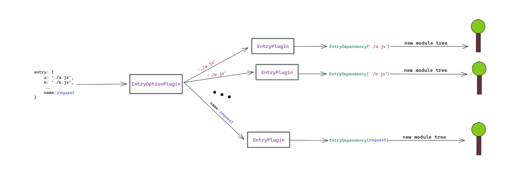

For the sake of being on par with the initial diagram, it's worth mentioning that the `EntryPlugin` is also the place where an `EntryDependency` is created.

Based on the above diagram, let's get more insights about how important the `EntryOptionsPlugin` is by loosely implementing it ourselves:

```ts
class CustomEntryOptionPlugin {
  // This is the standard way of creating plugins.
  // It's either this, or a simple function, but we're using this approach
  // in order to be on par with how most of the plugins are created.
  apply(compiler) {
    // Recall that hooks offer us the possibility to intervene in the
    // bundling process.
    // With the help of the `entryOption` hook, we're adding the logic
    // that will basically mean the start of the bundling process. As in,
    // the `entryObject` argument will hold the `entry` object from the
    // configuration file and we'll be using it to set up the creation of
    // module trees.
    compiler.hooks.entryOption.tap('CustomEntryOptionPlugin', entryObject => {
      // The `EntryOption` class will handle the creation of a module tree.
      const EntryOption = class {
        constructor (options) {
          this.options = options;
        };

        // Since this is still a plugin, we're abiding by the standard.
        apply(compiler) {
          // The `start` hook marks the start of the bundling process.
          // It will be called **after** `hooks.entryOption` is called.
          compiler.hooks.start('EntryOption', ({ createModuleTree }) => {
            // Creating new tree of modules, based on the configuration of this plugin.
            // The `options` contain the name of the entry(which essentially is the name of the chunk)
            // and the file name.
            // The `EntryDependency` encapsulates these options and also provides way to
            // create modules(because it maps to a `NormalModuleFactory`, which produces `NormalModule`s).
            // After calling `createModuleTree`, the source code of the file will be found,
            // then a module instance will be created and then webpack will get its AST, which 
            // will be further used in the bundling process.
            createModuleTree(new EntryDependency(this.options));
          });
        };
      };

      // For each item in the `entryObject` we're preparing
      // the creation of a module tree. Remember that each
      // module tree is independent of others.
			// The `entryObject` could be something like this: `{ a: './a.js' }`
      for (const name in entryObject) {
        const fileName = entryObject[name];
        // We're fundamentally saying: `ok webpack, when the bundling process starts,
        // be ready to create a module tree for this entry`.
        new EntryOption({ name, fileName }).apply(compiler);
      };
    });
  }
};
```

In the last part of this section, we will expand a bit upon what a `Dependency` is, because it's something we will use further in this article and will be mentioned in other articles. You might be wondering now what an `EntryDependency` is and why it is required. From my perspective, it all boils down to a **smart abstraction** when it comes to creating new modules. Simply put, a **dependency** is just a **preliminary to** an actual `module` instance. For instance, even the `entry` object's items are dependencies in webpack's view and they indicate the bare minimum for a `module` instance to be created: its path(e.g `./a.js`, `./b.js`). The creation of a module can't start without a **dependency**, because a dependency holds, among other significant information, the module's **request**, i.e the **path** to the file where the module's source can be found(e.g `'./a.js'`). A dependency also indicates how to construct that module and it does that with a **module factory**. A module factory knows how to start from a raw state(e.g the source code which is a simple string) and arrive at concrete entities which are then leveraged by webpack. The [`EntryDependency` is](https://github.com/webpack/webpack/blob/main/lib/dependencies/EntryDependency.js#L11) in fact a type of [`ModuleDependency`](https://github.com/webpack/webpack/blob/main/lib/dependencies/ModuleDependency.js#L16), meaning that it will for sure hold the module's **request** and the module factory it points to is `NormalModuleFactory`. Then, the `NormalModuleFactory` knows exactly what to do in order to create something meaningful to webpack from just a path. Another way to think about it is that a module was at first just a simple path(either in the `entry` object or part of an `import` statement), then it became a dependency and then, finally, a module.  
Here's a way to visualize this:

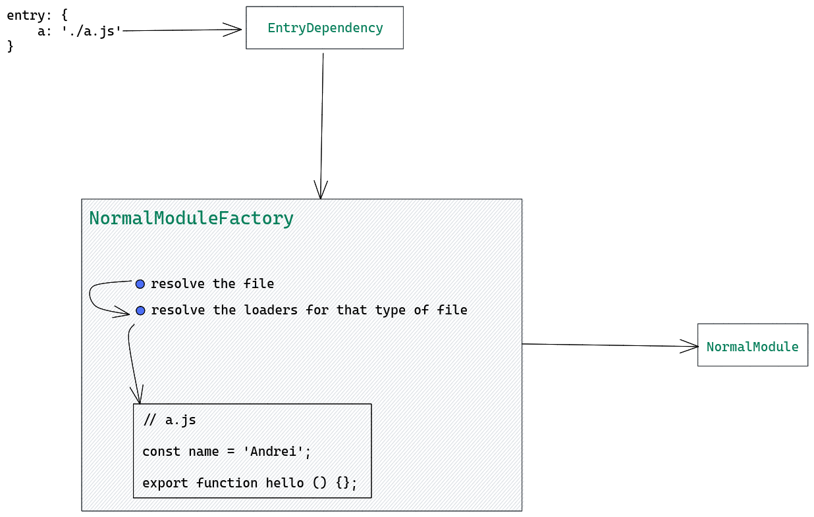

_An Excalidraw link for the above diagram can be found [here](https://excalidraw.com/#json=4907940771266560,zqDQZYTbwHupJqyFprykWA)._

So, the `EntryDependency` is used at the beginning, when creating the **root module** of the module tree.  
For the rest of the modules, there are other types of dependencies. For example, if you use an `import` statement, like `import defaultFn from './a.js'` , then there will be a `HarmonyImportSideEffectDependency` which holds the module's **request**(in this case, `'./a.js'`) and also maps to the `NormalModuleFactory`. So, there will be a new module for the file `'a.js'` and hopefully now you can see the important role that dependencies play. They essentially instruct webpack in how to create `modules`. We will reveal more information about dependencies later in the article.

**A quick recap of what we've learned in this section**: for each item in the `entry` object, there will be an `EntryPlugin` instance, where an `EntryDependency` is created. This `EntryDependency` holds the module's **request**(i.e the path to the file) and also offers a way to make something useful of that request, by mapping to a module factory, namely `NormalModuleFactory`. A module factory knows how to create entities useful to webpack from just a file path. Once again, a dependency is crucial to creating a module because it holds important information, such as the module's request and how to process that request. There are several types of dependencies and not all of them are useful to creating a new module. From each  `EntryPlugin`  instance and with the help of the newly created `EntryDependency`, a module tree will be created. The module tree is built on top of modules and their dependencies, which are as well modules, which can also have dependencies.

Now, let's continue our learning journey by finding out more about the `ModuleGraph`.

## Understanding the `ModuleGraph`

The `ModuleGraph` is a way to keep track of **built modules**. It heavily relies on dependencies in the sense that they provide ways to connect 2 different modules. For example:

```ts
// a.js
import defaultBFn from '.b.js/';

// b.js
export default function () { console.log('Hello from B!'); }
```

Here we have 2 files, so 2 modules. File `a` requires something from file `b`, so in `a` there is a dependency which is established by the `import` statement. As far as the `ModuleGraph` is concerned, a dependency defines a way to connect 2 modules. Even the `EntryDependency` from the previous section connects 2 modules: the root module of the graph, which we will refer to as the _null module,_ and the module associated with the entry file. The above snippet can be visualized as follows:


It's important to clarify the distinction between a simple module(i.e a `NormalModule` instance) and a module that belongs to the `ModuleGraph`. A `ModuleGraph`'s node is called [`ModuleGraphModule`](https://github.com/webpack/webpack/blob/main/lib/ModuleGraph.js#L60) and it is just a _decorated_ `NormalModule` instance. The `ModuleGraph` keeps track of these _decorated_ modules with the help of a [map](https://github.com/webpack/webpack/blob/main/lib/ModuleGraph.js#L90), which has this signature: `Map<Module, ModuleGraphModule>`. These aspects were necessary to mention because, for instance, if there are only `NormalModule` instances, then there isn't much you can do with them, they don't know how to communicate with each other. The `ModuleGraph` gives meaning to these bare modules, by interconnecting them with the help of the aforementioned map which assigns each `NormalModule` with a `ModuleGraphModule`. This will make more sense at the end of the _Building the `ModuleGraph`_ section, where we will use the `ModuleGraph` and its internal map in particular in order to traverse the graph. We will refer to a module that belongs to the `ModuleGraph` simply as `module`, since the difference consists of only a few additional properties.  
For a node that belongs to the `ModuleGraph` there are few things well defined: the **incoming connections** and the **outgoing connections**. A connection is another small entity of the `ModuleGraph` and it holds meaningful information such as: the origin module, the _destination_ module and the dependency that connects the 2 beforementioned modules. Concretely, based on the above diagram, a new connection has been created:

```ts
// This is based on the diagram and the snippet from above.
Connection: {
	originModule: A,
	destinationModule: B,
	dependency: ImportDependency
}
```

And the above connection will be added to `A.outgoingConnections` set and to `B.incomingConnections` set.  
These are the basic concepts of the `ModuleGraph`. As already mentioned in the previous section, all of the module trees created from the entries will output meaningful information to the same single place, the `ModuleGraph`. This is because all these trees of modules will eventually be connected with the _null module_(the root module of the `ModuleGraph`). The connection to the _null module_ is established through the `EntryDependency` and the module created from the entry file. Here is how I think of the `ModuleGraph`:


_[Here](https://excalidraw.com/#json=6723625398829056,kgoBBvUYMyhqGk6dOvY2Sg) is the Excalidraw link for the above diagram. Note: this diagram is not based on a previous example._

As you can see, the _null module_ has a connection to the root module of each module tree generated from an item in the `entry` object. Each edge in the graph represents a connection between 2 modules and each connection holds information about the source node, destination node and the dependency(which informally answers the question _why are these 2 modules connected?_).

Now that we're a bit more familiar with the `ModuleGraph`, let's see how it is built.

## Building the `ModuleGraph`

As we have seen in the previous section, the `ModuleGraph` starts with a _null module_ whose direct descendants are the root modules of the module trees which were built from `entry` object items. For that reason, in order to understand how the `ModuleGraph` is built, we are going to examine the building process of a single module tree.

### The first modules to be created

We will start with a very simple `entry` object:

```ts
entry: {
	a: './a.js',
}
```

Based on what's been said in the first section, at some point we would end up with an `EntryDependency` whose **request** is `'./a.js'`. This `EntryDependency` provides a way to create something meaningful from that **request**  because it maps to a module factory, namely `NormalModuleFactory`. This is where we left off in the first section.

The next step in the process is where the `NormalModuleFactory` comes into play. The `NormalModuleFactory`, if it successfully completes its task, will create a `NormalModule`.  
**And just to make sure there are no uncertainties, the `NormalModule` is just a _deserialized_ version of a file's source code, which is nothing more than a raw string**. A raw string does not bring much value, so webpack can't do much with it. A `NormalModule` will also store the source code as a string, but, at the same time, it will also contain other meaningful information and functionality, such as: the loaders applied to it, the logic for building a module, the logic for generating runtime code, its hash value and much more. **In other words, the `NormalModule` is the useful version of a simple raw file, from webpack's perspective.**

In order for the `NormalModuleFactory` to output a `NormalModule`, it has to go through some steps. There is also stuff to do after the module has been created, such as building the module and processing its dependencies, if it has any.

Here is once again the diagram we've been following, now focusing on the _Building the `ModuleGraph`_ part:

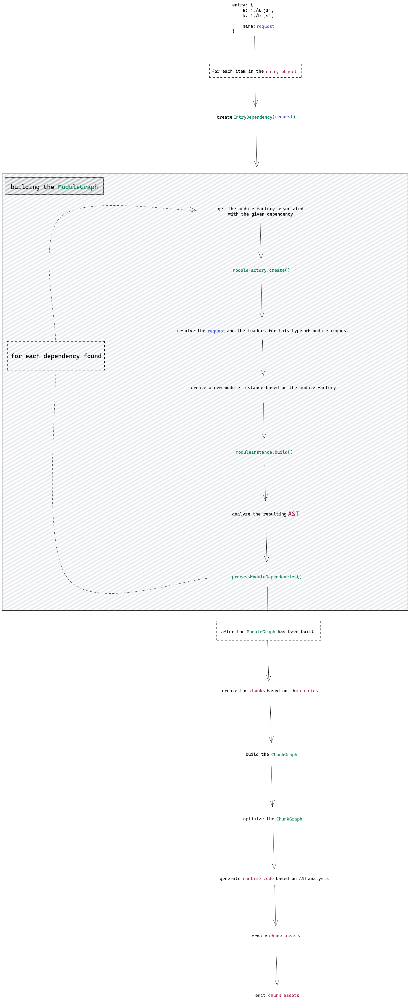

_You can find the link of the above diagram [here](https://excalidraw.com/#json=4517412917477376,mF3yLd-gYuRzCzWZ11fo7Q)._

`NormalModuleFactory` starts its magic by invoking its [`create` method](https://github.com/webpack/webpack/blob/main/lib/NormalModuleFactory.js#L747). Then, the _resolving process_ begins. Here is where the **request**(file's path) is resolved, as well as the loaders for that type of file. Notice that only the file paths of the loaders will be determined, the **loaders are not being invoked yet** in this step.

### The module's _build process_

After all the necessary file paths have been resolved, the `NormalModule` is created. However, at this point, the module is not very valuable. A lot of relevant information will come after the module has been built. The **build process** of a `NormalModule`  comprises a few other steps:

*   firstly, the loaders will be invoked on the raw source code; if there are multiple loaders, then the output of one loader might be the input another loader(the order in which loaders are provided in the config file is important);
*   secondly, the resulting string after running through all the loaders will be parsed with [acorn](https://github.com/acornjs/acorn)(a JavaScript parser) which yields the AST of the given file;
*   finally, the AST will be analyzed; the analysis is necessary because during this phase the current module's **dependencies**(e.g other modules) **will be determined**, webpack can detect its magic functions(e.g `require.context`, `module.hot`) etc;  the AST analysis happens in the [`JavascriptParser`](https://github.com/webpack/webpack/blob/main/lib/javascript/JavascriptParser.js#L151) and if you'll click on the link, you should see that a lot of cases are handled there; this part of the process is one of the most important, because a lot of what's coming next in the bundling process depends on this part;

### Dependencies discovery through the resulted AST

A way to think of the _discovery process_, without going too much into detail, would be this:


_A link to the above diagram can be found [here](https://excalidraw.com/#json=4927078877102080,H60JvyEHemF2nqVMrGGhLg)._

Where `moduleInstance` refers to the `NormalModule` created from the `index.js` file. The `dep` in red refers to dependency created from the first `import` statement, and the `dep` in blue refers to the second `import` statement. This is just a simplified way of viewing things. In reality, as mentioned earlier, the dependencies are added after the AST has been obtained.

Now that the AST has been examined, is time to continue the process of building the module tree we've talked about at the beginning of this section. The next step is to **process the dependencies** that have been found at the previous step. If we were to follow the above diagram, the `index` module has 2 dependencies, which are also modules, namely `math.js` and `utils.js`. But before the dependencies become **actual modules**, we just have the `index` module whose `module.dependencies` has 2 values which hold information such as the module **request**(the file's path), the import specifier(e.g `sum`, `greet`). In order to turn them into modules, we need to use the `ModuleFactory` that these dependencies map to and **repeat** the same steps described above(the repetition is indicated by the dashed arrow in the diagram showed at the beginning of this section). After processing the current module's dependencies, those dependencies might have dependencies as well and this process goes on until there are no more dependencies. This is how the module tree is being built, while of course making sure that the connections between parent and child modules are properly set.

Based on the knowledge we've gained so far, it would be a good exercise to actually experiment with the `ModuleGraph` ourselves. For this purpose, let's see a way to implement a custom plugin that will allow us to traverse the `ModuleGraph`. Here's the diagram that depicts how modules depend on each other:

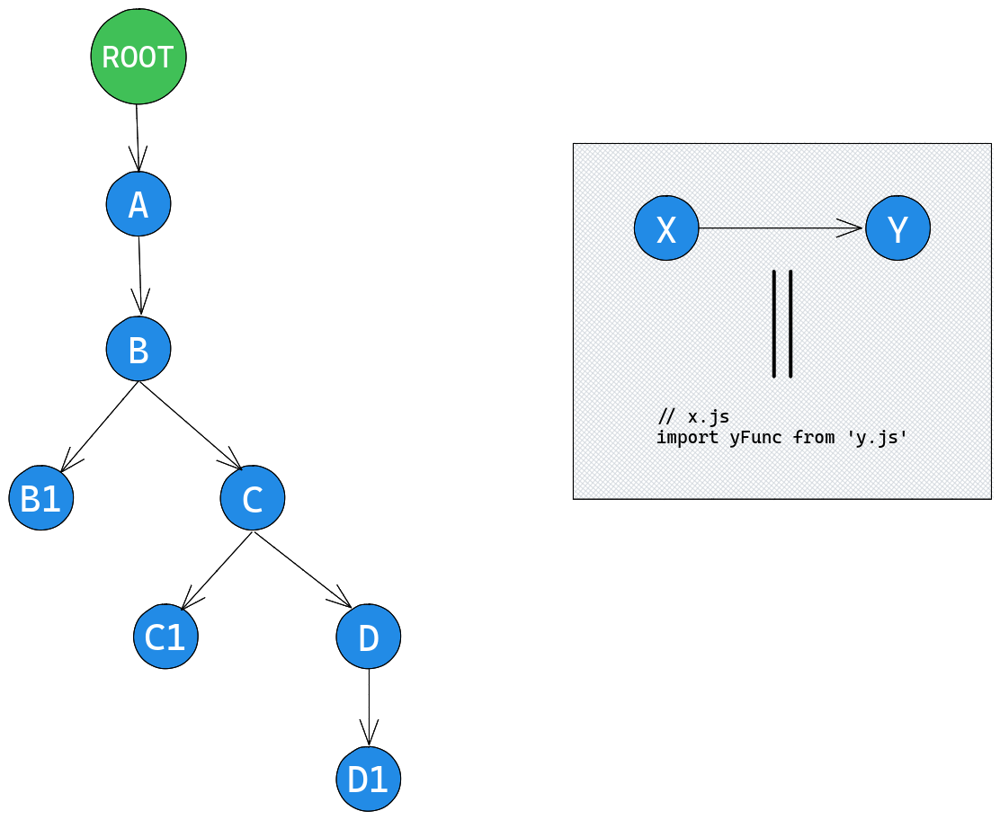

_The link for the above diagram can be found [here](https://excalidraw.com/#json=6301025929527296,nGs_YzUx5ET_qwZMv-RpMA)._

To make sure that everything in the diagram is intelligible, the `a.js` file imports the `b.js` file, which imports both `b1.js` and `c.js`, then `c.js` imports `c1.j` and `d.js` and finally, `d.js` imports `d1.js`. Lastly, `ROOT` refers to the _null module,_ which is the root of the `ModuleGraph`. The `entry` options consists of only one value, `a.js`:

```ts
// webpack.config.js
const config = {
  entry: path.resolve(__dirname, './src/a.js'),
	/* ... */
};
```

```ts
// The way we're adding logic to the existing webpack hooks
// is by using the `tap` method, which has this signature:
// `tap(string, callback)`
// where `string` is mainly for debugging purposes, indicating
// the source where the custom logic has been added from.
// The `callback`'s argument depend on the hook on which we're adding custom functionality.

class UnderstandingModuleGraphPlugin {
  apply(compiler) {
    const className = this.constructor.name;
    // Onto the `compilation` object: it is where most of the *state* of
    // the bundling process is kept. It contains information such as the module graph,
    // the chunk graph, the created chunks, the created modules, the generated assets
    // and much more.
    compiler.hooks.compilation.tap(className, (compilation) => {
      // The `finishModules` is called after *all* the modules(including
      // their dependencies and the dependencies' dependencies and so forth)
      // have been built.
      compilation.hooks.finishModules.tap(className, (modules) => {
        // `modules` is the set which contains all the built modules.
        // These are simple `NormalModule` instances. Once again, a `NormalModule`
        // is produced by the `NormalModuleFactory`.
        // console.log(modules);

        // Retrieving the **module map**(Map<Module, ModuleGraphModule>).
        // It contains all the information we need in order to traverse the graph.
        const {
          moduleGraph: { _moduleMap: moduleMap },
        } = compilation;

        // Let's traverse the module graph in a DFS fashion.
        const dfs = () => {
          // Recall that the root module of the `ModuleGraph` is the
          // *null module*.
          const root = null;

          const visited = new Map();

          const traverse = (crtNode) => {
            if (visited.get(crtNode)) {
              return;
            }
            visited.set(crtNode, true);

            console.log(
              crtNode?.resource ? path.basename(crtNode?.resource) : 'ROOT'
            );

            // Getting the associated `ModuleGraphModule`, which only has some extra
            // properties besides a `NormalModule` that we can use to traverse the graph further.
            const correspondingGraphModule = moduleMap.get(crtNode);

            // A `Connection`'s `originModule` is the where the arrow starts
            // and a `Connection`'s `module` is there the arrow ends.
            // So, the `module` of a `Connection` is a child node.
            // Here you can find more about the graph's connection: https://github.com/webpack/webpack/blob/main/lib/ModuleGraphConnection.js#L53.
            // `correspondingGraphModule.outgoingConnections` is either a Set or undefined(in case the node has no children).
            // We're using `new Set` because a module can be reference the same module through multiple connections.
            // For instance, an `import foo from 'file.js'` will result in 2 connections: one for a simple import
            // and one for the `foo` default specifier. This is an implementation detail which you shouldn't worry about.
            const children = new Set(
              Array.from(
                correspondingGraphModule.outgoingConnections || [],
                (c) => c.module
              )
            );
            for (const c of children) {
              traverse(c);
            }
          };

          // Starting the traversal.
          traverse(root);
        };

        dfs();
      });
    });
  }
}
```

The example we're following now be found at this [StackBlitz app](https://stackblitz.com/edit/node-rxfljv?file=webpack.config.js). Make sure to run `npm run build` in order to see the plugin in action. Based on the module hierarchy, after running the `build` command, this is the output we should be getting:

```ts
a.js
b.js
b1.js
c.js
c1.js
d.js
d1.js
```

Now that the `ModuleGraph` has been built and hopefully you've got a grasp on it, it's time to find out what happens next. According to the _main diagram_, the next step would be to create chunks, so let's get into it. But before doing that, it's worth clarifying some important concepts, such a `Chunk`, `ChunkGroup` and `EntryPoint`.

## Clarifying what `Chunk`, `ChunkGroup`, `EntryPoint` are

Now that we are a bit more familiar with what modules are, we will build on top of that to explain the concepts mentioned in this section's title. To quickly explain once again what modules are, it suffices to know that **a module is an _upgraded version_ of a file. A module, once created and built, contains a lot of meaningful information besides the raw source code, such as: the loaders used, its dependencies, its exports(if any), its hash and much more.**

**A `Chunk` encapsulates one or module modules**. At first glance, one might think that the number of entry files(an entry file = an item of the `entry` object) is proportional with the number of resulting chunks. This statement is partially true, because the `entry` object might have only one item and the number of resulting chunks could be greater than one. It is indeed true that for each **`entry` item** there will be a corresponding chunk in the _dist_ directory, but other chunks could be created implicitly, for example when using the `import()` function. But **regardless** of how it is created, each chunk will have a corresponding file in the _dist_ directory. We will expand upon this in the _Building the `ChunkGraph`_ section, where we will clarify which modules will belong to a `chunk` and which won't.

A `ChunkGroup` contains one or more chunks. A `ChunkGroup` can be a parent or a child to another `ChunkGroup`. For example, when using dynamic imports, for each `import()` function used there will be a `ChunkGroup` created, whose parent will be an existing `ChunkGroup`, the one which comprises the file(i.e the module) in which the `import()` functions are used. A visualization of this fact can be seen in the _Building the `ChunkGraph`_ section.

An `EntryPoint` is a **type of** `ChunkGroup` which is created **for each item** in the `entry` object. The fact that a chunk belongs to an `EntryPoint` has implications on the rendering process, as we will make it more clearer in a future article.

Given that we're more familiar with these concepts, let's proceed and understand the `ChunkGraph`.

## Building the `ChunkGraph`

Recall that all we have until this moment is just a `ModuleGraph`, which we talked about in a previous section. However, the `ModuleGraph` is just a necessary part of the bundling process. It has to be leveraged in order for features like code splitting to be possible.

At this point of the bundling process, for each item from the `entry` object there will be an `EntryPoint`. Since it is a type of `ChunkGroup`, it will contain at least a chunk. So, if the `entry` object has 3 items, there will be 3 `EntryPoint` instances, each of which has a chunk, also called the **entrypoint chunk**, whose name is the `entry` item key's value. The modules associated with the entry files are called **entry modules** and each of them will belong to their **entrypoint chunk**. They matter because they are the starting point of the `ChunkGraph`'s building process. Note that a chunk can have more than one **entry module**:

```ts
// webpack.config.js
entry: {
  foo: ['./a.js', './b.js'],
},
```

In the above example, there will be chunk named `foo`(the item's key) will have 2 entry modules: the one associated with the `a.js` file and the other associated with the `b.js` file. And of course, the chunk will belong to the `EntryPoint` instance created based on the `entry` item.

Before going into detail, let's set out an example based on which we will discuss the building process:

```ts
entry: {
    foo: [path.join(__dirname, 'src', 'a.js'), path.join(__dirname, 'src', 'a1.js')],
    bar: path.join(__dirname, 'src', 'c.js'),
  },
```

This example will encompass things that were mentioned earlier: the parent-child relationship of `ChunkGroups`(and hence dynamic imports), chunks and `EntryPoints`.

_You can try out the above example [here](https://stackblitz.com/edit/node-z6d8js?file=readme.md). The diagram that comes next is based on this example._

The `ChunkGraph` is built in an recursive fashion. It starts by adding **all the entry modules** to a queue. Then, when an entry module is processed, meaning that its dependencies(which are modules as well) will be examined and each dependency will be added to the queue too. This keeps on repeating until the queue becomes empty. This part of the process is where the modules are _visited._ However, this is just the first part. Recall that `ChunkGroup`s can be a parent to/child of other `ChunkGroup`s. These _connections_ are resolved in the second part. For example, as previously stated, a dynamic import(i.e `import()` function) will result in a new child `ChunkGroup`. In webpack's parlance, the `import()` expression defines an **asynchronous block of dependencies**. From my perspective, it's called a _block_ because the first thing that comes to mind is something that contains other objects. In case of `import('./foo.js'.then(module => ...)`, it's clear that our intention is to load something **asynchronously** and it's obvious that in order to use the `module` variable, all the dependencies(i.e modules) of `foo`(including `foo` itself) must be resolved, before the actual module is available. We will thoroughly discuss how the `import()` function works, along with its particularities(e.g magic comments and other options), in a future article.  
_If this sparked your curiosity, [here](https://github.com/webpack/webpack/blob/main/lib/dependencies/ImportParserPlugin.js#L27) is where the block is created during the AST analysis_.  
_The source code which summarizes the building process of the `ChunkGraph` can be found [here](https://github.com/webpack/webpack/blob/main/lib/buildChunkGraph.js#L1277-L1299)._

For now, let's just see the diagram of the `ChunkGraph` created from our above configuration:

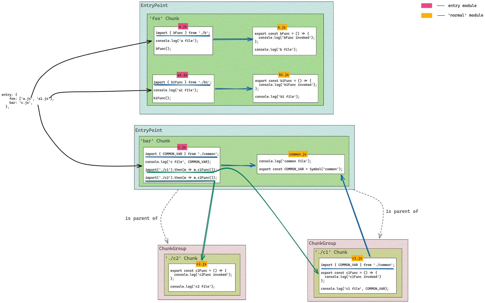

_The link to the above diagram can be found [here](https://excalidraw.com/#json=6255037734977536,S8OwG9rWcdgphRWDBoiZwg)._

The diagram illustrates a very simplified version of the `ChunkGraph`, but it should be sufficient to highlight the resulting chunks and the relationships between `ChunkGroup`s. We can see 4 chunks, so there will be 4 output files. The `foo` chunk will have 4 modules, of which 2 are **entry modules.** The `bar` chunk will only have 1 entry module and the other one can be considered a _normal_ module. We can also notice that each `import()` expression will result in a new `ChunkGroup`(whose parent is the _bar_ `EntryPoint`), which involves a new chunk.

The content of the yielded files is determined based on the `ChunkGraph`, so this is why it is very important to the whole bundling process. We will briefly talk about the chunk assets(i.e the yielded files) in the following section.

Before exploring a practical example where we'd use the `ChunkGraph`, it's important to mention a few of its particularities. Similar to the `ModuleGraph`, a node that belongs to the `ChunkGraph` is called [`ChunkGraphChunk`](https://github.com/webpack/webpack/blob/main/lib/ChunkGraph.js#L199)(read as _a chunk that belongs to the `ChunkGraph`_) and it is just a _decorated_ chunk, meaning that it as some extra properties such as the modules which are part of the chunk, the entry modules of a chunk and others. Just like the `ModuleGraph`, the `ChunkGraph` keeps track of these _chunks with additional properties_ with the help of a map which has this signature: `WeakMap<Chunk, ChunkGraphChunk>`. In comparison with the `ModuleGraph`'s map, this map maintained by the `ChunkGraph` does not contain information about the connections between chunks. Instead, all the necessary information(such as the `ChunkGroup`s it belongs to)  is kept within the chunk itself. Remember that chunks are grouped together in `ChunkGroups` and between these chunk groups there can be parent-child relationships(just as we've seen in the above diagram). This is not the case for modules, because modules can depend on each other, but there is not a strict concept of _parent modules._

Let's now try to use the `ChunkGraph` in a custom plugin in order to get a better understanding of it. Note that this example we're considering is the one the above diagram depicts:

```ts
const path = require('path');

// We're printing this way in order to highlight the parent-child
// relationships between `ChunkGroup`s.
const printWithLeftPadding = (message, paddingLength) => console.log(message.padStart(message.length + paddingLength));

class UnderstandingChunkGraphPlugin {
  apply (compiler) {
    const className = this.constructor.name;
    compiler.hooks.compilation.tap(className, compilation => {
      // The `afterChunks` hook is called after the `ChunkGraph` has been built.
      compilation.hooks.afterChunks.tap(className, chunks => {
        // `chunks` is a set of all created chunks. The chunks are added into
        // this set based on the order in which they are created.
        // console.log(chunks);
        
        // As we've said earlier in the article, the `compilation` object
        // contains the state of the bundling process. Here we can also find
        // all the `ChunkGroup`s(including the `Entrypoint` instances) that have been created.
        // console.log(compilation.chunkGroups);
        
        // An `EntryPoint` is a type of `ChunkGroup` which is created for each
        // item in the `entry` object. In our current example, there are 2.
        // So, in order to traverse the `ChunkGraph`, we will have to start
        // from the `EntryPoints`, which are stored in the `compilation` object.
        // More about the `entrypoints` map(<string, Entrypoint>): https://github.com/webpack/webpack/blob/main/lib/Compilation.js#L956-L957
        const { entrypoints } = compilation;
        
        // More about the `chunkMap`(<Chunk, ChunkGraphChunk>): https://github.com/webpack/webpack/blob/main/lib/ChunkGraph.js#L226-L227
        const { chunkGraph: { _chunks: chunkMap } } = compilation;
        
        const printChunkGroupsInformation = (chunkGroup, paddingLength) => {
          printWithLeftPadding(`Current ChunkGroup's name: ${chunkGroup.name};`, paddingLength);
          printWithLeftPadding(`Is current ChunkGroup an EntryPoint? - ${chunkGroup.constructor.name === 'Entrypoint'}`, paddingLength);
          
          // `chunkGroup.chunks` - a `ChunkGroup` can contain one or mode chunks.
          const allModulesInChunkGroup = chunkGroup.chunks
            .flatMap(c => {
              // Using the information stored in the `ChunkGraph`
              // in order to get the modules contained by a single chunk.
              const associatedGraphChunk = chunkMap.get(c);
              
              // This includes the *entry modules* as well.
              // Using the spread operator because `.modules` is a Set in this case.
              return [...associatedGraphChunk.modules];
            })
            // The resource of a module is an absolute path and
            // we're only interested in the file name associated with
            // our module.
            .map(module => path.basename(module.resource));
          printWithLeftPadding(`The modules that belong to this chunk group: ${allModulesInChunkGroup.join(', ')}`, paddingLength);
          
          console.log('\n');
          
          // A `ChunkGroup` can have children `ChunkGroup`s.
          [...chunkGroup._children].forEach(childChunkGroup => printChunkGroupsInformation(childChunkGroup, paddingLength + 3));
        };
        
		// Traversing the `ChunkGraph` in a DFS manner.
        for (const [entryPointName, entryPoint] of entrypoints) {
          printChunkGroupsInformation(entryPoint, 0);
        }
      });
    });
  }
}; 
```

The example can be found at this [StackBlitz app](https://stackblitz.com/edit/node-nlpz6x?file=webpack.config.js). After running `npm run build`, this is the output that you should see:

```markdown
Current ChunkGroup's name: foo;
Is current ChunkGroup an EntryPoint? - true
The modules that belong to this chunk group: a.js, b.js, a1.js, b1.js

Current ChunkGroup's name: bar;
Is current ChunkGroup an EntryPoint? - true
The modules that belong to this chunk group: c.js, common.js

   Current ChunkGroup's name: c1;
   Is current ChunkGroup an EntryPoint? - false
   The modules that belong to this chunk group: c1.js

   Current ChunkGroup's name: c2;
   Is current ChunkGroup an EntryPoint? - false
   The modules that belong to this chunk group: c2.js
```

We've used indentation in order to distinguish the parent-child relationships. We can also notice that the output is on par with the diagram, so we can be sure of the traversal's correctness.

## Emitting chunk assets

It is important to mention that the resulting files are not simply a copy-paste version of the original files because, in order to achieve its features, webpack needs to add some custom code that makes everything working as expected.

This begs the question of how does webpack know what code to generate. Well, it all starts from the most basic(and useful) layer: the `module` . A module can export members, import other members, use dynamic imports, use webpack-specific functions(e.g `require.resolve`) etc. Based on the module's source code, webpack can determine which code to generate in order to achieve the desired features. This _discovery_ starts during the AST analysis, where the dependencies are found. Although we've been using _dependencies_ and _modules_ interchangeably until now, things are a bit more complex under the hood.

For example, a simple `import { aFunction } from './foo'` will result in 2 dependencies(one is for the `import` statement itself and the other is for the specifier, i.e `aFunction`), from which a single module will be created. Another example would be the `import()` function. This will result, as it was mentioned in the earlier sections, in an asynchronous block of dependencies and one of these dependencies is the `ImportDependency`, which is specific to a dynamic import.  
These **dependencies are essential** because they come with some _hints_ about what code should be generated. For example, the `ImportDependency` knows exactly what to tell webpack in order to asynchronously fetch the imported module and use its exported members. These _hints_ can be called **runtime requirements.** For instance, if the module exports some of its members, there will be some dependency(recall we're not referring to _modules_ now), namely `HarmonyExportSpecifierDependency`, that will inform webpack that it needs to handle the logic for exporting members.

To summarize, a module will come with its **runtime requirements**, which depend on what that module is using in its source code. The **runtime requirements of a chunk** will be the set of all the runtime requirements of **all** the modules that belong to that chunk. Now that webpack knows about all the requirements of a chunk, it will be able to properly generate the runtime code.

This is also called the _rendering process_ and we will discuss it in detail in a dedicated article. For now, it's enough to understand that the rendering process heavily relies on the `ChunkGraph`, because it contains groups of chunks(i.e `ChunkGroup`, `EntryPoint`), which contain chunks, which contain modules, which, in a granular way, contain information and hints about the runtime code that will be generated by webpack.

This section marks the end of the theoretical part of this article. In the following section, we will see a few ways to debug webpack's source code, which can come handy whenever you're dealing with a problem or you just want to find out more about how webpack works.

## Debugging webpack's source code

In the hope that the previous sections shed some light on how webpack works under the hood, in this section we will see how to debug its source code. We will also see where to place breakpoints in order to examine specific parts of the bundling process.

### Using VS Code

VS Code is an amazing tool and what I particularly like about it is the variety of features it provides when it comes to navigating through a code base.

The approach we're going to follow is to clone the webpack repo in another custom repo, with the help of [git submodules](https://git-scm.com/book/en/v2/Git-Tools-Submodules). We'll do so because it becomes very easy to be up to date with the changes that take place in the webpack repo, as we will see in a moment. I will show the way I'm doing things, but feel free to choose whatever approach fits you best.

First, I have created [this repo](https://github.com/Andrei0872/understanding-webpack), named _understanding-webpack._ If you want to follow along, you can set up the repo like this:

```bash
git clone --recurse-submodules git@github.com:Andrei0872/understanding-webpack.git
yarn
```

There you will see a directory named _examples,_ where each particular example is represented by a directory. In `package.json`, you'll see something like this:

```json
"scripts": {
    "understand": "yarn import-order",
    "import-order": "webpack --config ./examples/import-order/webpack.config.js",

    "create-example": "cd examples && cp -r dummy-example"
  },
```

The _rules_ I decided to follow are these: the _main_ command(i.e the command I'll always be running in order try out any example) is `yarn understand`. If you run it now, webpack will use the example from at the `examples/import-order` path. Each example will get its own script, like `import-order` in the above snippet. When I want to use a different example, all I have to do is to replace `import-order` in `"understand": "yarn import-order"` with the name of the example.

And now onto the debugging part. There is a [`.vscode/launch.json`](https://github.com/Andrei0872/understanding-webpack/blob/master/.vscode/launch.json) directory which holds the debugging configuration. After pressing `F5`, it should run the `yarn understand` command in a debugging environment, so in order to quickly test it, place a breakpoint in the `seal()` function's body, in `Compilation.js` file(`CTRL + P`, then type `webpack/lib/Compilation.js`, then `CTRL + SHIFT + O`, then type `seal`) before starting the debugger.

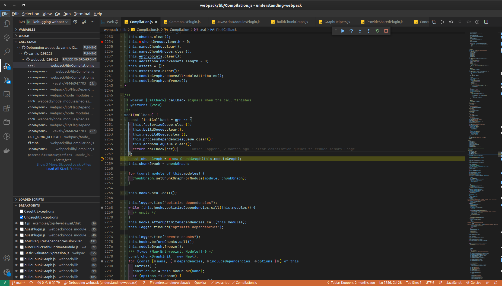

By the way, the `seal` function encompasses a lot of the steps illustrated in the main diagram, such as: creating the first chunks, building the `ChunkGraph`, generating the runtime code and creating the chunk assets.

So, we've seen how to debug our own examples. Let's see now how to debug webpack's test or any other script that webpack has defined in its `package.json` file.

**A quick side note**: If you're running webpack in production mode or, more accurately said, if you include the _terser plugin_, you might have some troubles with the VS Code's built-in debugger, because there is no way to debug `worker_threads` or child processes in VS Code, as far as I'm aware. The `jest-worker` package makes use of those and `jest-worker` is used by `terser-webpack-plugin`. For that, I found a very useful tool, called [ndb](https://github.com/GoogleChromeLabs/ndb). After installing it, you can simply `cd` into the `webpack` directory(the git submodule) and type `ndb` to a new window, from which you'll be able to choose which script to run in debugging mode. You can also press breakpoints there, as you'd normally do in VS Code.

For instance, I placed a breakpoint in the `Chunk.unittest.js` before telling _ndb_ to run the `test:unit` script(found in the bottom left corner):

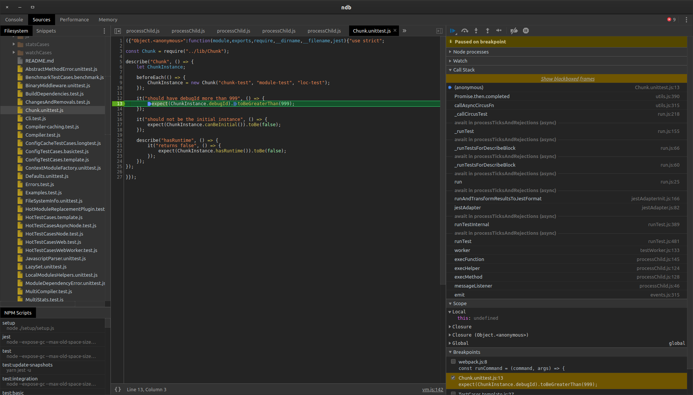

You can also run specific suite of tests, by using a command similar to this:

```bash
// The options are taken from one of the `package.json` scripts
// Simply replace `TestCases.template.js` with other file name if you want
// to debug something else.
ndb node --max-old-space-size=4096 --trace-deprecation node_modules/jest-cli/bin/jest --testMatch "<rootDir>/test/TestCases.template.js"
```

One problem that `ndb` solves is to allow you to use the debugger on files that are executed on a worker thread or on a different process than the original which started the debugging process. So, if you want to debug the _terser's_ minifying process on your custom example, you can use `ndb yarn understand`(from the repo's root directory):

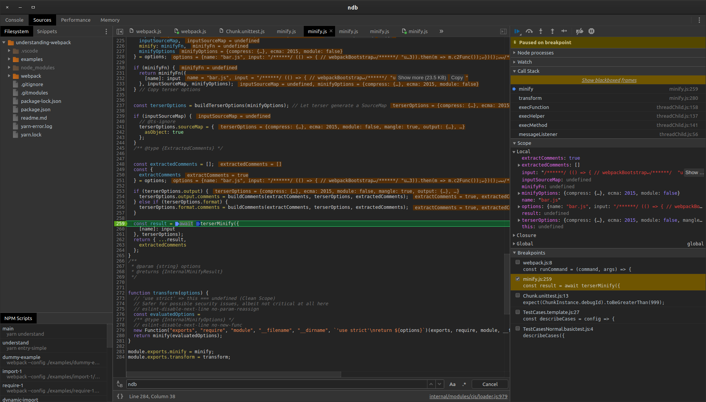

The file can be found at `webpack/node_modules/terser-webpack-plugin/dist/minify.js`. If you try debugging in VS Code, you should notice that the breakpoint won't be hit. With `ndb`, however, it works.

If you want to explore the bundling process from the beginning, you can add a breakpoint in the `createCompiler` function, in the `webpack/lib/webpack.js` file.


At this point, you can also inspect the default configuration values.

So, my recommendation would be to use `ndb` whenever you want to debug files that are run with the help of `worker_threads` or run on a different process than the one which you started the debugging process with.

### A few tricks to easily navigate in webpack's (or any) codebase

_Note: this assumes the VS Code editor is used._

*   use `CTRL + SHIFT + F12` to see all the places in the repo where a certain variable/entity/function has been used:


*   use `CTRL + SHIFT + \` to go to the matching parenthesis
*   use `ALT + SHIFT +  H` to see the **call hierarchy**

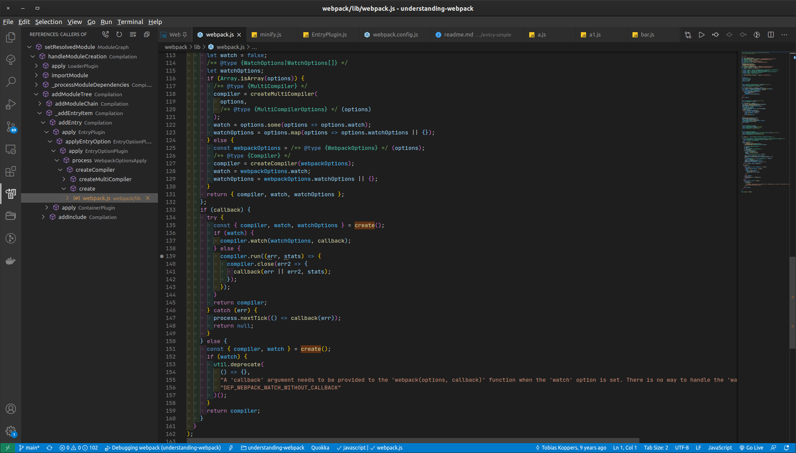

In the above screenshot, you can see what causes the `setResolvedModule` to be called.

*   to determine which plugins have added custom functionality to the hooks provided by webpack, you can do a global search(`CTRL + SHIFT + F`) and type `.hooks.nameOfTheHook.tap`(the way you add custom functionality to a hook is by using the `tap/tapAsync` method):

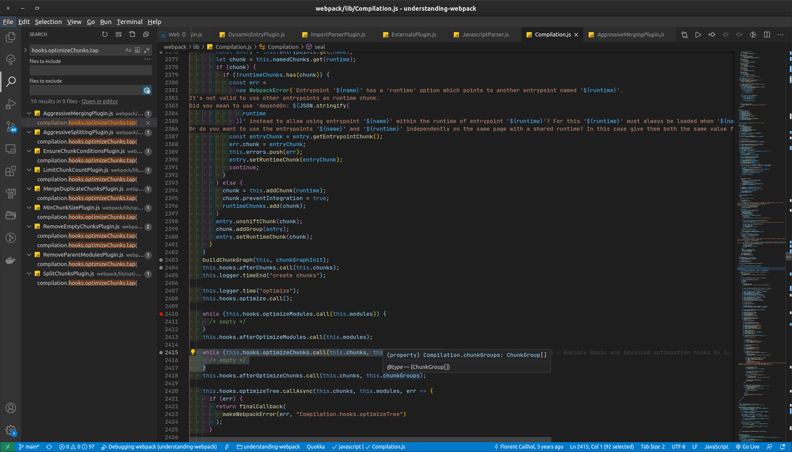

In the left panel you can see which plugins have added new logic to the built-in `optimizeChunks` hook.

Moreover, if you're using the debugger, quickly inspect the `taps` property of a hook to see the sources from where functionality has been added:

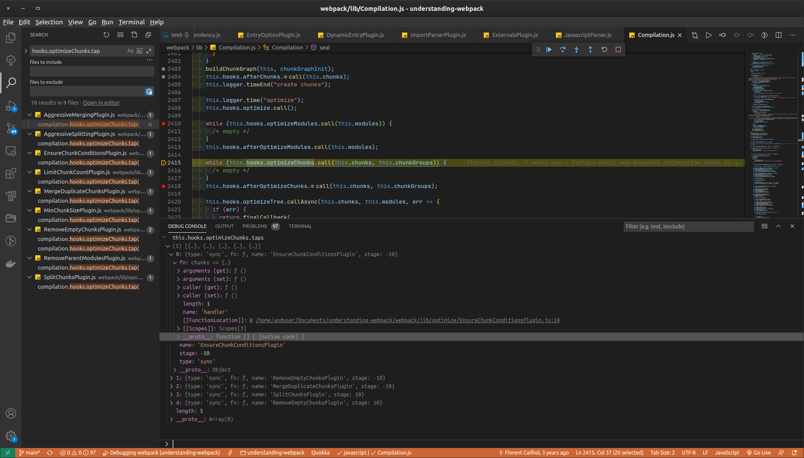

### Using StackBlitz

[StackBlitz](https://stackblitz.com/) is another great tool that we're lucky to have as developers. When using StackBlitz, you basically no longer have to leave the browser and you can do exactly what's been explained in the the _Using VS Code_ section. Moreover, the `ndb` behavior is already built in StackBlitz - so, no need for an additional tool!

I have created a StackBlitz project called [`webpack-base`](https://stackblitz.com/edit/node-cazzv3?file=webpack.config.js) and it contains a basic setup and it can be a very good starting point when creating other demos. Whenever I want to quickly explore some webpack feature, I simply open this project, fork it and I'm good to go!

I also made [a video about it](https://www.youtube.com/watch?v=9s-t3uECOic). Assuming we want to start exploring the bundling process from the point where the compiler is created, here are the necessary steps to do that(make sure to fork the project first):

*   run `code node_modules/webpack/lib/webpack.js` in the terminal
*   go to line 135(`CTRL + G` - same as in VS Code!) or search for the place where the `create` function is invoked(`CTRL + SHIFT + P` could help)
*   type the `debugger;` keyword
*   open the DevTools
*   run the `npm run build` script in terminal

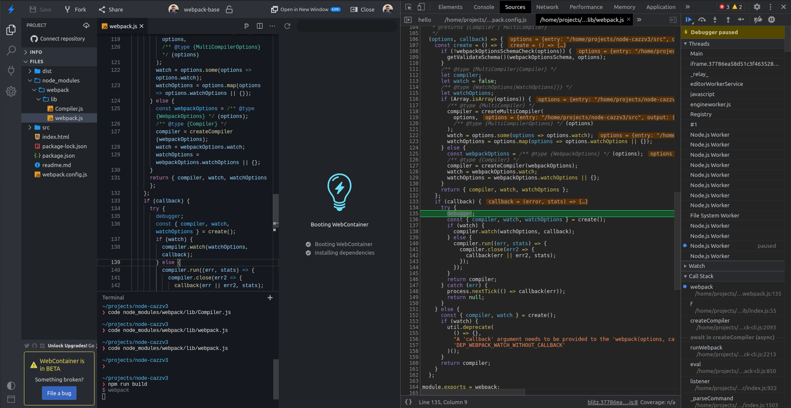

We've used the `debugger;` keyword so that the file would appear much easier in the `Sources` tab. Sometimes it can be difficult to find it with `CTRL + P`. From this point, you can debug as you would normally do: click on line numbers to place breakpoints, you can add conditional breakpoints, step into etc.

> You can apply the same process for **every node script.**

## Conclusion

In this article I've tried to include, without redundant details, as much information as needed in order for you to see webpack from a different perspective. It is a complex (and fascinating) tool and this write-up aimed to break it in smaller and digestible parts.

**Thanks for reading!**

_The diagrams have been made with [Excalidraw](https://excalidraw.com/)._

_Special thanks [Max Koretskyi](https://twitter.com/maxkoretskyi) for reviewing this article and for providing extremely valuable feedback._