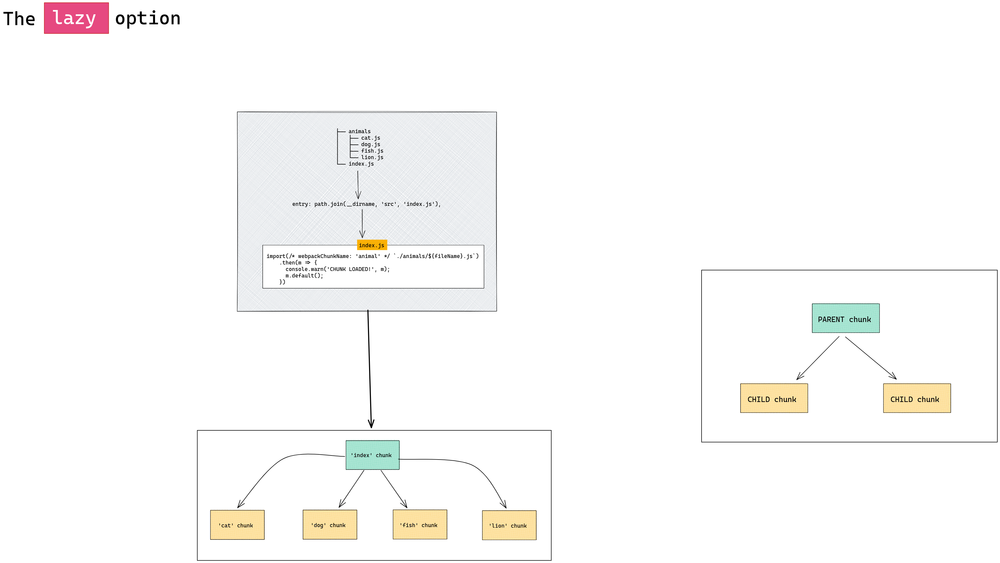
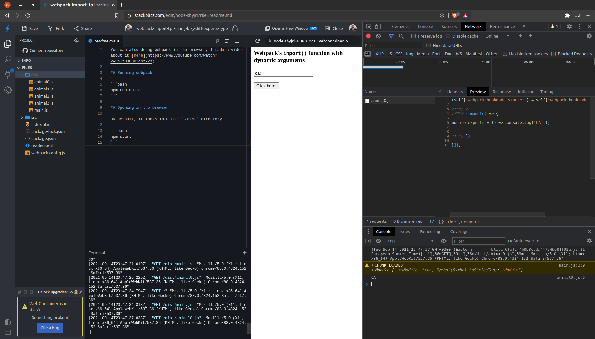
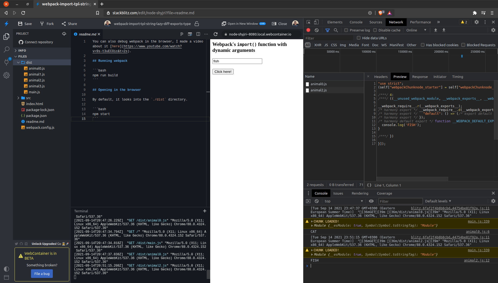
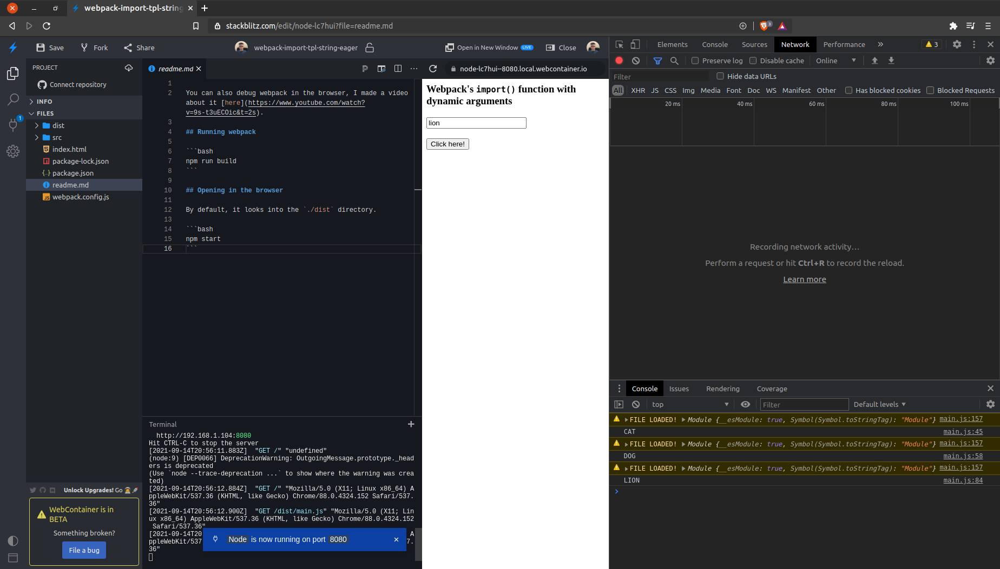
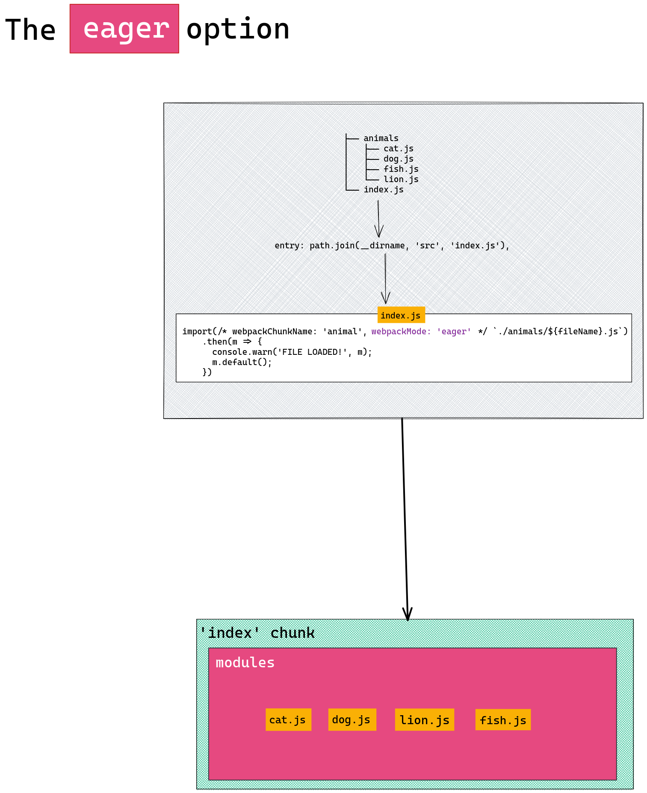
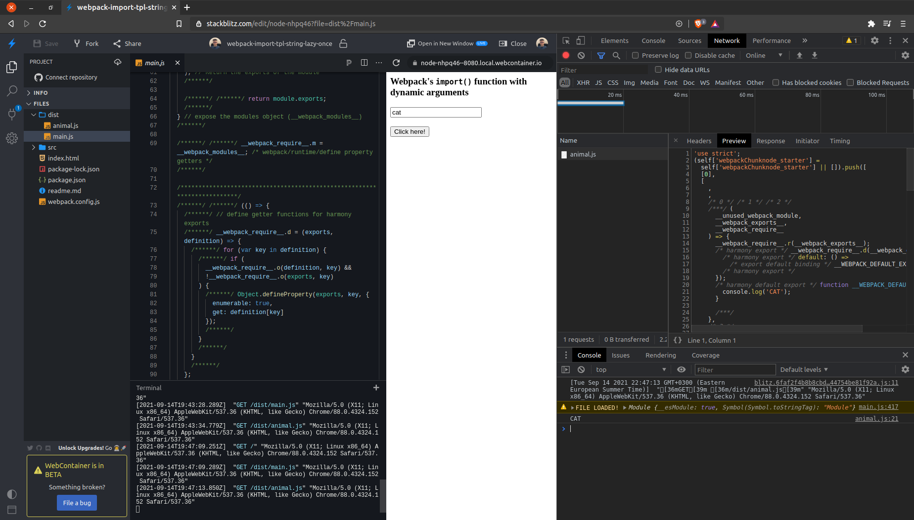
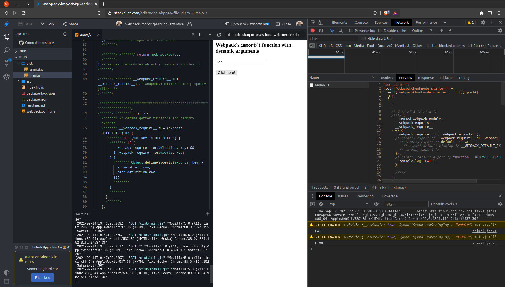
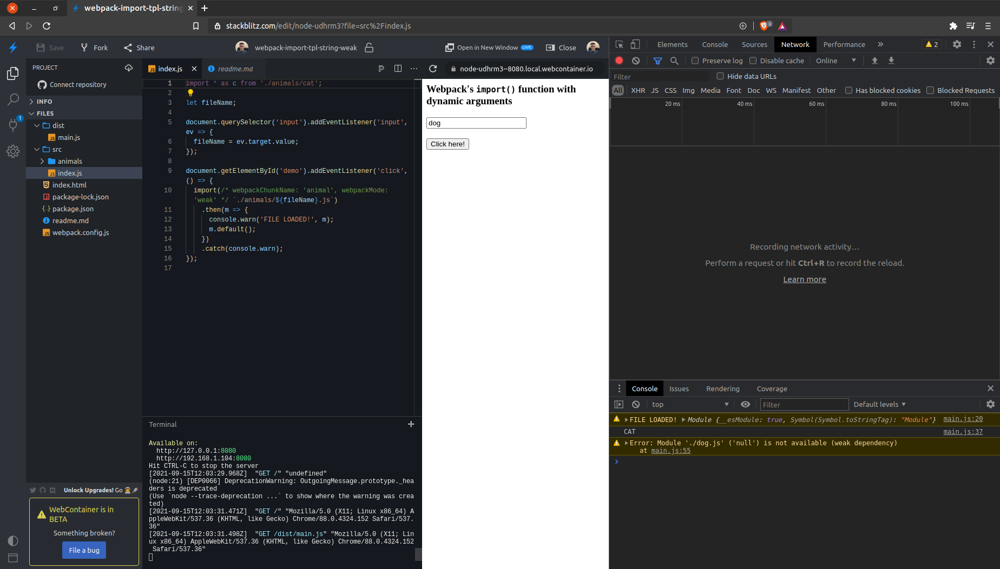
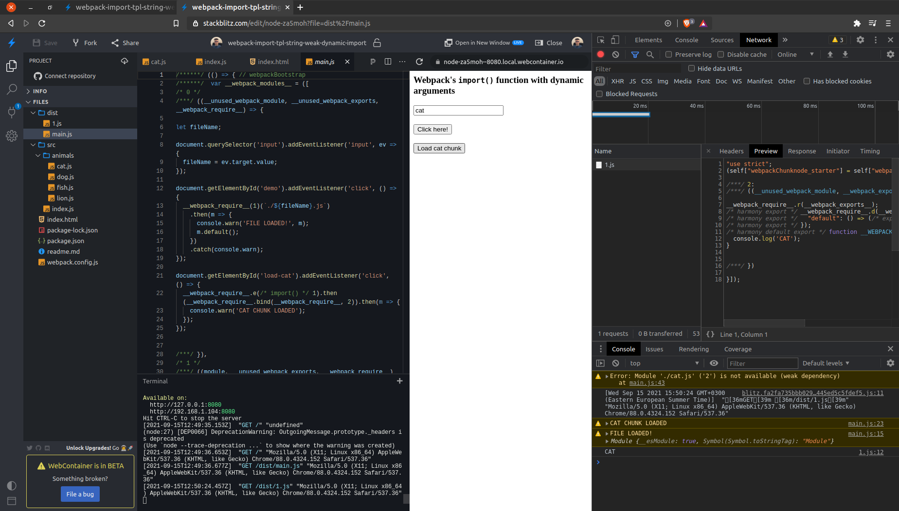

_This article has been published on [indepth.dev](https://indepth.dev/posts/1483/demistifying-webpacks-import-function-using-dynamic-arguments)._

## Introduction

Although it is a popular selling point of webpack, the `import` function has many hidden details and features that many developers may not be aware of. For instance, the `import` function can accept dynamic expression and still be able to achieve well known features such as lazy loading. You can think of a dynamic expression as anything that's not a **raw string**(e.g `import('./path/to/file.js')`). A few examples of dynamic expressions could be: `import('./animals/' + 'cat' + '.js')`, `import('./animals/' + animalName + '.js')`, where `animalName` could be known at runtime or compile time. In this article, we will dive deep into the concept of dynamic expressions when it comes to the `import` function and hopefully, at the end, you will be more acquainted with the range of possibilities that this webpack's feature provides.

There are no special prerequisites, apart from a basic understanding of how the `import` function behaves when its argument is static(i.e it creates a new chunk). There is also an article named _[An in-depth perspective on webpack's bundling process]()_ in which concepts such as `Module`s and `Chunk`s are explained, but it shouldn't affect the understanding of this article too much.

Throughout the article we will be using live examples(all of them in the form of a StackBlitz app) and diagrams, so let's get started!

## The implications of dynamic arguments

Although the value is not known at compile time, by using the `import()` function with dynamic arguments we can **still achieve lazy loading**. Unlike SystemJS, webpack can't load any arbitrary module at runtime, so the fact that the value will be known at runtime will constrain webpack to make sure that **all the possible values** that the argument can resolve to are accounted for. We will see what is meant by that in the following sections, where we will examine the customizations the `import` function can accept.

For now, we will focus on the `import`'s argument. All the following sections will be based on the same example where there is a directory called `animals`  and inside there are files that correspond to animals:

```markdown
├── animals
│   ├── cat.js
│   ├── dog.js
│   ├── fish.js
│   └── lion.js
├── index.js
```

Each examples uses the `import` function like this: `import('./animals/${fileName}.js')`. As far as the `./animals/${fileName}.js` segment is concerned, each `${fileName}` refers to a **dynamic part** and it will be replaced with `/.*/` by default(you can think of it as a glob pattern). The given expression can have multiple dynamic parts. The provided argument will eventually result into a RegExp object which will be used to determine which files should be considered later. The traversal starts from the first **static** part of the provided path(in this case it is `./animals`) and in each step it will read the files from the current directory and will test the RegExp object against them. It can also traverse nested directories(this is the default behaviour) and once the files are properly discovered, webpack will proceed based on the chosen mode. In this example, **the resulting RegExp** object will be `/^\\.\\/.*\\.js$/` and it will be tested against all the files which reside in the `animals/` directory(e.g `regExp.test('./cat.js')`).

It's important to mention that the traversal and the file discovery are done **at compile time.**

As a side note, the replacement for the dynamic parts and whether nested directories should be traversed can be chosen by us in the config file:

```ts
// wepback.config.js
module: {
    parser: {
      javascript: {
        wrappedContextRegExp: /.*/,
				wrappedContextRecursive: true
      }
    }
  }
```

So, `wrappedContextRecursive` specifies whether nested directories should be traversed or not(e.g  considering files inside `animals/aquatic/` too or not) and with `wrappedContextRegExp` we can tell webpack what to replace the expression's dynamic parts with.

Based on the default configuration, our initial expression `./animals/${fileName}.js` will result in `./animals/.*.js`(loosely).  
In the upcoming sections we will explore what happens once these files have been figured.

Let's get into it!

## The `lazy` mode

_The example this section is based on can be found [here](https://stackblitz.com/edit/node-eujyms?file=readme.md)(make sure to also start the server)._

This is the default mode, meaning that you don't have to explicitly specify it. Suppose there is a directory structure that looks like this:

```markdown
├── animals
│   ├── cat.js
│   ├── dog.js
│   ├── fish.js
│   └── lion.js
└── index.js
```

By using the `import` function in our application code:

```ts
// index.js

// In this example, the page shows an `input` tag and a button.
// The user is supposed to type an animal name and when the button is pressed,
// the chunk whose name corresponds to the animal name will be loaded.

let fileName;

// Here the animal name is written by the user.
document.querySelector('input').addEventListener('input', ev => {
  fileName = ev.target.value;
});

// And here the chunk is loaded. Notice how the chunk depends on the animal name
// written by the user.
document.getElementById('demo').addEventListener('click', () => {
  import(/* webpackChunkName: 'animal' */ `./animals/${fileName}.js`)
    .then(m => {
      console.warn('CHUNK LOADED!', m);
      m.default();
    })
    .catch(console.warn);
});
```

webpack will generate a **chunk for each file** in the `animals` directory. This is the `lazy` option's behaviour. What happens in this example is that the user will type the name of an animal into the input and when the button is clicked, the chunk which corresponds to that name will be loaded. If the name of the animal can't be found in the `animals` directory, an error will be thrown. You might be wondering now: _isn't it a waste of resources, if webpack creates multiple chunks when in the end there will be only one chunk that matches the path?_ Well, practically it isn't, because all those possible chunks are just files held on the server which are not sent to the browser unless the browser requires them(e.g when the `import()`'s path matches an existing file path).

As with the _static_ `import` situation where the path is known at compile time(e.g `import('./animals/cat.js)`), when only one chunk would be created, when the `import`'s path is dynamic, the loaded chunk will be cached, so no important resources will be wasted in case the same chunk is required multiple times.

Precisely, webpack stores the loaded chunks in a map such that if the chunk that is requested has already been loaded, it will be immediately retrieved from the map. The map's keys are the IDs of the chunks and the values depend on the chunk's status: `0`(when the chunk is loaded), `Promise`(when the chunk is currently loading) and `undefined`(when the chunk hasn't even been requested from anywhere).

Here's a way to visualize this example:



_A link for the above diagram can be found [here](https://excalidraw.com/#json=5579912295481344,6TqFOfloQIGg1xXAtrboUQ)._

We can notice from this diagram the 4 chunks that have been created(one for each file in the `animals` directory), along with the main parent chunk(called `index`). It is crucial to have a (root) parent chunk because it contains the required logic to fetch and integrate other child chunks in the application.

The way webpack handles this behavior internally is by having a **map** where the keys are the filenames(in this case, the keys are the filenames from the `animals` directory) and the values are arrays(as we will see, the array's pattern will be`{ filename: [moduleId, chunkId] }`). An array of this kind contains very useful information to webpack, such as: the **chunk id**(it will be used in the HTTP request for the corresponding JS file), the **module id**(so that it knows what module to require as soon as the chunk has finished loading) and, finally, the **module's exports type**(it used by webpack in order to achieve compatibility when using other types of modules than ES modules). This concept of a map which is used to keep track of modules and their traits is used regardless of the mode we're using.

To see an example of what that array would look like, you can open the StackBlitz app whose link can be found at the beginning of this section(or [here](https://stackblitz.com/edit/node-eujyms?file=readme.md)) and run the `npm run build` script. Then, if you open the `dist/main.js` file, you can already notice the map we talked about earlier:

```ts
var map = {
	"./cat.js": [
		2,
		0
	],
	"./dog.js": [
		3,
		1
	],
	"./fish.js": [
		4,
		2
	],
	"./lion.js": [
		5,
		3
	]
};
```

Once again, this object follows this pattern: `{ filename: [moduleId, chunkId] }`. Concretely, if the user types `cat` and then presses the button, the chunk with the id `2` will be loaded and as soon as the chunk is ready, it will use the module with id `0`.

It's also worth exploring a case where the array has the module's exports type specified. In this situation, the `cat.js` file is a CommonJS module and the rest are ES modules:

```ts
// cat.js
module.exports = () => console.log('CAT');
```

_The StackBlitz app for this new example can be found [here](https://stackblitz.com/edit/node-shyjri?file=readme.md)._

If you run `npm run build` and check the `dist/main.js` file, the map will look a bit different:

```ts
var map = {
	"./cat.js": [
		2,
		7,
		0
	],
	"./dog.js": [
		3,
		9,
		1
	],
	"./fish.js": [
		4,
		9,
		2
	],
	"./lion.js": [
		5,
		9,
		3
	]
};
```

Here, the pattern is this: `{ filename: [moduleId, moduleExportsMode, chunkId] }`.  Based on the module's exports type, webpack knows how to load the module after the chunk has been loaded. Basically, `9` indicates a simple ES module, case in which the module with the `moduleId` will be required. `7` indicates a CommonJS module and in this case webpack needs to create a _fake_ ES module from it.  
To see it in practice, you can open the last provided example and start the server. If I want to use the `cat` module, after clicking on the button, I should see a new request for the chunk which contains the module in question:



As probably noticed, the console tells us that the chunk has been loaded, as well as the module it contains, namely the `cat` module. The same steps are taken if we want to use, for instance, the `fish` module:



And the same will happen for each file which matches the pattern resulted in the `import` function.

## The `eager` mode

_If you want to follow along, you can find a StackBlitz demo [here](https://stackblitz.com/edit/node-lc7hui?file=readme.md)(it's safe to run `npm run build` first)._

Let's first see the example which we'll use throughout this section:

```ts
let fileName;

// Here the animal name is written by the user.
document.querySelector('input').addEventListener('input', ev => {
  fileName = ev.target.value;
});

// Here the chunk that depends on `fileName` is loaded.
document.getElementById('demo').addEventListener('click', () => {
  import(/* webpackChunkName: 'animal', webpackMode: 'eager' */ `./animals/${fileName}.js`)
    .then(m => {
      console.warn('FILE LOADED!', m);
      m.default();
    })
    .catch(console.warn);
});
```

As you can see, the mode can be specified with the `webpackMode: 'eager'` magic comment.

When using the `eager` mode, there won't be any additional chunks created. All the modules which match the `import`'s pattern will be part of the same main chunk. More specifically, considering the same file structure,

```markdown
├── animals
│   ├── cat.js
│   ├── dog.js
│   ├── fish.js
│   └── lion.js
└── index.js
```

it's as if the current module would directly require the modules which are inside the `animals` directory, with the exception that none of the modules will be actually executed. They will just be placed into an object/array of modules and when the button it clicked, it will execute and retrieve that module on the spot, without additional network requests or any other asynchronous operations.

After running `npm run build` and after opening the `dist/main.js` file, you should see a map object like this one:

```ts
var map = {
	"./cat.js": 2,
	"./dog.js": 3,
	"./fish.js": 4,
	"./lion.js": 5
};
```

Each value indicates the module's ID and if you scroll down a little, you'll find those modules:

```ts
/* 2 */ // -> The `cat.js` file
/***/ ((__unused_webpack_module, __webpack_exports__, __webpack_require__) => {},
/* 3 */ // -> The `dog.js` file
/***/ ((__unused_webpack_module, __webpack_exports__, __webpack_require__) => {}
```

So, the advantage of this approach is that the module, when required, it will be retrieved immediately, as opposed to making an extra HTTP request for each module, which is what happens when using the `lazy` mode.

This can be verified in our example: after starting the server, try to require any of the modules present in the `animals` directory. The expected behavior is that no requests should appear in the _Network panel_ and each existing module should be executed properly, as seen in the following image:



Finally, here's a diagram to summarize this mode's behavior:



_A link for the above diagram can be found [here](https://excalidraw.com/#json=6470887859552256,bk5OVUIJhKUbACnjlpU7dQ)._

## The `lazy-once` mode

_The StackBlitz app for this section can be found [here](https://stackblitz.com/edit/node-nhpq46?file=readme.md)._

In the previous section we've seen how to manually specify the mode, so the way to tell webpack we want to use the `lazy-once` mode should come as no surprise:

```ts
/*
The same file structure is assumed:

├── animals
│   ├── cat.js
│   ├── dog.js
│   ├── fish.js
│   └── lion.js
└── index.js
*/
let fileName;

// Here the user chooses the name of the module.
document.querySelector('input').addEventListener('input', ev => {
  fileName = ev.target.value;
});

// When clicked, the chunk will be loaded and the module that matches with the `fileName`
// variable will be executed and retrieved.
document.getElementById('demo').addEventListener('click', () => {
  import(/* webpackChunkName: 'animal', webpackMode: 'lazy-once' */ `./animals/${fileName}.js`)
    .then(m => {
      console.warn('FILE LOADED!', m);
      m.default();
    })
    .catch(console.warn);
});
```

The behavior in this case is somehow similar to what we've encountered in the previous section, **except that all the modules which match the `import`'s expression will be added to a child chunk and not into the main chunk. With this, it's also close to the `lazy` mode, as far as the lazy chunk goes.**

Once the `npm run build` is run, the `dist` directory should have 2 files: `main.js`, which is the main chunk, and `animal.js`, which is the chunk in which all the modules corresponding to the files inside the `animals/` directory reside. The upside of this way of loading modules is that you don't overload the main chunk with all the possible modules that can match the `import`'s expression, but rather they are put in another chunk which can be loaded lazily. When the user presses the button to load a module, the entire chunk will be requested over the network and when it is ready, the module requested by the user will be executed and retrieved. **Moreover, all the modules that this newly loaded chunk contains will be registered by webpack**. The **interesting thing** is that if now the user requires a different module which also belongs to the just loaded chunk, there **won't be any additional requests over the network**. That's because the chunk will be served from a cache internally maintained by webpack and the required module will be retrieved from the array/object of modules where webpack records them.

Let's also try it in our example. I will first type `cat` and then press the button. In the _Network tab,_ there should be a request for the `animal` chunk which, as stated earlier, contains all the necessary modules:



_Also notice that the `cat` module has been indeed invoked._

Now if we want to use the `lion` module, I should not see a new request, but only a confirmation that the `lion` module has been executed:



Here's a diagram to supplement what's been accumulated so far:


_A link for the above diagram can be found [here](https://excalidraw.com/#json=6146532868882432,eCeP8OXmnRmnsdX7PVTJDg)._

## The `weak` mode

We've saved this section until last because of its peculiarities. By using `weak` imports, we're essentially telling webpack that the resources we want to use should **already** be prepared for retrieval. This implies that the resources in question should by now be **loaded**(i.e **required** and **used**) from somewhere else, so as to when a `weak` import is used, this action doesn't trigger any fetching mechanisms(e.g making a network request in order to load a chunk), but only uses the module from the data structure that webpack uses to keep track of modules.

We will start with a straightforward example which will initially throw an error and then we will expand on it in order to get a better understanding of what this `weak` mode is about:

```ts
let fileName;

// Here the user types the name of the module
document.querySelector('input').addEventListener('input', ev => {
  fileName = ev.target.value;
});

// Here that module is retrieved directly if possible, otherwise
// an error will be thrown.
document.getElementById('demo').addEventListener('click', () => {
  import(/* webpackChunkName: 'animal', webpackMode: 'weak' */ `./animals/${fileName}.js`)
    .then(m => {
      console.warn('FILE LOADED!', m);
      m.default();
    })
    .catch(console.warn);
});
```

_A StackBlitz app with the example can be found [here](https://stackblitz.com/edit/node-udhrm3?file=readme.md)(make sure to run `npm run build` and `npm run start` to start the server)._

Nothing elaborate until now, it's just what we've been doing in other sections, namely specifying the mode we want the `import` function to operate, which in this case is `weak`.

If you type _cat_ in the input and then press the button, you'll notice an error in the console:


And this should make sense because, as it's been mentioned previously, the `weak` import expects that the resource should already be ready to be used, not to make webpack take action in order to make it available. The way we're currently doing things, the `cat` module is not loaded from anywhere else, so this is **why** we're facing an error.

In order to quickly mitigate this issue, we can add an `import * as c from './animals/cat';` statement at the beginning of the file:

```ts
// index.js

import * as c from './animals/cat';

let fileName;
/* ... */
```

If we run `npm run build` and `npm run start` again and take the same steps, we should see that the `cat` module has been successfully executed. However, if you try with any other module than `cat`, the same error will appear:



This feature could be used to enforce modules to be loaded beforehand, so that you ensure that at a certain point the modules accessible. Otherwise, an error will be thrown.

As opposed to the other modes, the modules won't be added to the current chunk, neither to a child chunk, neither each into its own chunk. What webpack does in this case is to keep track of whether modules that match the `import`'s expression exist or not and also keep track of modules' exports type, if needed(e.g if they are all ES modules, then there is no need for it). For instance:

```ts
var map = {
	"./cat.js": 1,
	"./dog.js": null,
	"./fish.js": null,
	"./lion.js": null
};
```

In the above map(which can be found in the `dist/main.js` file - the only generated file), it is known **for sure** that the `cat` module is used across the app. **However**, it does not necessarily guarantee that the `cat` module is available. So the **role** of the `map` object from above is so keep track of modules which _have a purpose_(i.e if they are used at all) at all in the project. In other words, it keeps track of modules' existence. The other modules whose values are `null` are called **orphan modules**.

**There might be a case where the module exists, but it is not available**. Consider the following example:

```ts
let fileName;

// Here the user chooses the name of the file.
document.querySelector('input').addEventListener('input', ev => {
  fileName = ev.target.value;
});

// Requesting the module that should already be available.
document.getElementById('demo').addEventListener('click', () => {
  import(/* webpackChunkName: 'animal', webpackMode: 'weak' */ `./animals/${fileName}.js`)
    .then(m => {
      console.warn('FILE LOADED!', m);
      m.default();
    })
    .catch(console.warn);
});

// Dynamically loading the `cat.js` module.
document.getElementById('load-cat').addEventListener('click', () => {
  import('./animals/cat.js').then(m => {
    console.warn('CAT CHUNK LOADED');
  });
});
```

_The StackBlitz app for this example can be found [here](https://stackblitz.com/edit/node-za5moh?file=readme.md)._

From the `import('./animals/cat.js')` statement, we can tell that the module exists in the app, but in order for it to be **available**, the `#load-cat` button must be clicked first. By clicking it, the chunk will be fetched and the `cat` module will become accessible and that is because when a chunk is loaded, all of its modules will become available for the entire application.

We can try to directly require the `cat` module(without pressing the `Load cat chunk` first), but we will end up with an error, saying _the module is not available:_


However, if we load the `cat` chunk first and then require the module, everything should be working fine:



The takeaway from this section is that when using the `weak` mode, it is expected of the resource to be already at hand. Thus, there are 3 _filters_ that a module must overcome: it must match with the `imports` expression, it must be used across the app(e.g it is directly imported or imported through a chunk) and it must be available(i.e already loaded from somewhere else).

## Conclusion

In this article we've learned that the `import` function can do much more than simply creating a chunk. Hopefully, at this point, things make more sense when it comes to using `import` with dynamic arguments.

**Thanks for reading!**

_The diagrams have been made with [Excalidraw](https://excalidraw.com/)._

_Special thanks [Max Koretskyi](https://twitter.com/maxkoretskyi) for reviewing this article and for providing extremely valuable feedback._