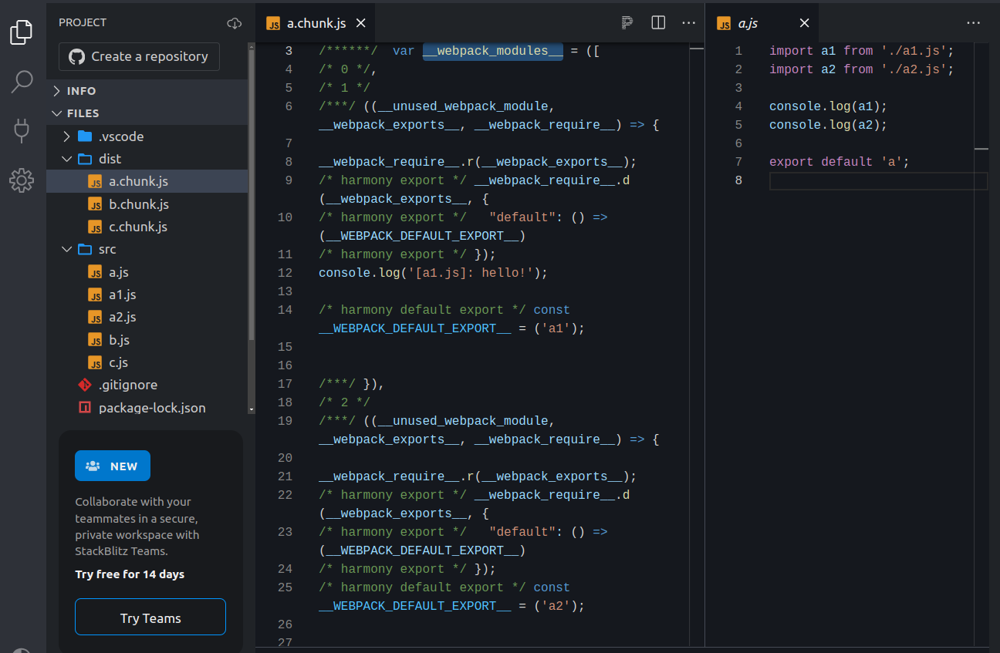
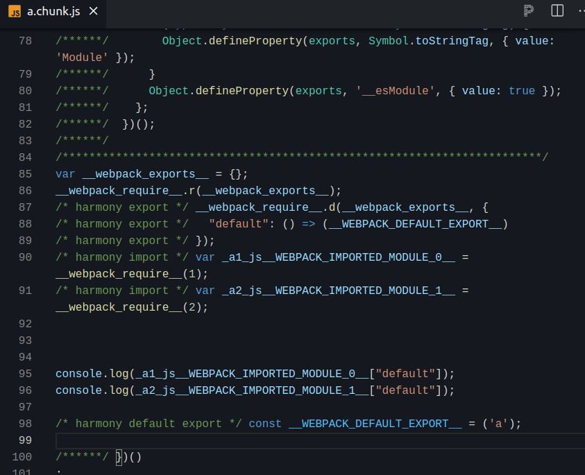
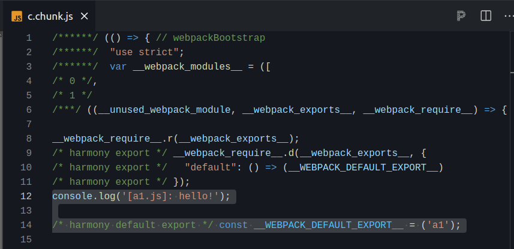
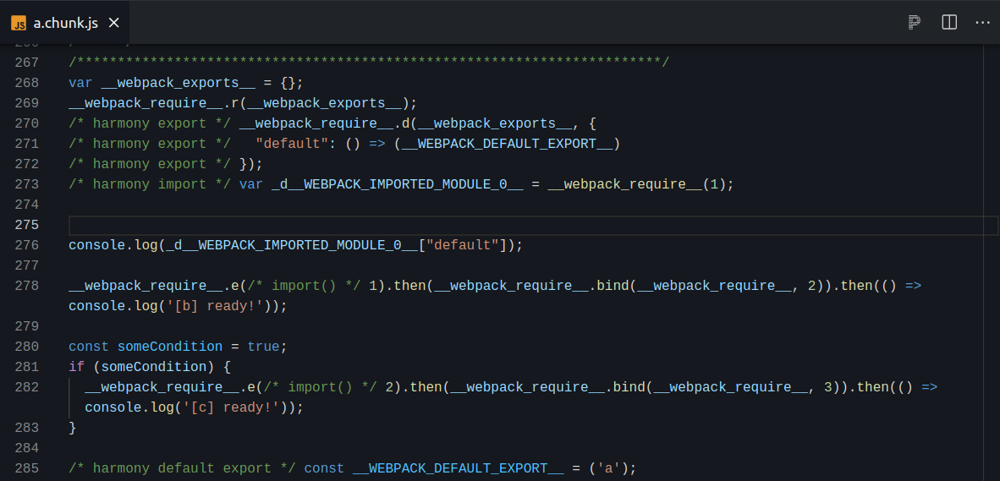

## Introduction

The word *chunk* seems to be ubiquitous in the parlance of web bundlers, especially of *webpack*.

In my opinion, understanding the concept of a *chunk* is essential to understanding how *webpack* works (even at a higher level only). From my experience, everything revolves around chunks - from input files to code splitting and lazy loading, bundle improvements, optimizations and output files.

My goal for this article is to explain as simply and concisely as possible what a chunk is when it comes to *webpack*. The first part will be a bit theoretical, but then we will dive into some practical examples to make sure there are no concepts left unclear. Let’s see how it goes!

## What exactly is a chunk?

Simply speaking, a *chunk* is a **file** resulted from the bundle process. But it is not *just a file*, it is a file that

1. encapsulates modules.
2. contains generated code, also known as **runtime code** - this code plays an important role in making sure the bundled application works as expected when loaded in the browser.

I feel that’s all there is to it. What might be left unclear at this point is the difference between a module and a chunk and how they harmoniously work together. Let’s find out in the next section!

## What is the difference between a chunk and a module?

Isn’t a module a file, too? Or, at least, aren’t these two very tied?

In order to clarify things, we first need to make a **distinction** between **input files** and **output files** (i.e. files resulted after bundling).

Initially, a module resides in a file. We could safely state that, in the beginning, there is a 1:1 relationship between a module and a file. 

**After the bundling process**, things will be different - the *rule* we agreed upon above no longer is valid. Every file resulted is a **chunk** and the modules that we had initially are just part of those chunks.

So, a module is a file in the beginning, but, after *webpack* has finished bundling, the **resulted files** are called **chunks** and the **chunks contain modules**, as well as runtime code. Webpack uses this runtime code in order to properly tie together all the resulted chunks so that the application becomes functional.

There is good news - this has been the theoretical part of this article. In the next section, we will see some practical examples.

## How is a chunk created?

There are multiple ways to create a chunk:

1. By using the `entry` option. Every file provided to the `entry` option will result in a new chunk.
2. By using the `import()` function. This function allows us to create chunks and even load them dynamically (e.g. based on runtime conditions).
3. By using certain webpack plugins, such as `SplitChunksPlugin`.

### Creating chunks with the `entry` option

> The example we will use in this section can be found and tested live [here](https://stackblitz.com/edit/stackblitz-starters-uj3fe7?description=Starter%20project%20for%20Node.js,%20a%20JavaScript%20runtime%20built%20on%20Chrome%27s%20V8%20JavaScript%20engine&file=src%2Fc.js,webpack.config.js,src%2Fa.js,src%2Fa2.js,src%2Fa1.js,dist%2Fc.chunk.js,readme.md&title=node.new%20Starter).
> 

Suppose the `webpack.config.js` file has the `entry` option configured as follows:

```tsx
entry: {
    a: './a.js',
    b: './b.js',
    c: './c.js',
  },
output: {
    path: path.join(__dirname, 'dist'),
    filename: '[name].chunk.js',
  },
```

And these are the raw files:

```tsx
├── a1.js
├── a2.js
├── a.js
├── b.js
└── c.js
```

After running webpack, the `dist` directory will have 3 chunks:

```tsx
├── a.chunk.js
├── b.chunk.js
└── c.chunk.js
```

As stated earlier, each of these chunks will contain modules and some runtime code.

For instance, `a.js` imports both `a1.js` and `a2.js` and, as a result, `a.chunk.js` will contain all these 3 modules (`a`, `a1` and `a2`):



We could think of `a.js` as the *main* module of `a.chunk.js` and all of `a.js`'s dependencies (as well as their dependencies and so on) will be part of this chunk.
If we scroll until the end of the file, we will see the dependencies actually being used:



The same applies for `b.chunk.js` and `c.chunk.js`.

Now, I would like to raise the following questions, knowing that `c.js` also imports `a1.js`. 
What do you think `c.chunk.js` will look like? Will there be a **copy** of `a1.js` just like in `a.chunk.js` or will webpack find a clever way to not duplicate the module?

Well, as it turns out, `a1.js` will be copied **twice** - once in `a.chunk.js` and once in `c.chunk.js`:



This is the default behavior, when no optimizations are applied by webpack. If you want to have more control on such situations, webpack’s [SplitChunksPlugin](https://andreigatej.dev/blog/webpack-splitchunksplugin/) is a powerful way to achieve that.

### Creating chunks with the `import()` function

> The example we will use in this section can be found and tested live [here](https://stackblitz.com/edit/stackblitz-starters-e6bzrm?description=Starter%20project%20for%20Node.js,%20a%20JavaScript%20runtime%20built%20on%20Chrome%27s%20V8%20JavaScript%20engine&file=package.json,webpack.config.js,readme.md,src%2Fa.js,src%2Fb.js,src%2Fc.js,src%2Fd.js,dist%2Fa.chunk.js&title=node.new%20Starter).
> 

This time, we don’t have to dabble with webpack’s configuration too much:

```tsx
// webpack.config.js
entry: {
    a: './a.js',
  },
output: {
  path: path.join(__dirname, 'dist'),
  clean: true,
  filename: '[name].chunk.js',
},
```

These are the files we are starting off with:

```tsx
├── a.js
├── b.js
├── c.js
└── d.js
```

The interesting bits reside in the `a.js` file, while all the other files simply export a string:

```tsx
import d from './d';

console.log(d);

import('./b.js').then(() => console.log('[b] ready!'));

const someCondition = true;
if (someCondition) {
  import('./c.js').then(() => console.log('[c] ready!'));
}

export default 'a';
```

The `import()` function has been used twice, so we expect at least two resulting chunks after the bundling process. 

Let’s run webpack with `npm run dev` and see what the output is:

```tsx
├── 1.chunk.js
├── 2.chunk.js
└── a.chunk.js
```

Actually, there are 3 chunks. `a.chunk.js` is the **entry chunk** (i.e. the one that corresponds to the `entry` field), while `1.chunk.js` and `2.chunk.js` map to `b.js`'s chunk and `c.js`'s chunk, respectively. The `d.js` module simply belongs to `a.chunk.js`.

If we take a look at what the `import()` functions have been translated into, we shall see the following *runtime code*:



`import('./b.js')` has turned into `__webpack_require__.e(/* import() */ 1)`. The `e` function, along with other cleverly defined functions, are part of the so-called *runtime code.* Such code, in the context of the `import()` function, is responsible for loading chunks over the network (e.g. via a `script` tag and JSONP), as well as for integrating the constituent modules of loaded chunks so that the entire bundled application is functional.

With the help of the `import()` function, developers can achieve, besides code splitting, **lazy loading**. It also has an interesting trait - it can be used with **dynamic arguments**. I have written an article on this topic [here](https://andreigatej.dev/blog/webpack-import-function-dynamic-arguments/).

### Creating chunks via webpack plugins

This topic deserves an article on its own, which is why I have written [Webpack: An in-depth introduction to SplitChunksPlugin](https://andreigatej.dev/blog/webpack-splitchunksplugin/). In that article, I share my findings about how `SplitChunksPlugin` acts as an optimization layer in the bundling process.

One case where `SplitChunksPlugin` could create new chunks is when there are *heavy* modules (i.e. files with a lot of lines of code) that are frequently imported in the application. This plugin will *magically* group such heavy modules in chunks so that they are loaded only once and not duplicated at all. This could be a huge performance improvement, especially on devices with low CPU power or low network bandwidth.

## Conclusion

I hope this fairly short article shed a light on what a chunk is in the context of webpack. For me, understanding this concept was a turning point in my webpack learning journey. After that, I could properly focus on specific features and other advanced concepts.

Thank you for reading!
