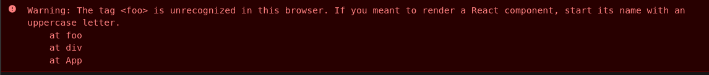
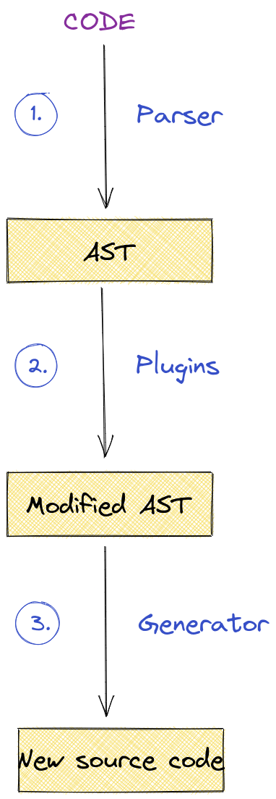
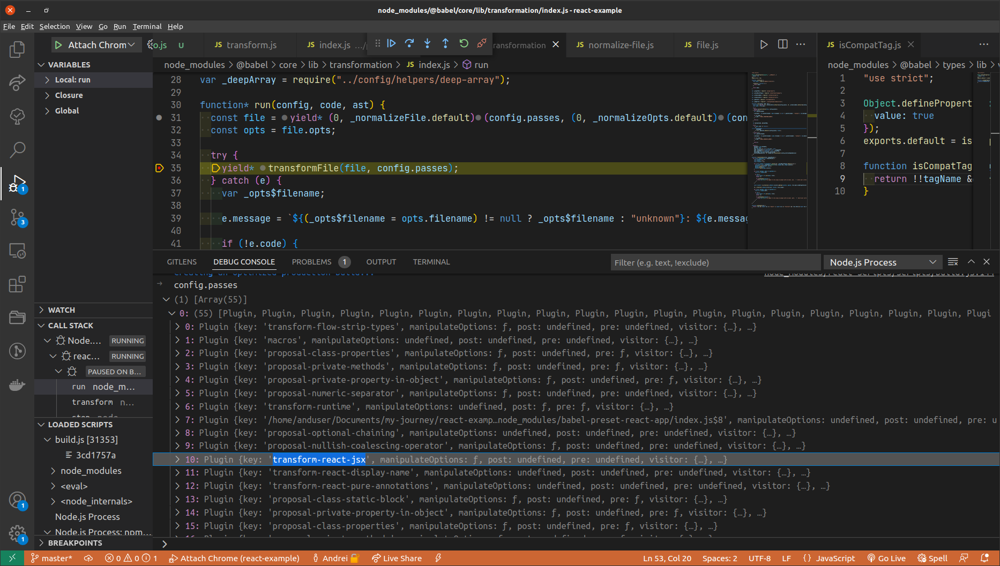
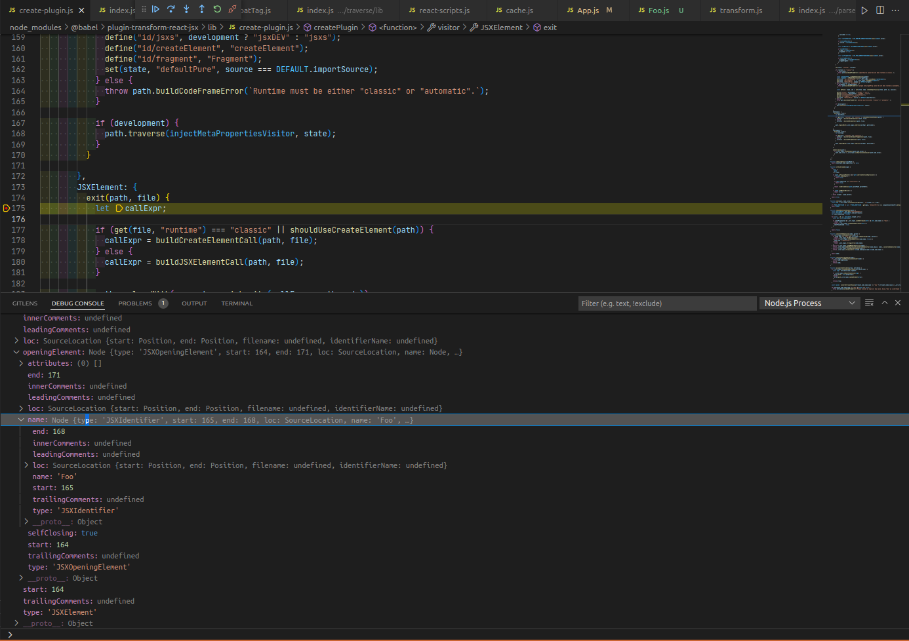
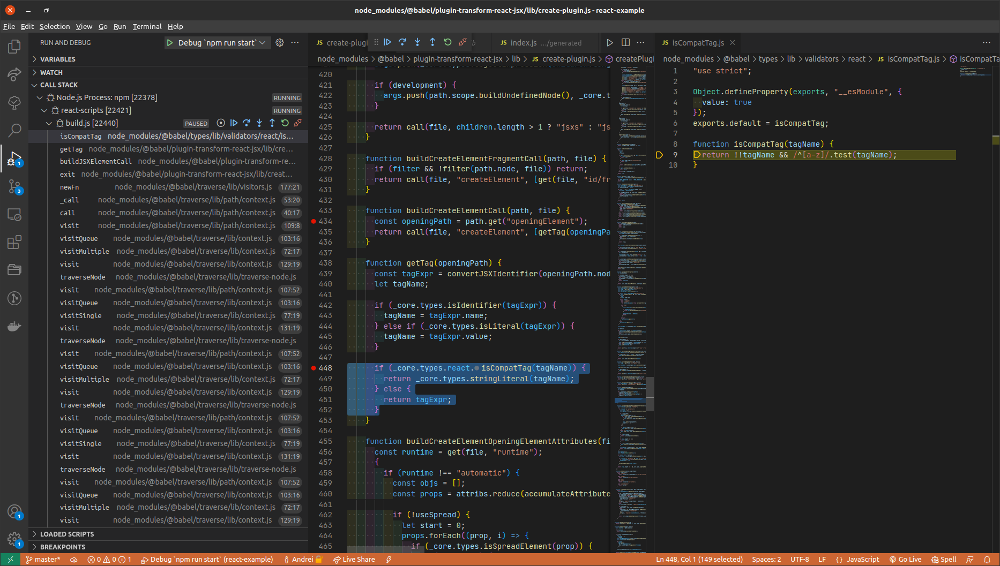

_This article has been published on [indepth.dev](https://indepth.dev/posts/1499/why-component-identifiers-must-be-capitalized-in-react)._

## Introduction

In this short article, I’d like to share some findings as to why a component must be used as `<Foo />`(capitalized), as opposed to `<foo />`. It may not occur very often(may not even be recommended), but if you import a component like `import foo from './Foo'` and use it as `<foo />`, React will not be happy with that:



_You can quickly see this in action in [this CodeSandbox app](https://codesandbox.io/s/busy-proskuriakova-npp9gj?file=/src/App.js)._

In other words, `<foo />` is considered a DOM element and the `foo` DOM element does not actually exist, hence the error. Although the fix is straightforward, another thing sparked my interest: _how exactly is decided that `<Foo />` should be a component and `<foo />` a DOM element?_

In the rest of the article we will briefly talk about the Babel and then we will reveal the answer to that question.

## How Babel works at a high level

As you might know, Babel is the tool responsible, among other things, for converting JSX into syntax which is comprehensible for the browser. It does that through a number of plugins, but the one of interest for now is [`@babel/plugin-transform-react-jsx`](https://github.com/babel/babel/tree/main/packages/babel-plugin-transform-react-jsx).

Here is a diagram that partially covers the Babel’s compiling process:



_The corresponding link for the above diagram can be found [here](https://excalidraw.com/#json=n0ipIimqsZJ1gtZVNiB--,mfHwERMjPGsFDvAbdjVuXw)._

So, Babel will take the initial source code as a raw string and then it will build the corresponding AST which all sorts of plugins will be applied on. For example, here we can see the plugin we mentioned earlier, `transform-react-jsx`:



In the image above, the `transformFile` function refers to the **second phase** of the previous diagram - it’s where all the selected plugins are applied on the _raw_ AST.

The way the `transform-react-jsx` plugin works is that it comes with some **functions** to be invoked when **certain AST nodes are visited**. For example, here is what happens when a `JSXElement` node has been visited:



> The `exit` function can be thought of as a _visiting hook._ Its complement is the `enter` function, which is called when a node is about to be visited. After `enter`, the current AST node’s children are visited and, after that, the `exit` function is called for that node. To put it another way: `Node.enter()` → visited children → `Node.exit()`.

In the image above, we are at the `<Foo />` part. As you can notice, the `JSXElement` has an `JSXOpeningElement` which, for its part, has a name(i.e. `JSXIdentifier`). What also happens **at this step** is to decide what really `Foo` refers to - _does it refer to a **component** or just another **DOM element**?_ This decision has to be made because in JSX we can write `<div></div>`, as well `<CustomComponent></CustomComponent>` - at some point, Babel has to choose what actually a `JSXElement` is and, later on, React will _react_ accordingly.

Calling `JSXElement.exit()` will eventually lead to calling the `getTag` function, which is the place where the question stated at the beginning finds its answer:



The `getTag` function will return a **string literal**(e.g. `“div”`, `“foo”` if used as `<foo />`) if the `tagName` starts with a lowercase letter(i.e. `/^[a-z]/`). So, if `<Foo />` is used, the result will be:

```ts
{
  type: "Identifier",
  start: 165,
  end: 168,
  name: "Foo",
  /* ... */
}
```

and, on the other hand, if `<foo />` is used:

```ts
{
	type: "StringLiteral",
	value: 'foo',
}
```

The fundamental difference between an `Identifier` and a `StringLiteral` is that the former will end up in `createElement(componentName)` and the latter in `createElement('componentName')`(take note of the quotes). React will then choose different paths **depending on the element’s type.**

## Conclusion

Before starting to explore some of the things that Babel does under the hood, I had expected that there must be a check somewhere that indicates whether `JSXElement` actually refers to a component identifier or not, but I had not idea where that check was located.

In the end, the answer to my question turned out to be the `isCompatTag` function. Even if I had known this beforehand, I would’ve needed some more context about that function - so, exploring a bit how Babel works not only made things more clearer to me, but also exposed me to other interesting aspects of the entire compiling process(which I will hopefully write about in the future).

**Thanks for reading!**
