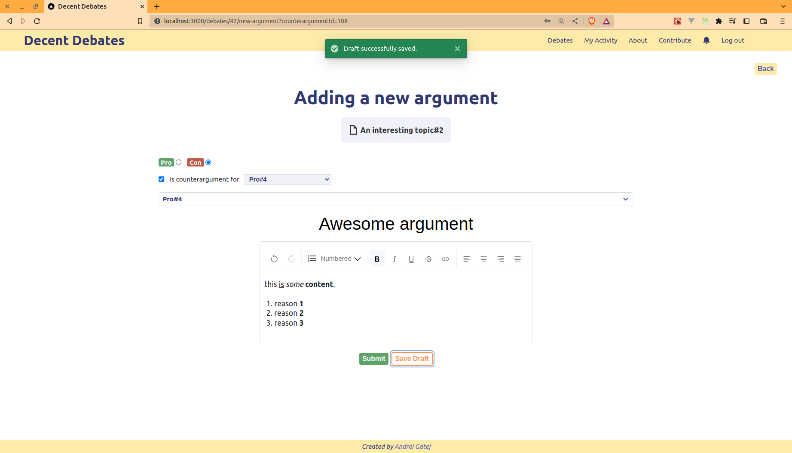

_This application was also my bachelor's **degree project**._

## Motivation

_Decent Debates_ is the place where various subjects are exhaustively discussed in a civilized manner. Its **ultimate purpose** is to centralize extensively discussed topics, allowing the person following it to easily and accurately form an opinion about the debated subject.

In a debate, PRO arguments are presented on the left side of the screen, while the CONs are shown on the right. As the application aims to be accessible to everyone, users are not required to register in order to examine a discussion. However, in order to **contribute to a discussion** (e.g. by adding an argument) or to propose topics to be debated, logging into the application is necessary.

**Another motivation** behind this project is, in fact, a **personal belief**: the idea that one can learn a lot by confronting their own opinions. Ultimately, it's about how one's own conceptions can open up new horizons for other participants in the debate, and how external opinions can offer fresh viewpoints or even change personal convictions.

Last but not least, the application is intended to be an **effort of the community**, **for the community**. As a result, there are human moderators who verify proposed debates and the suitability of arguments that are to be included in a certain discussion. Those who benefit to a great extent are, of course, those who simply study the discussions, but also those who share their viewpoints, even with the risk of being contradicted, which is not necessarily a bad thing; on the contrary, an insightful and profound debate arises from covering as many facets of the discussed subject as possible.

## About the app

Some main features are:

* exposing debates and allowing users to filter them(e.g. by debate title, debate tags)
* an authenticated user can propose debates(and, with them, new debate tags as well) and arguments; the newly proposed debates and arguments are not immediately visible in the app, they are first **converted into tickets** and they are subject to a **review process** in which a **moderator must take part**, along with the ticket's owner
* an argument can have counterarguments
* a user can inspect a thread of arguments and counterarguments(because counterarguments can have their counterarguments too)
* an authenticated user can save an argument as a draft and submit it when ready
* an authenticated user has a page where they can see their activity, i.e. all the debates and arguments proposed along with their statuses(e.g. *PENDING*, *ACCEPTED*, *IN REVIEW*, *CANCELED*), as well as their drafts
* a moderator has a page which exposes a sort of Kanban board where all the app's tickets(e.g. debates and arguments)
* during the review process, the user and the moderator communicate in real-time via comments
* during the review process, the user's edits on the ticket(e.g. debate title, argument title, argument content) are seen in real-time by the moderator
* a notification system(implemented with Server-Sent Events), whereby users and moderators are notified when certain events(e.g. an argument/debate has been posted, a new comment has been added on a ticket, etc.) occur

## Some pictures

*Note: the design has also been conceived by me, so expect not to be amazed :).*

### Proposing a debate

### User's activity

### Moderator's board

### A debate's page

### Writing a new argument

### Communicating via comments during the review process

### Notifications

### Debates pages

