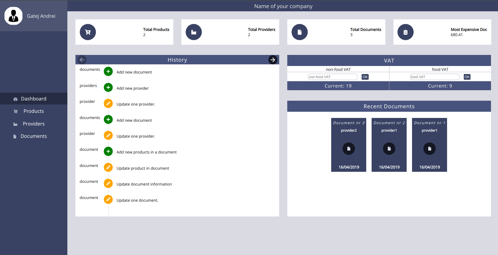
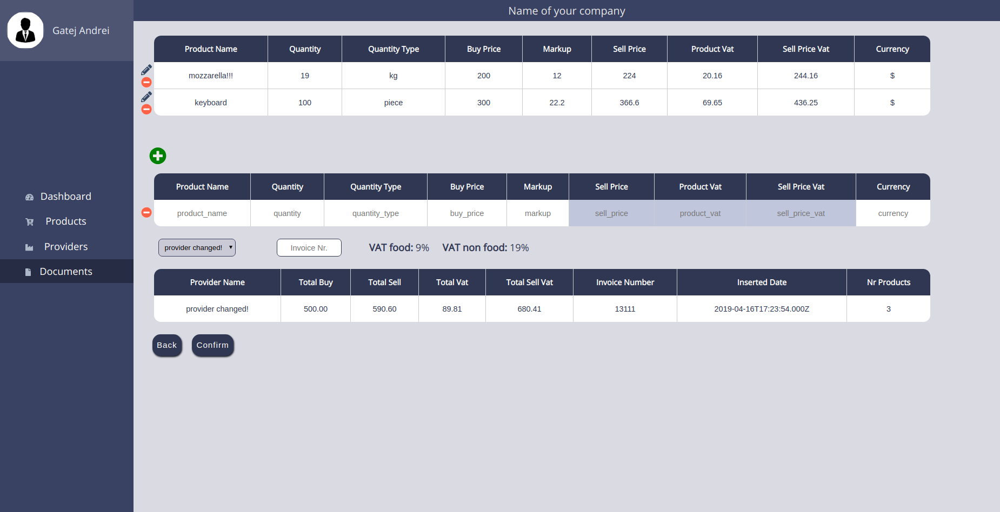

## About

This application is meant to facilitate the process of writing up a traditional invoice.
Keeping track of goods sent and services provided should be a computer's job.

This application is now more of a learning project or a *playground* because here is where I'm try out new things. It all started in 2019 when I took part in a national programming competition, [InfoEducatie](https://infoeducatie.ro/), where I took second place(the project's page can be found [here](https://community.infoeducatie.ro/t/aplicatie-nir-web-dambovita-lucrari-2019-nationala/5017)).



## Cool stuff I've learned along the way

### GitHub Actions

I wanted to find a way to seamlessly add features to this app, without having to *ssh into* my VPS to trigger a new deployment. So, I had a look at GitHub Actions and this tool has turned out to be exactly what I've been looking for. Now, whenever I push a commit into the `master` branch or a PR is merged into `master`, a deployment will be triggered automatically. 

All this logic can be found in the [`autodeploy.yml`](https://github.com/Andrei0872/vue-invoice-app/blob/master/.github/workflows/autodeploy.yml) file.

### Bash Scripting

Considering that this is a full-stack application, I didn't want to re-deploy the entire application when only one part included some new changes. For example, if the `client` brings something new, then only the `build` script of the Vue application should be run. Similarly, when the `server` contains some updates, then only the `server` container should be restarted. 

In order to achieve that, I had to get familiar with a few Bash scripting concepts. This is the way the previously described logic is implemented at the moment:

* whenever something is pushed into the `master` branch, the `origin/master` branch will be *updated* by using the `git fetch origin master` command; then, I will check whether the `HEAD` of `master` is the same as the `HEAD` of `origin/master`; the check is done by comparing the hashes of the two:

  ```bash
    if [ $(git log --format="%H" HEAD -1) == $(git log --format="%H" FETCH_HEAD -1) ]
  ```

  where `FETCH_HEAD` points to the commits that had just been fetched as a result of issuing the `git fetch origin master` command.

* a check is done in order to determine if among the newly pushed commits there are some changes in the `/client` directory:

    ```bash
    git diff --pretty=%gd --stat HEAD FETCH_HEAD | grep -q client/
    clientExitCode=$?
    ```

    as a side note, if `grep` finds something, then the exit code will be `0`(more about it [here](https://stackoverflow.com/questions/49730043/the-exit-status-code-for-the-grep-command#:~:text=The%20grep%20manual%20at%20the,the%20exit%20status%20is%202.)).

    if the check is positive, then the `build` command is run.

* then, a check is done to see if something new appeared in the `/server` directory; if the check is positive, then the `server` container is restarted:

    ```bash
    docker-compose -f docker-compose.prod.yml --env-file ./server/.env -p "$(basename $(pwd))_PROD" restart server
    ```

Another very interesting thing that I've learned is that commands can be run **in parallel** in a Bash script. For instance, if the newly added commits comprise changes made in both `client` and `server` directories, then I wouldn't want to wait until the Vue's `build` command is ready before restarting the `server` container. In order to prevent that, here is how I'm running the `build` script:

```bash
if $shouldUpdateClient then
    npm run build -- &
fi

if $shouldUpdateServer then
    docker-compose -f docker-compose.prod.yml --env-file ./server/.env -p "$(basename $(pwd))_PROD" restart server
fi

wait
```

### Docker and docker-compose

Undoubtedly, having to manually install the required dependencies in order to run the application locally is not the smoothest experience. For this reason, and not only, I decided to improve the DX by *dockerizing* the entire application.

During the process, I faced many challenges and solving them clarified a lot of things to me. One of the most interesting findings was how to make the `server` container wait for the `redis` and the `db` containers until they're *truly ready*. For instance, it often occurred that the `db` container had started, but it was not ready to accept connections and it consequentially caused errors for the `server` container. This is how I overcame this issue:

```yaml
db:
  healthcheck:
      test: "mysql -uroot -p$DB_ROOT_PASSWORD -e 'select 1;'"
      interval: 1s
      retries: 20

redis:
  healthcheck:
    test: "redis-cli ping"
    interval: 1s
    retries: 20

server:
  depends_on:
    db:
      condition: service_healthy
    redis:
      condition: service_healthy
```

### Using a cron job to periodically clean up the accumulated data

Since the application is exposed to the world and since it's really just a playground where I could try new things, I didn't want the data to grow infinitely. To that end, I did some research and the best solution for this problem I found to be a cron job that will run a script periodically(e.g. 5 days) and that script will be responsible for cleaning up the accumulated data and eventually restart all the active sessions.

The script that will be run by the cron job is [`clean-up.sh`](https://github.com/Andrei0872/vue-invoice-app/blob/master/scripts/clean-up.sh). Since I'm using Docker containers, the way to clear the data was to delete the volume associated with the `db` container. Luckily, the `docker-compose down -v` command does exactly that. 

However, there was another **tricky problem** that occurred. Because I'm using JWT tokens for authentication and authorization, there's no state I'm keeping track of on the server, apart from the refresh tokens, which are stored in `redis`. So the problem was that logged in users(which had the access tokens stored in LS) were able to use the application as usual, although everything had been cleaned up(including the `users` table). The reason for that was the **key** which had been used to create the access token. In order to solve this, apart from cleaning up the data, I also changed that key, so that all the existing access tokens are invalidated.

This is the logic that I've followed:

```bash
docker-compose down -v \
  && openssl rand -base64 32 > ./server/.key \ # <- creating a new key!
  && docker-compose up -d
```

### Databases

Since the beginning of this project, I was settled to learn as much as possible from it. That's why I went with *pure SQL queries* instead of using an ORM.

This opened the door to many learning opportunities. One of my favorite discoveries was the use of **Stored Procedures** and **Triggers** in MySQL

### Deploying my first full-stack application

This application has a very special meaning to me. Apart from being my first *serious* application that I've built, it's also the **first full-stack application that I've ever deployed**. 

I'm also seeing this small project as a reference for future projects, in the sense that it contains many *starting points*. 

I had a great time learning more about how the Internet works and many other captivating aspects: web servers, DNS, ssh, cryptography, JWT. 

## Images


