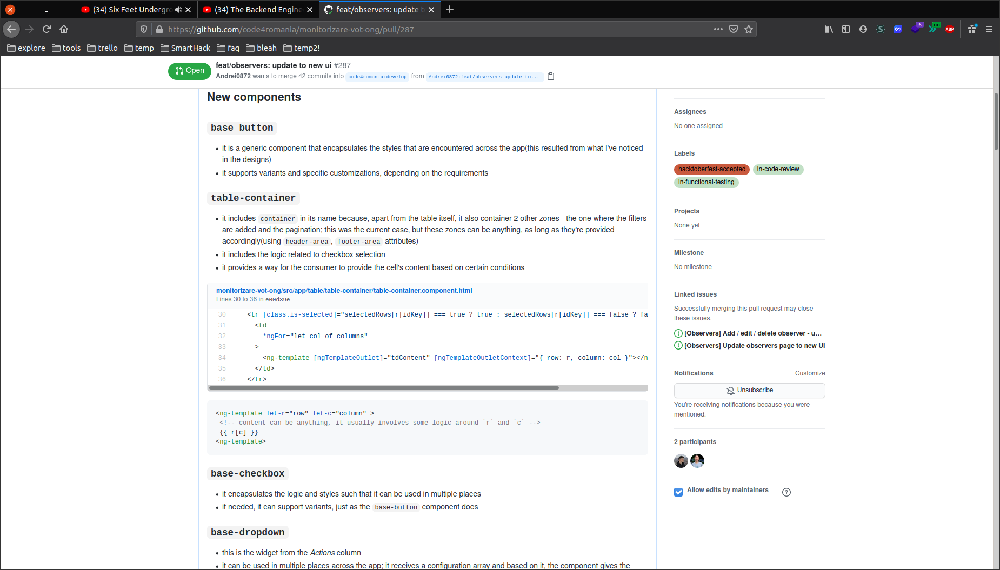
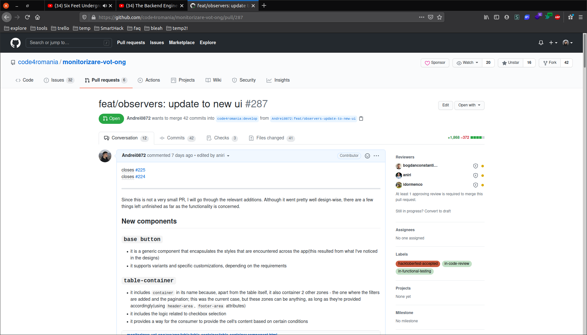

## About

Quoted from [the original repo](https://github.com/code4romania/monitorizare-vot-ong):

> NGO dashboard for viewing answers submitted by certified observers.

My contributions include:
  * developing significant parts of the application(e.g the *Observers* view, the *Answers* view)
  * implementing complex data-flows
  * fixing bugs

One of the most interesting challenges I've faced was to design a [reusable table component](https://github.com/code4romania/monitorizare-vot-ong/tree/develop/src/app/table). You can see how it looked like in [this file](https://www.figma.com/file/61NHR7fwmV1Dsv4Pb6F8T7/code4ro\_mv\_user-management\_2018.04.21-(Copy))(*All responses* and *Observer management* sections is where I've used the table component).  

## Images

